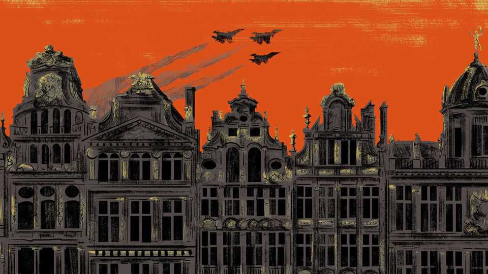

国际 | 电报
布鲁塞尔感觉像一个准备战争的城市
欧洲准备在敌对强人的世界中生存
2025年10月23日

摘要：虽然甚至打出这些词都是奇怪的，但布鲁塞尔这个国际首都——欧盟的家园和北约联盟的所在地——感觉像一个为战斗做准备的城市。"欧洲在战斗，"欧盟执行机构和公务员机构欧洲委员会主席乌尔苏拉·冯·德莱恩在9月10日的国情咨文中宣布。"基于权力的新世界秩序的战线正在被划定。"欧洲必须为它的价值观和选择命运的权利而战，她说。冯·德莱恩女士描述了一个"依赖被无情地武器化"的世界，在这个世界中"许多大国要么矛盾要么公开敌视欧洲"。

虽然甚至打出这些词都是奇怪的，但布鲁塞尔这个国际首都——欧盟的家园和北约联盟的所在地——感觉像一个为战斗做准备的城市。"欧洲在战斗，"欧盟执行机构和公务员机构欧洲委员会主席乌尔苏拉·冯·德莱恩在9月10日的国情咨文中宣布。"基于权力的新世界秩序的战线正在被划定。"欧洲必须为它的价值观和选择命运的权利而战，她说。冯·德莱恩女士描述了一个"依赖被无情地武器化"的世界，在这个世界中"许多大国要么矛盾要么公开敌视欧洲"。

可以肯定的是，泛欧治理的旧缺陷——空洞的演说、官僚主义的领土战争和昂贵的人人有份的妥协——持续存在。尽管如此，在欧盟和北约的总部，城市两端非常不同的机构，最近几个月看到了情绪的明显变化。

欧洲人"只有在受到威胁时才开始组织自己"，一位官员说。威胁现在很明确。最紧迫的涉及三个以蔑视或敌意看待欧洲的强人：总统唐纳德·特朗普、弗拉基米尔·普京和习近平。布鲁塞尔已经得出了一个严峻的认识。战争正在欧洲大陆乌克兰肆虐，这些强人中没有一个人被任何类似欧洲价值观的东西指导。

欧洲的深层国家正在发出战争可能更接近的警报。10月13日，德国外国情报机构负责人告诉他的议会，俄罗斯决心将其影响力扩展到欧洲，特别是德国，"如果必要，不会回避与北约的直接军事对抗"。

严肃的时代正在遇到务实的政治。在过去30年中，欧洲大多享受了不断增长的安全和繁荣。随着新成员加入欧盟和北约，欧洲战争和独裁的记忆消退，生活类似于沿着美国心理学家亚伯拉罕·马斯洛在1940年代描述的"需求层次"的庄严进步。很少有欧盟公民必须担心底层，处理生存的基本需求，如食物和住所。在那之上是"安全和保障"，无论这意味着没有战争、清洁环境还是免于严重匮乏。随着政府建设福利国家和控制污染，进步主义者呼吁欧洲处理与马斯洛更高需求一致的问题。这些包括"爱和归属"、"尊重"和"自我实现"，或追求有目的和快乐的生活。

欧洲选民似乎专注于更基本的需求。他们选举了一系列保守的国家政府，他们相应地派出了冷酷的政治家来管理欧盟机构。在通过繁重的环境和社会法规多年后，该集团现在大部分时间都在废除扼杀工作的规则。能够获得多数支持的新欧洲法律，无论是在欧洲委员会还是欧洲议会，往往涉及强硬政策，如驱逐寻求庇护者。

对其他大国的天真减少了。今年早些时候，一些欧洲政治家寻求与中国建立更密切的关系，作为对抗美国欺凌的对冲。今天，对中国的依赖是一个更大的担忧，因为这个巨人利用其对稀土矿物和其他关键投入的控制来赢得与特朗普先生的贸易战，并将欧洲企业视为附带损害。

贸易政策以实用主义为标志。在采访中，布鲁塞尔的官员驳斥了对欧盟通过与美国单方面贸易谈判的"羞辱夏天"的抱怨。鉴于美国的影响力和对贸易伙伴施加痛苦的意愿，希望保护欧盟的自尊是不现实的。"抱怨特朗普先生没有用，"一位官员平淡地说。

对欧洲与美国防务联盟的痛苦清晰。在特朗普先生对乌克兰的最新转变之后，对欧洲领导人在特朗普"损害控制"上花费的时间和精力感到愤怒。但对美国不可靠性的悲伤和否认已经让位于顺从。现在是一个规划假设，美国将不再向乌克兰提供援助，甚至其向欧洲人出售先进武器捐赠给乌克兰的意愿也不会持续。

至于欧洲的更广泛防务，计划A是尽可能长时间地与美国合作。欧洲仍然依赖美国提供"关键推动者"，包括卫星情报、远程武器、防空、重型运输机和将不同武器粘合在一起的数字系统。有很多关于建设欧洲军火工业的讨论，但也同意它不能完全取代美国作为供应商十年或更长时间，这对重新武装以威慑俄罗斯攻击它的大陆来说太慢了。对俄罗斯的恐惧使官员们甚至对最敏感的问题保持警惕，如果美国有一天走开，欧洲是否需要其安全的计划B。一些人担心讨论美国抛弃就是邀请俄罗斯攻击。其他人寻求识别与计划A和计划B都有效的投资：要么使欧洲成为美国更好的合作伙伴，要么帮助它独自行动。

欧洲团结仍然是一个目标。它不再是教条。如果坚持一致同意给莫斯科友好的欧盟和北约成员（如匈牙利）否决权，愿意的联盟是协调欧洲防务和支持乌克兰的实用方式。人们认为，更接近俄罗斯的国家将在威慑普京先生方面发挥领导作用是不可避免的。

欧洲的严肃性受到欢迎，但变化需要时间。唉，大玩家，从英国和法国开始，在财政上破产了。欧洲看到了它面临的危险。幸运的是，还不算太晚。■

【一｜布鲁塞尔准备战斗】布鲁塞尔感觉像一个为战斗做准备的城市，冯·德莱恩宣布"欧洲在战斗"，基于权力的新世界秩序战线正在被划定，欧洲必须为价值观和选择命运的权利而战。

【二｜威胁明确】欧洲人只有在受到威胁时才开始组织自己，威胁现在很明确，涉及三个以蔑视或敌意看待欧洲的强人：特朗普、普京和习近平，战争正在乌克兰肆虐。

【三｜务实政治】严肃的时代正在遇到务实的政治，欧洲选民专注于更基本的需求，选举保守国家政府，现在大部分时间废除扼杀工作的规则，新欧洲法律往往涉及强硬政策。

【四｜贸易政策实用主义】对其他大国的天真减少，对中国依赖是更大担忧，贸易政策以实用主义为标志，官员驳斥对"羞辱夏天"的抱怨，抱怨特朗普先生没有用。

【五｜防务联盟痛苦清晰】对欧洲与美国防务联盟的痛苦清晰，现在假设美国将不再向乌克兰提供援助，计划A是尽可能长时间与美国合作，欧洲团结仍然是目标但不再是教条。

总的来说，布鲁塞尔感觉像一个准备战争的城市。布鲁塞尔为战斗做准备，威胁明确涉及三个强人，严肃时代遇到务实政治，贸易政策实用主义，防务联盟痛苦清晰，欧洲看到了面临的危险，幸运的是还不算太晚。
