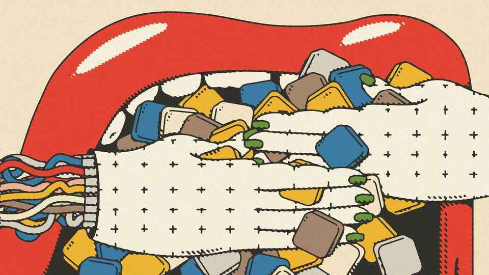

商业 | AI的权力平衡
OpenAI和Anthropic对抗应用开发者：科技的克洛诺斯综合症
实验室会吞噬运行在其模型上的应用吗？
2025年10月23日

摘要：在通常八卦的硅谷世界中，正在发生一些奇怪的事情。很难找到一个生成式人工智能企业家对任何人说坏话。这可能是一个年龄问题。许多启动AI初创公司的人出生在"黑客帝国"（1999年）等科幻反乌托邦之后，年轻到仍然相信AI对每个人都是好事。对他们来说，甚至"友敌"这个词听起来也太血腥。除了友善之外，一个竞争动态正在出现，只会变得更加激烈。

在通常八卦的硅谷世界中，正在发生一些奇怪的事情。很难找到一个生成式人工智能企业家对任何人说坏话。这可能是一个年龄问题。许多启动AI初创公司的人出生在"黑客帝国"（1999年）等科幻反乌托邦之后，年轻到仍然相信AI对每个人都是好事。对他们来说，甚至"友敌"这个词听起来也太血腥。除了友善之外，一个竞争动态正在出现，只会变得更加激烈。以AI初创公司为例，如Anysphere，其Cursor应用帮助软件开发人员编写代码，Harvey，为律师事务所提供AI，以及OpenEvidence，为医生做同样的事情（10月20日以60亿美元的估值筹集了2亿美元）。这些应用通过使用ChatGPT制造商OpenAI和Claude制造商Anthropic等提供的大型语言模型（LLMs）快速增长。他们付费使用模型，但与AI实验室不同，他们不会在追求超级智能的过程中烧掉数十亿美元。这使得他们盈利的道路更容易。

与此同时，烧钱的AI实验室的估值——OpenAI 5000亿美元和Anthropic 1830亿美元——是平流层的，表明随着他们的模型变得更强大，投资者相信他们有一天会篡夺依赖他们的初创公司的利润。将实验室视为克洛诺斯，希腊神话中的泰坦，试图吞噬他的孩子（或作为亚马逊，电子商务的泰坦，制造产品来削弱在其平台上销售良好的产品）。问题是，与克洛诺斯一样：小家伙能生存并反击吗？

杀婴可能已经开始。初创公司太友善了，不会发出警报。但AI尖锐通讯的作者埃德·齐特龙10月20日报告说，Anthropic今年和去年将其收入的很大一部分花在亚马逊网络服务上，这是其云提供商之一。结果，他说，它引入了服务层级，推高了像Cursor这样的大客户的成本，以帮助填补漏洞。Anthropic说服务层级是整个行业的标准做法。

威胁超出了定价。大型AI实验室正在努力实现人工通用智能（AGI），这将使他们的模型能够做人类能做的大部分任务——包括匹配并可能超越应用制造商的能力。目前，可能仍然有每个人的空间。但墙上的字迹很明显。只需看看编码，生成式AI应用在那里最快起飞。Anthropic和OpenAI都开发了编码工具，与Cursor等工具竞争，有细微差别。

初创公司的创始人仍然非常乐观。他们相信权力平衡将在可预见的未来坚定地站在他们一边。有说服力的是，许多人对AGI持怀疑态度，尽管是低声的（一个人要求《经济学人》不要将他命名为怀疑者，以免他被旧金山派对场景列入黑名单）。他们认为，企业实际需要推动生成式AI更深入采用的能力不是AGI，而是"人工专业智能"，即特定于特定领域（如法律或医学）的AI。这是他们希望保持竞争优势的地方。

Sierra制造与人类在客户服务中一起行动的AI"代理"，使用图片来说明动态。它显示了冰山的尖端：这是LLMs服务的市场。下面是大量更复杂的业务流程，呈现更大的挑战和机会。它们都不是可推广的。价值在"最无聊、平凡的事情...隐藏在公司后面[那是]缓慢、昂贵和后果性的"中找到，Sierra的联合创始人（也是OpenAI的主席）布雷特·泰勒说。

为了支撑自己，应用开发者正在尝试新的收入模式。他们承认，与以前的软件开发浪潮不同，他们变得越大，使用LLMs越多，他们的边际成本就会越高。为了抵消这些不断上升的成本，他们需要新技术。一种是使用各种模型，包括开源模型，以便将最简单的查询路由到处理最便宜的地方。另一种是根据结果而不是使用情况向客户收费。例如，Harvey能够选择最大的模型，因为律师事务所愿意为完美的准确性付费。

此外，应用开发者认为，他们在业务中停留的时间越长，他们的代理将获得的专业数据越多，改善他们的表现——就像自动驾驶汽车行驶的里程越多，它们变得越可靠。这可能会使他们与客户"更粘"，创造一个AI实验室将努力跨越的竞争护城河。例如，Cursor使用实时数据每两小时更新自己的LLM，它相信这改善了客户的编码体验。Harvey超越了AI生成的非披露协议等样板内容。它的目标是更复杂的任务，如帮助协调几家律师事务所进行大型合并，这对通用模型来说更难复制。

应用制造商仍然有劣势。专业化可能使超越特定领域（如法律、医学或客户服务）变得更困难，限制了他们潜在市场的规模。通用模型可能能够走得更广。然后是招聘。比AI实验室小得多，应用制造商将在昂贵的AI人才战争中努力竞争。但所有人都需要顶级AI开发者来构建最好的代理。

然而，即使AI实验室变得更加掠夺性，他们也有问题。他们之间的差异如此之小，软件公司从一个LLM提供商切换到另一个如此容易，以至于他们面临被商品化的风险。这导致汇丰银行在最近的一份报告中估计，到2030年，LLM提供商在全球13万亿美元的AI增强IT服务市场中只能达到30%的份额。其余将属于使用LLMs的软件供应商。

这就是克洛诺斯综合症。在希腊神话中，宙斯，克洛诺斯最小的儿子，幸存下来并拯救了他的兄弟姐妹。经过长期战斗，他们的父亲被投入地下世界。这不一定是等待OpenAI和Anthropic的命运。但AI实验室的万能也不是预定的。■

【一｜AI企业家友善】在硅谷世界中很难找到生成式AI企业家对任何人说坏话，这可能是一个年龄问题，年轻到仍然相信AI对每个人都是好事，但竞争动态正在出现。

【二｜克洛诺斯综合症】AI实验室的估值是平流层的，投资者相信他们有一天会篡夺依赖他们的初创公司的利润，将实验室视为克洛诺斯试图吞噬他的孩子，问题是小家伙能生存并反击吗？

【三｜杀婴可能开始】Anthropic将其收入的很大一部分花在亚马逊网络服务上，引入了服务层级推高大客户成本，威胁超出了定价，大型AI实验室正在努力实现AGI。

【四｜初创公司乐观】初创公司创始人仍然非常乐观，相信权力平衡将在可预见的未来坚定地站在他们一边，许多人对AGI持怀疑态度，认为企业需要的是"人工专业智能"。

【五｜新收入模式】应用开发者正在尝试新的收入模式，使用各种模型将简单查询路由到处理最便宜的地方，根据结果而不是使用情况收费，专业化数据改善表现创造竞争护城河。

总的来说，OpenAI和Anthropic对抗应用开发者：科技的克洛诺斯综合症。AI企业家友善但竞争动态出现，AI实验室估值平流层，杀婴可能开始，初创公司乐观，应用开发者尝试新收入模式，这就是克洛诺斯综合症，AI实验室的万能不是预定的。
