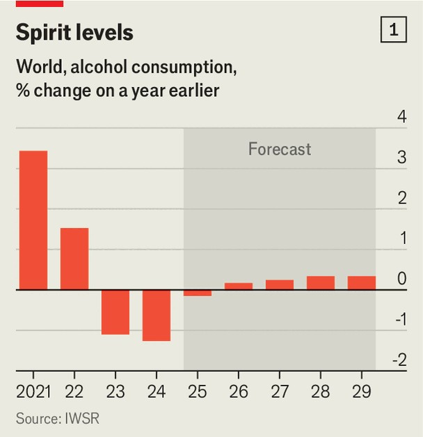

商业 | 半空对半满
尽管Z世代节制，酒类行业依然强劲
宣布饮酒死亡还为时过早
2025年10月23日

摘要：伦敦市中心的Lucky Saint看起来像任何其他酒吧。大木桶兼作桌子。调酒师拉品脱。但这不是一个普通的饮水洞。虽然提供酒类，但约15%的销售是Lucky Saint，拥有这个地方的无酒精啤酒品牌。其他顾客愉快地啜饮无酒精鸡尾酒和起泡酒。"回到几年前，人们过去在1月清洁，"经理之一内特·罗伯茨说，"但现在我们一年365天都看到这种情况。"对饮料行业来说，这些似乎是困难时期。

伦敦市中心的Lucky Saint看起来像任何其他酒吧。大木桶兼作桌子。调酒师拉品脱。但这不是一个普通的饮水洞。虽然提供酒类，但约15%的销售是Lucky Saint，拥有这个地方的无酒精啤酒品牌。其他顾客愉快地啜饮无酒精鸡尾酒和起泡酒。"回到几年前，人们过去在1月清洁，"经理之一内特·罗伯茨说，"但现在我们一年365天都看到这种情况。"对饮料行业来说，这些似乎是困难时期。美国、英国和其他地方的政策制定者正在推动"没有安全水平"的酒精摄入想法。消费者担心酒类对他们的钱包和健康都不好——特别是年轻人，他们比前几代人喝得更少。难怪投资者谈到"烟草时刻"：根据股价与收益的比率判断，帝亚吉欧、保乐力加和雷米·科涅克，三个领先的烈酒制造商，比英美烟草的估值更低。悲伤的清单确实很长。但杯子比你想象的更满。

从对健康日益增长的担忧开始。去年，世界卫生组织将酒精与烟草、化石燃料和超加工食品一起列为欧洲非传染性疾病的主要原因。然后美国外科医生总长发布了建议，指出酒精消费与癌症之间的联系。消费者似乎正在注意：在最近对美国成年人的盖洛普民意调查中，只有54%的受访者说他们喝酒，这是该公司在近90年的询问中记录的最低份额。大多数人甚至说每天一两杯酒对健康有害。

经济因素帮助消除了酒类两个最大市场的泡沫。在疲软的中国，人们在许多事情上花费更少，从花哨的手袋到外出过夜。在美国，总统唐纳德·特朗普的关税使干邑和健力士进口更贵。帝亚吉欧（酿造健力士）认为新关税每年将花费2亿美元，并已放弃其销售增长目标，部分原因是贸易政策的不确定性。其较小的竞争对手雷米·科涅克预计新关税和中国反倾销措施合计将造成3000万欧元（3500万美元）的打击。

研究公司IWSR的数据显示，自covid-19封锁以来，全球消费的酒精量已经下降，当时许多人沉迷于消磨时间（见图表1）。啤酒饮用五年来大致持平；葡萄酒和烈酒的饮用已经减弱。

但该行业远未干涸。饮料支出持续上升。价格上涨比一般通货膨胀慢，但人们转向更昂贵的饮品。根据IWSR，今年将花费约1.2万亿美元。虽然西方消费者更节制，但新兴市场的消费者变得更渴。一些分析师现在看到酒精股票的买入机会。

美国和其他地方清醒趋势将全球化的假设看起来值得怀疑。德意志银行的估计表明，酒精摄入在几个新兴市场正在上升，包括印度、南非和巴西（见图表2）。这些是人口众多、不断增长、更自由消费的中产阶级的地方。经纪公司Bernstein的特雷弗·斯特林说，在两大啤酒商AB InBev和嘉士伯，新兴市场在上一财政年度贡献了利息和税前收益的65%以上。2025年AB InBev的股价上涨11%，嘉士伯上涨16%。

在西方，该行业一直担心年轻人比前几代人喝得更少。AB InBev的首席营销官马塞尔·马孔德斯说，这是封锁的短期影响，这使得社交变得困难，以及疲软的就业市场，这让年轻人破产。在IWSR调查中，超过法定饮酒年龄的Z世代受访者说他们在过去六个月中消费了酒精的比例今年3月跃升至73%，而两年前为66%。马孔德斯先生认为这一代人的成长比他们的父母晚几年："25岁是新的21岁，"他补充说。

人们不是完全戒酒，而是以不同的方式喝酒。预调鸡尾酒从超市货架上飞走。德意志银行的分析表明，在过去五年中，大多数市场的人均烈酒消费量下降，但在即饮选择（通常是烈酒和含糖调酒器的混合物）中情况相反。由该行业资助的非营利组织国际负责任饮酒联盟的老板朱利安·布雷思韦特认为，一些人"喝得更少但更好"。想想年轻嬉皮士啜饮昂贵的精酿啤酒或天然葡萄酒。

从戒酒者那里也能赚钱。大品牌已经投入资金到无酒精品种；喜力0.0赞助了F1赛车，健力士0.0支持六国橄榄球。研究公司Euromonitor预测，今年全球无酒精和低酒精啤酒的销售将达到286亿美元，比2024年增长11%以上。在伦敦的Lucky Saint，顾客为一品脱无酒精啤酒支付6.70英镑（9美元）——大约与传统产品相同。■

【一｜Lucky Saint酒吧】伦敦市中心的Lucky Saint看起来像任何其他酒吧，但约15%的销售是无酒精啤酒品牌Lucky Saint，其他顾客啜饮无酒精鸡尾酒和起泡酒，一年365天都看到这种情况。

【二｜困难时期】对饮料行业来说是困难时期，政策制定者推动"没有安全水平"的酒精摄入想法，消费者担心酒类对钱包和健康都不好，投资者谈到"烟草时刻"。

【三｜健康担忧】世界卫生组织将酒精列为欧洲非传染性疾病的主要原因，美国外科医生总长指出酒精消费与癌症联系，盖洛普调查显示只有54%受访者说他们喝酒。

【四｜经济因素】经济因素帮助消除酒类两个最大市场的泡沫，中国疲软，美国关税使干邑和健力士更贵，帝亚吉欧认为新关税每年花费2亿美元。

【五｜行业远未干涸】饮料支出持续上升，价格上涨比一般通货膨胀慢，人们转向更昂贵饮品，新兴市场消费者变得更渴，一些分析师看到酒精股票买入机会。

总的来说，尽管Z世代节制，酒类行业依然强劲。Lucky Saint酒吧显示无酒精趋势，对饮料行业是困难时期，健康担忧增加，经济因素影响，但行业远未干涸，新兴市场消费者更渴，宣布饮酒死亡还为时过早。
