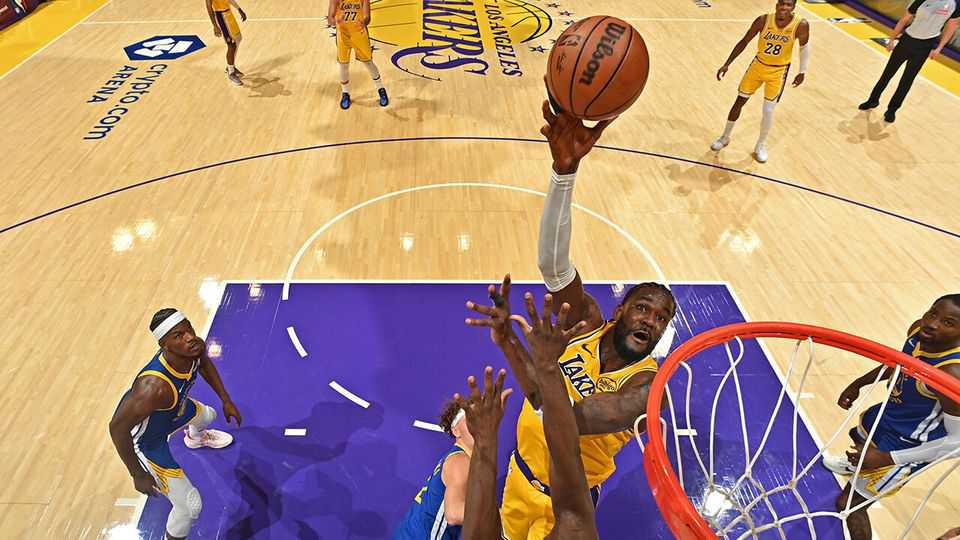

商业 | 如果你不能打败他们，就利用他们
体育联盟发现流媒体盗版有其目的
有方法将其观众货币化
2025年10月23日

摘要：广播公司仍然渴望现场体育。以美国国家篮球协会（NBA）为例，其新赛季，有新的权利协议，于10月21日开始。ESPN、NBC和亚马逊在11年内支付760亿美元来播放联盟，打破了旧的每赛季费率。在这个价格（转嫁给订阅者）下，该协议也肯定会维持对盗版广播的需求。2021年的一项研究建议，如果盗版网站被关闭，世界体育联盟每年可能带来额外的280亿美元。但数据分析和内容创作者的崛起为联盟提供了反击的方法。

广播公司仍然渴望现场体育。以美国国家篮球协会（NBA）为例，其新赛季，有新的权利协议，于10月21日开始。ESPN、NBC和亚马逊在11年内支付760亿美元来播放联盟，打破了旧的每赛季费率。在这个价格（转嫁给订阅者）下，该协议也肯定会维持对盗版广播的需求。2021年的一项研究建议，如果盗版网站被关闭，世界体育联盟每年可能带来额外的280亿美元。但数据分析和内容创作者的崛起为联盟提供了反击的方法。

联盟和盗版之间的竞争更像打地鼠而不是篮球。8月，埃及警察逮捕了两名涉嫌经营Streameast的人，这被广泛认为是世界上最大的体育盗版行动。现已关闭，据说去年访问了16亿次。上个月，在意大利流行的网站Calcio的操作员在摩尔多瓦被逮捕。但没有人相信非法广播可以完全停止。

粉丝对盗版漠不关心。当NBA最大的明星勒布朗·詹姆斯被发现观看Streameast时，粉丝对他感到愤怒——不是因为非法观看，而是因为冒险关闭网站。研究公司Ampere Analysis去年对16个国家的调查发现，64%的粉丝在过去一个月观看了盗版内容。Ampere的丹尼尔·莫纳汉说，这部分是因为联盟将权利分成不同广播商的套餐，所以想要观看他们所有球队比赛的粉丝必须购买几个订阅。体育商业网站Sportico将观看NBA球队本赛季全部82场比赛的价格定为650美元。

但体育联盟对盗版的方法正在演变。他们不再只是跟踪和关闭未经授权的流，而是寻求捕获有多少人观看它们的详细数据。他们可以在与商业伙伴的谈判中使用这些信息，这给出了他们粉丝基础的更完整图景。然后通过赞助商的更高费用赢回一些因盗版而失去的收入。

对什么构成盗版的更自由的观点也在出现。联盟迄今为止寻求关闭任何重新广播他们镜头的人。但社交媒体平台上拥有大量观众的内容创作者的崛起迫使重新思考。NBA已经签约了一群他们作为联盟大使。现在精选的少数人每年被授予数万小时的官方镜头。■

【一｜NBA新权利协议】NBA新赛季有新的权利协议，ESPN、NBC和亚马逊在11年内支付760亿美元播放联盟，打破了旧的每赛季费率，该协议肯定会维持对盗版广播的需求。

【二｜联盟和盗版竞争】联盟和盗版之间的竞争更像打地鼠而不是篮球，埃及警察逮捕Streameast操作员，摩尔多瓦逮捕Calcio操作员，但没有人相信非法广播可以完全停止。

【三｜粉丝对盗版漠不关心】粉丝对盗版漠不关心，勒布朗·詹姆斯观看Streameast时粉丝愤怒，不是因为非法观看而是因为冒险关闭网站，64%的粉丝在过去一个月观看了盗版内容。

【四｜联盟方法演变】体育联盟对盗版的方法正在演变，不再只是跟踪和关闭未经授权的流，而是寻求捕获详细数据，在与商业伙伴谈判中使用这些信息，通过赞助商更高费用赢回收入。

【五｜更自由观点】对什么构成盗版的更自由观点正在出现，联盟不再寻求关闭任何重新广播镜头的人，内容创作者的崛起迫使重新思考，NBA签约他们作为联盟大使。

总的来说，体育联盟发现流媒体盗版有其目的。NBA新权利协议支付760亿美元，联盟和盗版竞争像打地鼠，粉丝对盗版漠不关心，联盟方法正在演变，更自由的观点正在出现，有方法将其观众货币化。
