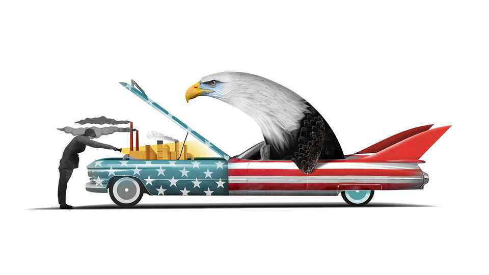

商业 | 熊彼特
美国大企业面临1万亿美元的资本支出问题
看看非AI经济的引擎盖下
2025年10月23日

摘要：有什么能阻止美国企业吗？随着世界最大经济体中最大公司开始公布最新业绩，答案似乎是"让开！"分析师认为大企业的净利润已经连续九个季度增长。那些押注总统唐纳德·特朗普看似反增长和促通胀的贸易和移民政策会让美国企业翻车的做空者，反而自己成了路杀。标普500蓝筹股指数今年上涨了14%，创造了近8万亿美元的股东价值。但是打开非AI经济的引擎盖，你可以发现紧张的迹象。

有什么能阻止美国企业吗？随着世界最大经济体中最大公司开始公布最新业绩，答案似乎是"让开！"分析师认为大企业的净利润已经连续九个季度增长。那些押注总统唐纳德·特朗普看似反增长和促通胀的贸易和移民政策会让美国企业翻车的做空者，反而自己成了路杀。标普500蓝筹股指数今年上涨了14%，创造了近8万亿美元的股东价值。轰！

这种加速的狂热并不局限于人工智能。是的，美国十大科技巨头——英伟达、苹果、微软、Alphabet、亚马逊、Meta、博通、特斯拉、甲骨文和Palantir——自1月以来占标普500涨幅的五分之三。但指数中剩余的490家公司合计增加了3.3万亿美元，或可观的10%的市值。10月20日，好于预期的收益推动可口可乐、3M和通用汽车的股价分别上涨4%、8%和15%。这三家公司2025年都上涨了两位数。投资者不需要AI就能兴奋。苏打水、便利贴和皮卡就足够了。

这种普遍的狂欢是由美联储降息和特朗普先生其他政策的商业友好性推动的：延长对公司减税、放松监管的热情（特别是在金融、加密货币和钻探方面）以及对公司交易的放手态度（只要交易者保持他的好感）。

但是打开非AI经济的引擎盖，你可以发现紧张的迹象。银行家指出汽车零部件制造商First Brands和汽车贷款公司Tricolor的爆雷，作为信贷周期转折的早期证据。可口可乐可能很起泡，但作为一个群体，根据投资银行Jefferies的计算，大型食品和家庭必需品生产商最近几个月相对于其他大企业而言，股市表现是自1988年以来第二差的。通用汽车的股价跳涨是因为其调整后的营业利润在第三季度同比下降了18%，这比预期的要好。这家汽车制造商说，关税今年将削减其净利润至少23亿美元。其底特律竞争对手福特预计也会受到类似打击。

问题不在于关税账单的大小，而在于它的不稳定性——以及特朗普先生政策制定的更广泛的不稳定性。他真的会对中国征收100%的税吗？会有更多公司像英特尔那样获得国家作为股东，或像农民那样获得国家作为救世主吗？对当前收益的有限影响掩盖了对未来增长的潜在持久影响。因为当涉及到对增长的投资时，美国的非AI企业看起来就像被车灯照到的鹿一样被不确定性所麻痹。

当公司感到有信心这些投资会产生回报时，它们会进行昂贵的投资。总的来说，标普500的成员看起来一如既往地自信，准备今年在资本支出上花费超过1万亿美元。在2025年上半年，405个成员合计在设施和设备上花费了5540亿美元（不包括金融行业和约50家公司，S&P Capital IQ中数据不可用）。这比去年同期多960亿美元，相当于资本支出增长21%。

然而，这个强劲的净数字是误导性的。在某种意义上，它低估了资本支出的狂潮。实际上同比增加支出的公司将支出增加了1230亿美元。这是这些相同企业在一年前支出的42%。但净结果也夸大了繁荣。在我们样本中，完全有186家公司，或近一半，削减了资本支出——合计276亿美元。超过一半的公司预计在下一个财政年度再次减少支出。

这些不是标普500的小鱼。它们包括邮轮公司（嘉年华和皇家加勒比，合计下降31亿美元）、大汽车（通用汽车、特斯拉和福特，下降29亿美元）、大制药（辉瑞，下降7.77亿美元）和大石油（雪佛龙，下降4.16亿美元）。总的来说，资本支出削减者占该集团总资本支出的24%、市值的26%、收入的35%和全球劳动力的37%。

依赖进口并因此面临特朗普先生贸易好战的行业，可以理解地小气：汽车行业在2025年上半年削减支出20%，同比；食品、饮料和烟草制造商削减15%；资本品生产商削减4%。消费者服务公司减少了14%，可能是对美国消费者在2025年大部分时间里阴沉情绪的反应。可再生能源生产商如AES和NextEra也逆转了支出，因为特朗普先生对风力涡轮机和太阳能农场的厌恶。

与所有资本支出削减一样值得注意的是资本支出增长的极端集中。1230亿美元总增长的大部分是大型科技公司对AI赚钱潜力的信心结果。Alphabet、亚马逊、Meta、微软和甲骨文，它们的数据中心建设热潮使它们成为AI十巨头中最热衷于资本支出的五家，它们负责了额外支出的730亿美元。电力公用事业（不包括受挫的可再生能源公司）如果没有那些数据中心的电力需求，就不会增加它们所增加的90亿美元。许多其他大支出者也与AI相关。

如果这些AI赌注成功，非AI企业可能会受益。在人工智能世界中，公司AI用户可能产生更高的收入和利润，而不需要将自己的现金投入资本支出。这可能是那些资本支出谨慎的公司所希望的。或者他们可能正在等待特朗普先生做出决定。两种前景似乎都很遥远。等待的时间越长，美国企业的利润引擎开始熄火的可能性就越大。■

【一｜美国企业表现强劲】大企业净利润连续九个季度增长，标普500上涨14%创造近8万亿美元价值，但打开非AI经济的引擎盖可以发现紧张迹象。

【二｜普遍狂欢】加速的狂热不局限于AI，十大科技巨头占涨幅五分之三，但剩余490家公司也增加3.3万亿美元，投资者不需要AI就能兴奋。

【三｜紧张的迹象】信贷周期转折的早期证据，汽车零部件和汽车贷款公司爆雷，食品和家庭必需品生产商表现第二差，关税削减利润。

【四｜1万亿美元资本支出】标普500成员准备今年在资本支出上花费超过1万亿美元，上半年405个成员花费5540亿美元，比去年同期多960亿美元。

【五｜资本支出削减】186家公司削减资本支出合计276亿美元，汽车、制药、石油等行业削减，资本支出增长极端集中在AI相关公司。

总的来说，美国大企业面临1万亿美元的资本支出问题。美国企业表现强劲，但打开非AI经济的引擎盖可以发现紧张迹象，信贷周期转折，关税削减利润。1万亿美元资本支出中，186家公司削减支出，资本支出增长极端集中在AI相关公司，如果AI赌注成功非AI企业可能受益，但等待时间越长利润引擎开始熄火的可能性越大。
