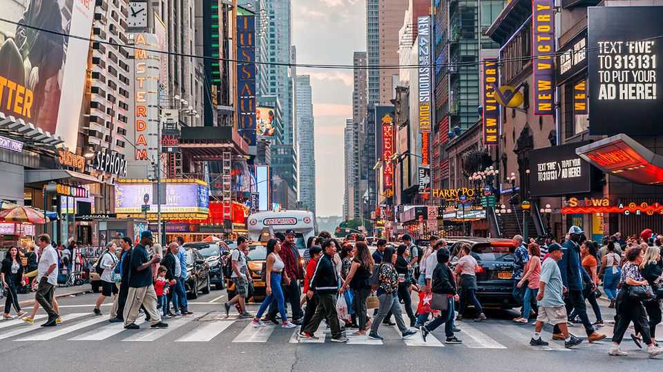
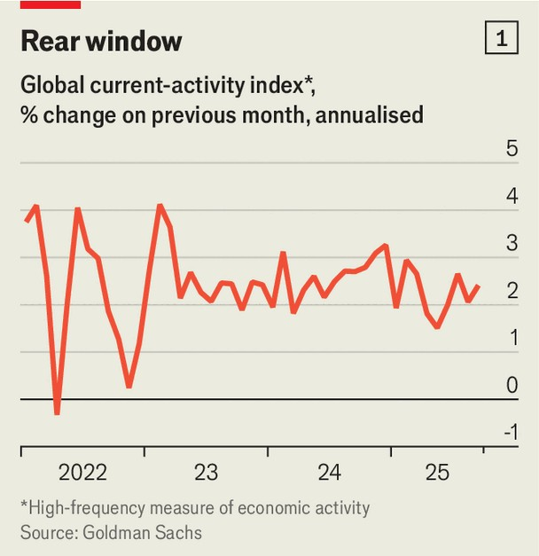
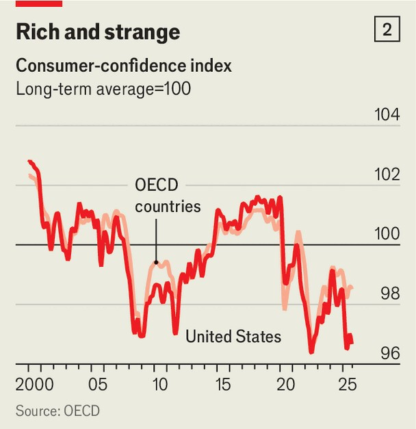

金融与经济 | 解放
世界经济对贸易战和AI恐惧都置之不理
有什么能把它拉下来吗？
2025年10月23日

摘要：六个月前，当总统唐纳德·特朗普宣布一场前所未有的激烈贸易战时，企业和投资者准备迎接衰退。金融市场的走势指向衰退。美国消费者的信心暴跌。一些经济增长的实时衡量指标也是如此。然而今天，即使美国和中国进行激烈的贸易交锋，"解放日"效应也比预期的少。

六个月前，当总统唐纳德·特朗普宣布一场前所未有的激烈贸易战时，企业和投资者准备迎接衰退。金融市场的走势指向衰退。美国消费者的信心暴跌。一些经济增长的实时衡量指标也是如此。然而今天，即使美国和中国进行激烈的贸易交锋，"解放日"效应也比预期的少。

银行高盛产生的"当前活动"指标发现，在春季暴跌之后，全球经济几乎以特朗普先生开始之前的速度增长（见图表1）。摩根大通全球综合PMI是活动的高频衡量指标，看起来很强劲：在8月达到14个月高点。亚特兰大联邦储备银行的实时衡量指标表明，2025年第三季度美国GDP以年化率3.9%增长——表现强劲，尽管几乎所有人都预计第四季度会更弱。只有一个经合组织国家芬兰处于衰退中，而2023年初有八个。4月，经济学家将2025年全球经济增长预测下调至2.2%；现在共识是2.6%，这是年初的水平。

全球经济表现良好，部分原因是特朗普先生的关税战争结果比预期的要温和。他4月的政策意味着美国有效关税高达28%。在一系列让步之后，进口目前面临略高于10%的税收。与此同时，激进的财政政策，特别是在美国，正在刺激需求。这些有利条件可能会结束：特朗普先生随时可能征收新关税；在某个时候，政府可能会找到减少预算赤字的方法。但目前，金融市场相信经济势头将持续。

投资者预计今年第三季度企业收益季节表现不错，第二季度全球公司利润同比增长7%——高于历史平均水平。摩根士丹利资本国际ACWI是全球股票指数，处于历史高位。在经济扩张期间，"周期性"公司——那些提供自由支配物品如汽车和建筑设备的公司——通常表现优于"防御性"公司，后者提供无论天气如何人们都需要的产品。与4月形成鲜明对比的是，全球周期性公司的股价正在飙升。

除此之外，常见的经济担忧没有听起来那么可怕。一个担忧是人工智能投资支出，特别是数据中心，是唯一维持聚会的因素，如果投资者对科技冷却，这将意味着灾难。这个论点在美国最强，在过去一年中，信息处理设备和软件（IPES）的投资占实际GDP增长的40%左右。然而，至少三分之二的IPES与AI无关。数据包括，例如，企业购买计算机。此外，在美国以外，没有任何证据表明IT正在推动增长。

第二个担忧与就业有关。美国的就业增长已经放缓，引发了AI导致的失业的担忧。没那么快。耶鲁预算实验室的一项新研究发现，"自ChatGPT发布以来，更广泛的劳动力市场没有经历明显的破坏。"在美国以外，几乎没有就业放缓的证据。在今年上半年，其他经合组织国家增加了300万个工作岗位，与covid-19大流行前的标准一致。就美国劳动力市场疲软而言，特朗普政府对移民的打击等特定因素可能是罪魁祸首。

第三个担忧与消费者信心有关。尽管在美国，它已经从4月和5月的低点上升，但仍远低于covid前的水平（见图表2）。其他地方的情况只略好一些。经济政策不确定性的全球衡量指标仍然很高，谷歌搜索"关税"也是如此，表明特朗普先生的政策仍然压在人们身上。其他人担心AI股市崩盘会让人们更加痛苦。经济学家通常认为，悲观预示着经济放缓。然而，从解放日开始六个月后，如果高度不确定性会产生这样的影响，它肯定应该已经这样做了。全球经济对"危机"变得非常有弹性。■

【一｜解放日效应减少】六个月前特朗普宣布激烈贸易战，企业和投资者准备迎接衰退，但今天"解放日"效应比预期的少，全球经济几乎以之前的速度增长。

【二｜全球经济表现良好】全球经济表现良好，部分原因是关税战争结果比预期温和，从28%降至略高于10%，激进的财政政策刺激需求，金融市场相信经济势头将持续。

【三｜企业收益表现不错】第二季度全球公司利润同比增长7%高于历史平均水平，全球股票指数处于历史高位，周期性公司股价正在飙升。

【四｜常见担忧没那么可怕】AI投资支出担忧在美国最强，但至少三分之二IPES与AI无关，美国以外没有证据表明IT推动增长，就业增长放缓但AI导致的失业担忧被夸大。

【五｜消费者信心担忧】消费者信心仍远低于covid前水平，经济政策不确定性仍然很高，但全球经济对危机变得非常有弹性，有什么能把它拉下来吗？

总的来说，世界经济对贸易战和AI恐惧都置之不理。六个月前准备迎接衰退，但今天解放日效应比预期少，全球经济表现良好，关税战争结果比预期温和，企业收益表现不错，常见担忧没那么可怕，消费者信心担忧存在但全球经济对危机变得非常有弹性。