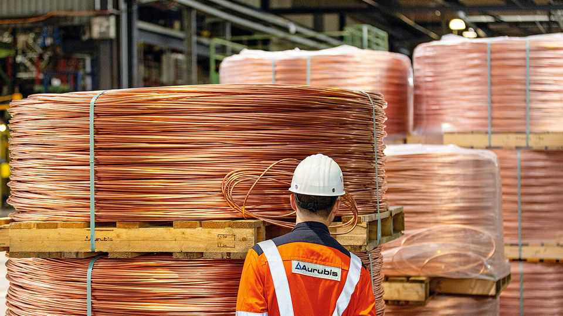
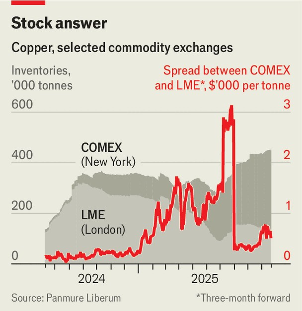

金融与经济 | 红旗
特朗普经济学正在扭曲世界铜市场
可能不会有好结果
2025年10月23日

摘要：伦敦金属交易所每年10月主办的晚宴是"基础"金属与西区相遇的地方。在闪闪发光的宴会厅里，1500名身着黑色领带的客人在枝形吊灯下交谈，在栏杆上自拍，为陈腐的笑话鼓掌。在VIP桌，矿工和部长们在啜饮霞多丽时达成交易。人们押注晚餐后表演将持续多长时间——结果是LME老板演唱"妈妈咪呀！"的20分钟表演。获奖者带着一瓶起泡酒回家。金属交易商有理由感到起泡。总统唐纳德·特朗普对美国铝、铜和钢铁进口征收的关税创造了巨大的套利机会，他们正在忙于利用。

伦敦金属交易所每年10月主办的晚宴是"基础"金属与西区相遇的地方。在闪闪发光的宴会厅里，1500名身着黑色领带的客人在枝形吊灯下交谈，在栏杆上自拍，为陈腐的笑话鼓掌。在VIP桌，矿工和部长们在啜饮霞多丽时达成交易。人们押注晚餐后表演将持续多长时间——结果是LME老板演唱"妈妈咪呀！"的20分钟表演。获奖者带着一瓶起泡酒回家。金属交易商有理由感到起泡。总统唐纳德·特朗普对美国铝、铜和钢铁进口征收的关税创造了巨大的套利机会，他们正在忙于利用。特别是铜，一直在飙升；现在在伦敦定价超过每吨10600美元，是18个月高点。价格上涨引发了英美资源集团和泰克资源两大矿商之间500亿美元的合并。世界上最大的必和必拓正在考虑重新开放废弃的矿场。甚至更石油化的公司沙特阿美也在雇用铜交易商。

然而，铜热潮的时机很奇怪。这种金属，长期以来被称为"铜博士"因为它诊断经济状况的能力，在世界经济虽然具有弹性但几乎没有飙升的时候不应该如此活跃。发生了什么？

三个可能的解释突出：价格可能受到强劲需求、稀缺供应或超出铜"基本面"的经济政策的推动。从需求开始。对铜看涨的投资者关注它在能源转型和人工智能繁荣中的作用。电动汽车比汽油车需要多两到四倍的铜；金属也是电网和风力涡轮机所需要的。今年新数据中心预计将消耗约30万吨精炼铜，或全球产量的1%。

然而，这个案例已经有一段时间了。在晚宴上，分析师开玩笑说，大铜短缺总是在四五年之后。随着新技术成熟，它们往往变得更加节俭：2025年制造的电动汽车比2020年制造的需要的铜少约10%。与此同时，铜需求的通常引擎正在停滞。中国陷入困境的经济正变得不那么依赖建筑，建筑过去吞噬了这些东西。银行Panmure Liberum的汤姆·普赖斯估计，这每年可能释放200万吨。他预计世界整体需求在今年剩余时间会萎缩，而不是激增。

价格飙升的另一个可能原因可能是难以捉摸的供应。9月8日，山体滑坡袭击了印度尼西亚的格拉斯伯格矿，这是世界第二大矿。该设施仍然关闭；其运营商自由港不期望在2027年之前恢复全面生产。这次中断，加上智利和刚果民主共和国的中断，可能在2025年移除40万吨精炼铜供应。事实上，当自由港在9月24日宣布格拉斯伯格不可抗力时，铜价跳涨了4%。即便如此，今年的事故还不足以让世界陷入赤字。它们的综合影响很容易被该行业典型的"中断容差"吸收。这是在考虑智利的埃斯康迪达矿之前，这是世界上最大的矿，正在生产意外的大量。

这就留下了经济政策作为价格飙升的唯一可信解释。特朗普先生的贸易交锋已经扭曲了铜市场。7月，在玩弄这个想法几个月后，美国对金属进口征收了50%的关税。自1月以来在纽约上涨远快于伦敦的铜价，在消息传出后跳得更高，在美国交易所创下纪录。当特朗普先生在8月免除精炼铜的关税时，它们下跌了，但在对新关税的猜测中再次上涨。套利机会导致库存外流到纽约（见图表）。约34万吨现在被困在该市，高于1月的8万吨。

这种扭曲对伦敦的铜价大多是中性的，这是全球基准。美国经济的缓和导致美联储降低利率，美元今年下跌。这使得以美元计价且不产生收益的商品对大型、通用投资基金更具吸引力，这些基金自2020年以来涌入铜市场。

"游客"买家的涌入，对他们来说铜只是多样化投资组合的一小部分，似乎很少关注供需的细节。他们对利率的痴迷使金属价格更加粘性。然而，在某个时候，重力可能会发挥作用。如果中国的经济低迷恶化或三位数关税导致铜需求崩溃，宏观基金可能会失去平衡。金属的大聚会可能以可怕的宿醉结束。■

【一｜铜热潮时机奇怪】伦敦金属交易所晚宴是基础金属与西区相遇的地方，金属交易商有理由感到起泡，特朗普关税创造巨大套利机会，但铜热潮时机很奇怪，世界经济虽然弹性但几乎没有飙升。

【二｜三个可能解释】价格可能受到强劲需求、稀缺供应或超出铜基本面的经济政策推动，投资者关注能源转型和AI繁荣作用，但新技术变得更加节俭，通常引擎正在停滞。

【三｜难以捉摸的供应】山体滑坡袭击格拉斯伯格矿，该设施仍然关闭，这次中断加上智利和刚果民主共和国中断可能在2025年移除40万吨精炼铜供应，但今年事故还不足以让世界陷入赤字。

【四｜经济政策扭曲】经济政策是价格飙升的唯一可信解释，特朗普贸易交锋扭曲了铜市场，7月美国对金属进口征收50%关税，套利机会导致库存外流到纽约，约34万吨被困在该市。

【五｜游客买家涌入】对伦敦铜价大多是中性的，美元下跌使商品对大型通用投资基金更具吸引力，游客买家很少关注供需细节，对利率的痴迷使金属价格更加粘性，但重力可能会发挥作用。

总的来说，特朗普经济学正在扭曲世界铜市场。铜热潮时机很奇怪，价格可能受到需求、供应或经济政策推动，但经济政策是唯一可信解释，特朗普贸易交锋扭曲了铜市场，套利机会导致库存外流，游客买家涌入使价格更加粘性，但重力可能会发挥作用，可能不会有好结果。
