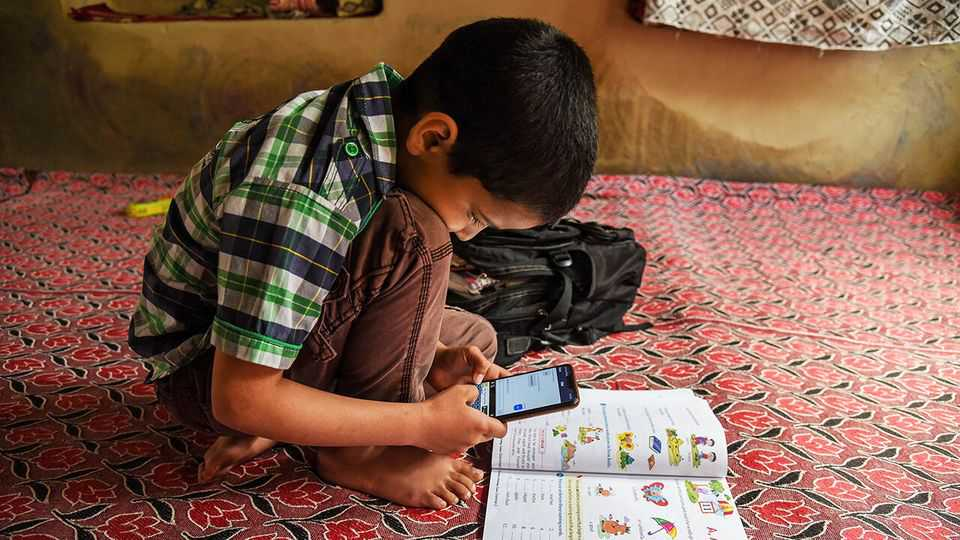
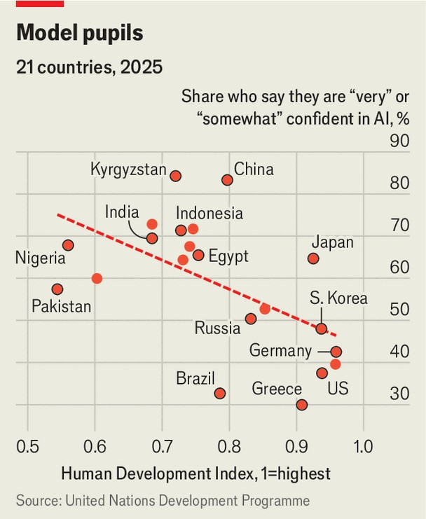

金融与经济 | 跳跃与限制
AI能让贫穷世界更富有吗？
它承诺一个公平的竞争环境。过去的技术也是如此
2025年10月23日

摘要：埃利·恩通德在乌干达布多多复习化学考试。这个村庄有未铺砌的道路、没有自来水、闪烁的电力。然而，当这个18岁的孩子在努力理解金属如何与酸反应时，世界上最先进的导师只有几次点击的距离。他走到一家商店，买了100MB的数据，并将其加载到手机上。几秒钟内，ChatGPT已经解释了答案。

埃利·恩通德在乌干达布多多复习化学考试。这个村庄有未铺砌的道路、没有自来水、闪烁的电力。然而，当这个18岁的孩子在努力理解金属如何与酸反应时，世界上最先进的导师只有几次点击的距离。他走到一家商店，买了100MB的数据，并将其加载到手机上。几秒钟内，ChatGPT已经解释了答案。

恩通德先生的经历抓住了人工智能的承诺。在ChatGPT推出不到三年后，约8亿人——世界成年人的七分之一——每周使用它。许多人在发展中国家，那里人口年轻且精通技术。除美国外，印度和巴西是最大市场。联合国调查发现，在人类发展得分较低的国家，对AI的信心更高。根据消费者研究公司GWI，加纳人和尼日利亚人是最热心的用户之一。

AI能民主化知识——在每个口袋里放一个导师、医生或顾问吗？早期研究暗示了承诺。在内罗毕，OpenAI和Penda Health（一家初级保健诊所连锁）测试了一个工具，在咨询期间为医生提供建议。在一项涵盖15个诊所近40000次患者访问的随机试验中，拥有助手的医生将诊断错误减少了16%，治疗错误减少了13%。在尼日利亚，一项使用微软Copilot的六周课后计划——学生每周与聊天机器人互动两次——将英语分数提高了相当于近两年额外教育的水平。

希望是，像之前的手机一样，AI可能会绕过旧的瓶颈。在1990年代，大多数非洲国家每100人中拥有的电话线不到一条。通过跳过有线阶段直接进入移动，它们在二十年内达到了接近普遍的手机接入。AI可以通过廉价智能手机和本地模型传播。要做到这一点，必须清除三个障碍：连接性、用户能力和机构能力。

从连接性开始。AI需要互联网接入。尽管2024年富裕国家十分之九的人在线，但贫穷国家只有四分之一。近85%的非洲人生活在移动宽带信号覆盖范围内。但即使是以即付即用形式，数据往往太昂贵。

好消息是，从用户的角度来看，AI相对便宜。一个充满图像和广告的搜索结果页面使用的数据是基于文本的AI查询的3000倍。由于推理成本下降，2024年向ChatGPT发送提示比加载搜索结果便宜90%。这可能使信息获取更加负担得起。然而，用户仍然必须在线；通过短信提供AI服务的努力仍然过于昂贵，因为移动运营商征收高额加价。在数据变得更便宜和连接性扩大之前，AI革命可能会错过最贫穷的人。

即使人们连接了，许多人也缺乏有效使用AI的技能——能力障碍。世界银行估计，中低收入国家70%的十岁儿童无法阅读简单文本。对于新用户来说，打开聊天机器人、输入提示或解释其响应可能令人望而生畏。从这些工具中获得价值还需要知道问什么。加州大学伯克利分校的尼古拉斯·奥蒂斯和合著者发现，更强的肯尼亚企业家用AI助手将利润提高了15%以上，而较弱的企业家在遵循通用建议后看到利润下降。在布多多，恩通德先生看到了类似的鸿沟。大约一半的年轻人拥有基本智能手机并尝试AI，他说，但大多数人主要用它来娱乐——比如创建吉卜力风格的肖像发到社交媒体——而不是学习或工作。

语言放大了问题。大多数AI系统主要用英语和其他富裕国家语言训练，留下数百种非洲语言几乎没有代表。结果是AI能说的和许多人能理解的之间存在鸿沟。一个很小但不断增长的研究人员群体正在努力缩小差距。诸如Masakhane、Ghana NLP和Kencorpus等项目——为非洲语言构建开放数据集的社区主导倡议——正在奠定基础。开源和基于语音的工具现在补充了这些努力，暗示了一个未来，人们可以用自己的语言与机器对话。

但最高的障碍不是技术接入。阿卜杜勒·拉蒂夫·贾米尔贫困行动实验室（一个研究中心）的伊克巴尔·达利瓦尔指出，有"银弹"技术失败的历史，因为它们没有融入现有机构。大规模开放在线课程，被誉为教育的未来，几乎没有提高贫穷国家的学习成果，因为它们在学校之外运作——提供内容而没有教师或考试使其坚持。AI现在可能走类似的道路。哥伦比亚大学的塔哈·巴瓦瓦拉和合著者研究了一个印度州用于检测虚假公司的模型。尽管算法成功标记了数千家不存在的公司，但执法未能改善，因为官员缺乏根据其发现采取行动的激励。

最终，AI的成功将取决于它是否能够提高整个经济的生产力，而不仅仅是改善个人服务。正如伦敦经济学院的兰特·普里切特指出的，没有一个国家在没有首先变得更富有的情况下实现了大众教育或良好健康。由工人生产力提高驱动的广泛增长是支撑人力资本持久收益的基础。

技术只有在企业重组以利用它们时才会提高生产力。当工厂首次用灯泡取代煤气灯时，变化很小；当它们围绕电力机械重新设计生产时，产出飙升。达特茅斯学院的迭戈·科明和当时西北大学的马蒂·梅斯蒂里进行的研究，查看了两个世纪以来的25种通用技术，发现较新的发明如PC和互联网更快地到达贫穷国家，但它们的使用仍然很浅。AI采用可能要求更高。即使在富裕国家，企业也在挣扎：在美国只有约十分之一报告在生产中使用该技术。对于较贫穷的经济体，挑战更加陡峭。■

【一｜AI承诺】恩通德经历抓住AI承诺，在ChatGPT推出不到三年后约8亿人每周使用它，许多人在发展中国家，在人类发展得分较低的国家对AI信心更高。

【二｜早期研究暗示承诺】AI能民主化知识，早期研究暗示承诺，在内罗毕随机试验中拥有助手的医生将诊断错误减少了16%，在尼日利亚六周课后计划将英语分数提高了相当于近两年额外教育。

【三｜三个障碍】AI可能绕过旧的瓶颈，像手机一样跳过有线阶段直接进入移动，但必须清除三个障碍：连接性、用户能力和机构能力，数据往往太昂贵，许多人也缺乏有效使用AI的技能。

【四｜语言放大问题】语言放大了问题，大多数AI系统主要用英语和其他富裕国家语言训练，留下数百种非洲语言几乎没有代表，结果是AI能说的和许多人能理解的之间存在鸿沟。

【五｜最高障碍不是技术接入】最高的障碍不是技术接入，而是没有融入现有机构，大规模开放在线课程几乎没有提高学习成果，AI现在可能走类似道路，AI成功将取决于是否能够提高整个经济的生产力。

总的来说，AI能让贫穷世界更富有吗？AI承诺民主化知识，早期研究暗示承诺，但必须清除三个障碍：连接性、用户能力和机构能力，语言放大问题，最高障碍不是技术接入而是没有融入现有机构，AI成功将取决于是否能够提高整个经济的生产力。
