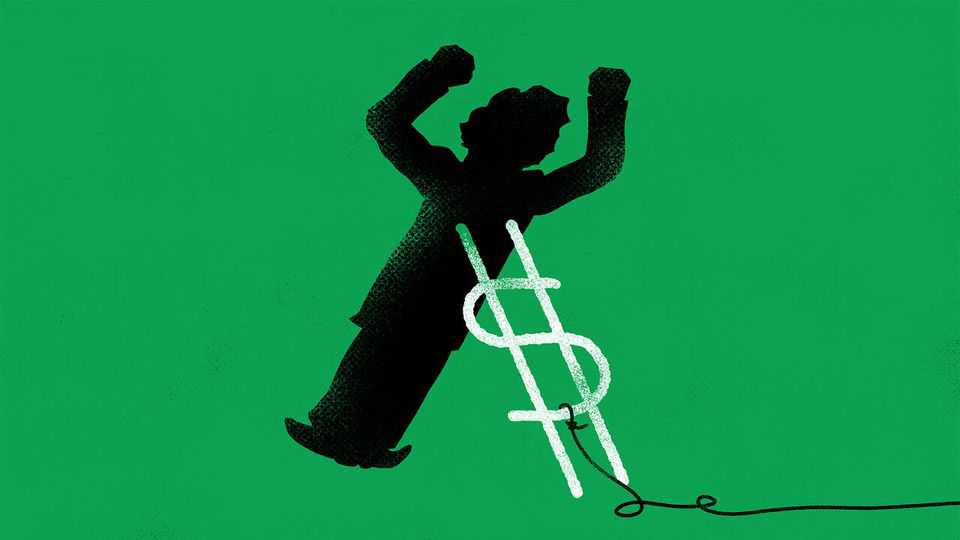

金融与经济 | 巴顿伍德
为什么投资者仍然不相信阿根廷
尽管唐纳德·特朗普和斯科特·贝森特尽了最大努力
2025年10月23日

摘要：美国的救助可以阻止金融危机的发展。1995年，总统比尔·克林顿在墨西哥货币崩溃时借给它200亿美元。两天后，嗅到便宜货，投资者愿意购买该国的债券。9月22日，斯科特·贝森特一定希望有类似的反应。阿根廷比索在10月26日成败攸关的中期选举之前的准备中下滑。因此，美国财政部长宣布，他将无条件支持该货币。"所有选项"，贝森特先生说，"都在桌面上"。

美国的救助可以阻止金融危机的发展。1995年，总统比尔·克林顿在墨西哥货币崩溃时借给它200亿美元。两天后，嗅到便宜货，投资者愿意购买该国的债券。9月22日，斯科特·贝森特一定希望有类似的反应。阿根廷比索在10月26日成败攸关的中期选举之前的准备中下滑。因此，美国财政部长宣布，他将无条件支持该货币。"所有选项"，贝森特先生说，"都在桌面上"。它没有产生克林顿式的影响。在短暂上涨后，比索已经跌至贝森特先生采取行动之前的水平以下。阿根廷十年期美元债务的收益率正在爬升。为什么投资者不相信？

阿根廷总统、总统唐纳德·特朗普的盟友哈维尔·米莱已经结束了许多导致他的国家走向边缘的习惯，如运行巨额赤字和印刷现金。理论上，比索现在也有来自美国的坚如磐石的后盾。

这似乎足以让投资者放心。但要让贝森特先生的行动奏效，他必须愿意为阿根廷政治和金融混乱可能产生的最坏情况承担责任。尽管贝森特先生表示愿意做任何需要的事情，但提供的救助表明了一些不那么令人放心的东西。

到目前为止，贝森特先生已经购买了价值7.5亿美元的比索，并确认了与阿根廷央行价值200亿美元的互换额度。美元将帮助米莱先生，他正在努力将货币保持在他4月建立的区间系统内——但只是在一定程度上。美国和阿根廷正在以非凡的速度消耗美元，试图支撑比索。据报道，仅在10月6日，阿根廷就卖出了4.8亿美元。

更糟糕的是，阿根廷在未来几个月将面临美元债务的猛攻。2026年将需要至少180亿美元的还款。如果政府无法找到所需的美元，它面临噩梦的风险。弹药用尽，米莱先生将只能眼睁睁地看着资本逃离该国，比索进一步暴跌，使债务还款更加负担不起。政府将无法从任何人那里借钱；比索可能一文不值。

阿根廷自己的储备已经枯竭，无法支付账单。9月26日，政府只有22亿美元可用。到10月7日，交易员估计其可用储备可能已降至7亿美元。即使是这些也是借来的，因为阿根廷长期以来要么难以出口很多，要么难以吸引外国投资。该国几乎已经耗尽了国际货币基金组织，它的最大债权人。该基金官员计划在2026年只向阿根廷借出15亿美元（尽管他们同意提前支付）。为了避免比索的挤兑，阿根廷需要从其他地方获得更多美元。

确切需要多少取决于米莱先生打算支撑汇率多长时间。他承诺了一段时间，比索最终将浮动。那也需要储备。阿根廷仍然对银行和企业实行资本管制，这意味着在完全自由化的情况下，对美元的抢购可能让一些人短缺。

永远不浮动比索会更危险。但将货币从护栏中解放出来将不受欢迎：其价值将暴跌，提高进口价格，包括食品和燃料，因此通货膨胀。米莱先生到目前为止一直在回避痛苦。特别是如果他输掉即将到来的选举，他可能永远不会冒险。他必须在2027年面对选民。

如果他不冒险，美国会提供数百亿美元吗？贝森特先生为一个做决定时即兴发挥的总统服务，他自己将美国的干预描述为只是"通往选举的桥梁"。10月14日，特朗普先生说，阿根廷的救助取决于米莱先生的胜利；他对外国支出持怀疑态度，即使它流向朋友。在不咨询政府其他部门的情况下，可用资金也有限制，这些部门不太可能纵容特朗普先生。贝森特先生计划使用的工具紧急稳定基金，在没有国会同意的情况下只能借出六个月。

在1995年救助墨西哥之前，克林顿先生的顾问告诫他。"如果你寄出那笔钱"，一个人说，"如果它在1996年之前没有回来，你就不会回来了"。三十年后，特朗普先生也不能免受这些考虑的影响。投资者知道这一点。■

【一｜美国救助没有克林顿式影响】美国的救助可以阻止金融危机，1995年克林顿借给墨西哥200亿美元，两天后投资者愿意购买债券，但贝森特宣布支持比索没有产生克林顿式影响。

【二｜米莱已经结束坏习惯】阿根廷总统米莱已经结束许多导致国家走向边缘的习惯，如运行巨额赤字和印刷现金，理论上比索现在也有来自美国的坚如磐石的后盾。

【三｜救助限制】但要让贝森特行动奏效，他必须愿意为最坏情况承担责任，提供的救助表明了一些不那么令人放心的东西，美国和阿根廷正在以非凡的速度消耗美元支撑比索。

【四｜美元债务猛攻】阿根廷在未来几个月将面临美元债务的猛攻，2026年需要至少180亿美元还款，如果政府无法找到所需美元，它面临噩梦的风险，阿根廷自己的储备已经枯竭。

【五｜美国会提供更多美元吗？】确切需要多少取决于米莱打算支撑汇率多长时间，如果他不冒险美国会提供数百亿美元吗？特朗普先生对外国支出持怀疑态度，紧急稳定基金只能借出六个月。

总的来说，为什么投资者仍然不相信阿根廷。美国救助没有克林顿式影响，米莱已经结束坏习惯，但救助有限制，阿根廷面临美元债务猛攻，自己的储备已经枯竭，美国会提供更多美元吗？投资者知道特朗普先生不能免受这些考虑的影响。
