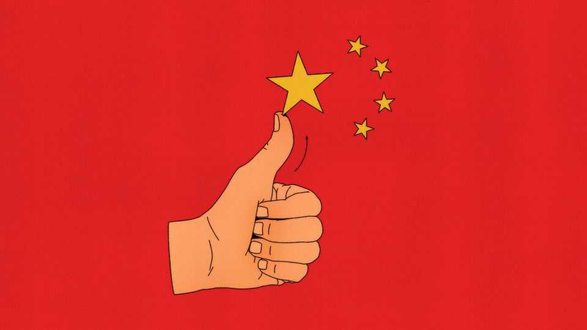

金融与经济 | 自由交换
中国正在被灵感而非汗水推动
只要它的领导人没有撒谎
2025年10月23日

摘要：当中国领导人谈论该国经济时，他们经常用共产党的行话说话，引用诸如"双循环"、"新生产力"和"内卷"等术语。最近的评论也出现了一些直接来自主流经济学的行话："全要素生产率"，或TFP。TFP的增长是新生产力的"标志"，中国领导人习近平去年说。10月21日，党报《人民日报》敦促中国拉动"创新的牛鼻子，努力改善全要素生产率"。激动人心的东西。但中国必须努力的这个奖品到底是什么？

当中国领导人谈论该国经济时，他们经常用共产党的行话说话，引用诸如"双循环"、"新生产力"和"内卷"等术语。最近的评论也出现了一些直接来自主流经济学的行话："全要素生产率"，或TFP。TFP的增长是新生产力的"标志"，中国领导人习近平去年说。10月21日，党报《人民日报》敦促中国拉动"创新的牛鼻子，努力改善全要素生产率"。激动人心的东西。但中国必须努力的这个奖品到底是什么？

TFP最好通过它不是什么来定义。一些经济增长来自动员更多工人并给他们更多机器和基础设施来工作。TFP增长捕捉了其他一切。这是经济学家给无法用增加的投入（如资本、劳动力和其他生产"要素"）解释的产出增加的名称。

根据加州大学洛杉矶分校的阿诺德·哈伯杰，有"至少1001种方法"来改善TFP。他最喜欢的例子之一是一个服装老板，通过在他的工厂播放背景音乐，从缝纫女工那里获得了20%的更多产出。TFP通常与技术或效率相关，而不是努力或费用。诺贝尔奖得主经济学家保罗·克鲁格曼曾经将其描述为"灵感"，而不是"汗水"。

本周会面以审查该国新五年计划的中国领导人，希望其进步不那么汗流浃背，更有灵感。他们几乎没有选择。中国在未来几年不会增加劳动力：自2016年以来，其劳动力已经下降了2000多万。随着人口老龄化和储蓄率下降，中国快速资本积累的速度将变得更难维持。当中国领导人重新想象该国的增长模式时，他们将TFP视为成功的重要衡量标准。

然而，中国并不经常发布TFP增长的官方衡量指标。最广泛引用的估计来自宾夕法尼亚世界表，由宾夕法尼亚大学的经济学家在1970年代开始，现在由加州大学戴维斯分校的罗伯特·芬斯特拉以及格罗宁根大学的罗伯特·因克拉尔和马塞尔·蒂默监督。该项目计算GDP和生产要素的可比估计，保持价格在时间和空间上恒定。根据一项估计，三分之二的跨国增长实证工作都基于它。

最近的版本表明，中国的增长一直缺乏灵感。根据2021年发布的第十版，TFP实际上在2009年至2019年（数据中的最后一年）之间萎缩了。换句话说，中国的经济增长低于你根据其积累的额外投入所预期的。在118个有数据的国家中，中国的TFP增长排名第83位。这样的数字促成了对中国的悲观看法。约翰霍普金斯大学的哈尔·布兰兹和塔夫茨大学的迈克尔·贝克利的书《危险区》中出现了类似的计算，他们创造了"中国峰值"一词。他们得出结论，中国陷入了让人想起苏联的"泥潭"。

但本月发布的最新版宾夕法尼亚世界表描绘了不同的画面。它报告说，中国的TFP在2009-19年间每年增长2.3%，排名世界第六。在数据中最近的十年（到2023年），它排名第三。什么解释了这种转变？TFP表现反映了GDP增长和投入增长之间的差距。虽然中国的投入增长基本不变，但新表选择了不同的GDP衡量标准。它采用了中国的官方数字，不像早期版本依赖北京大学哈里·吴计算的数字。由于中国的官方增长比吴先生的替代估计更快，其TFP数字看起来也更好。

这种转变是由几个担忧驱动的。因克拉尔先生担心，偏离更熟悉的官方数字可能会让研究人员困惑。"如果我们做太多这些...调整，人们停止使用数据库，因为他们无法将[其数字]追溯到其他人报告的内容，"他说。因克拉尔先生也对单独挑出中国持谨慎态度。是的，它的数据引起了怀疑。但其他新兴经济体也是如此。

此外，因克拉尔先生认为，并非所有吴先生的假设都像他首次提出时那样令人信服。为了估计工业增长，吴先生从100多种商品的实物产出衡量开始，如吨煤、升酒和米布。然后他将它们的增长率组合成一个指数，仔细加权以反映中国经济结构的变化。对于某些服务，如教育、金融、政府和医疗保健，吴先生采取了更简单的方法。他假设它们只与劳动力增长一样快（即每年每个工人0%）。这与官方数字暗示的5-6%增长形成对比。

他的方法可以作为官方数字的有用检查。但随着中国工业变得更加复杂，其产出更难用实物衡量捕捉。服务业也已成为经济的更大一部分。因此，更多取决于他假设每个工人0%增长的假设。虽然这样的速度与国际经验一致，但也有例外。根据因克拉尔先生的统计，至少七个经济体（包括印度和马来西亚）的增长超过了每个工人2%。

如果有人知道中国的数字是否更现实，那大概是中国领导层。如果他们自信，他们可以满意地看着过去十年经济的表现。如果他们秘密地相信吴先生的数字更好，他们有工作要做。有1001种方法可以改善TFP。中国领导人可能从改善他们的统计数据开始。■

【一｜TFP是新生产力的标志】中国领导人谈论经济时用党的行话，最近评论出现"全要素生产率"，TFP增长是新生产力的标志，中国必须努力改善TFP。

【二｜TFP是灵感而非汗水】TFP最好通过它不是什么来定义，它是无法用增加投入解释的产出增加，TFP通常与技术或效率相关，克鲁格曼描述为"灵感"而非"汗水"。

【三｜中国增长缺乏灵感】中国不经常发布TFP增长的官方衡量指标，最广泛引用的估计来自宾夕法尼亚世界表，第十版表明中国增长缺乏灵感，TFP在2009-19年之间萎缩，排名第83位。

【四｜最新版描绘不同画面】最新版宾夕法尼亚世界表报告中国TFP在2009-19年间每年增长2.3%排名世界第六，它采用了中国官方数字，不像早期版本依赖吴先生计算的数字。

【五｜数字是否更现实？】这种转变是由几个担忧驱动的，因克拉尔先生对单独挑出中国持谨慎态度，如果有人知道中国的数字是否更现实，那大概是中国领导层，如果他们自信可以满意地看着表现。

总的来说，中国正在被灵感而非汗水推动。TFP是新生产力的标志，是灵感而非汗水，但中国增长缺乏灵感，最新版描绘不同画面采用了官方数字，如果有人知道中国的数字是否更现实，那大概是中国领导层，只要它的领导人没有撒谎，有1001种方法可以改善TFP，中国领导人可能从改善他们的统计数据开始。
