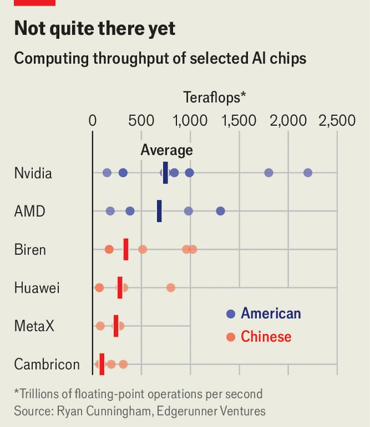
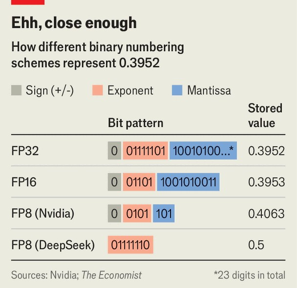

科学与技术 | 发明之母
中国芯片制造商巧妙地围绕美国限制进行创新
它们正在将工具推向边缘，扩大规模并依赖模糊数学
2025年10月23日

摘要：微芯片战争自2018年以来一直在进行。那是美国在唐纳德·特朗普（以及后来的乔·拜登和特朗普再次）领导下开始对希望在中国销售产品的半导体公司施加越来越繁重的出口限制时。这个高科技禁运旨在挫败中国建立自己先进芯片制造行业的雄心。相反，它刺激了他们。中国政府希望其公司能够用硬件做他们已经用软件做的事情，并围绕美国的限制进行创新。

微芯片战争自2018年以来一直在进行。那是美国在唐纳德·特朗普（以及后来的乔·拜登和特朗普再次）领导下开始对希望在中国销售产品的半导体公司施加越来越繁重的出口限制时。这个高科技禁运旨在挫败中国建立自己先进芯片制造行业的雄心。相反，它刺激了他们。中国政府希望其公司能够用硬件做他们已经用软件做的事情，并围绕美国的限制进行创新。1月，中国软件公司DeepSeek通过发布一个人工智能（AI）模型震惊了世界，该模型尽管只使用了计算能力的一小部分进行训练，但与西方竞争对手具有竞争力。中国的芯片制造商正在试图执行类似的技巧。它们正在将工具推向极限，构建大型处理器集群以抵消较慢的芯片，并融合硬件和软件以挤出每一滴性能。问题是，中国能否将这些组件——芯片、系统和代码——连接成一个自给自足、具有竞争力的AI"技术栈"。

从芯片本身开始。风险投资公司Edgerunner Ventures的瑞安·坎宁安收集的数据表明，中国AI芯片的中位性能是114万亿次浮点运算（每秒一万亿次计算），使它们明显落后于美国竞争对手（见图表）。华为的旗舰AI芯片Ascend 910C提供800万亿次浮点运算，而高端英伟达产品B200提供2500万亿次浮点运算。

差距的一个大原因是这些芯片很难制造。在过去半个世纪中，加速微芯片最可靠的方法是缩小其晶体管，这些微小的电开关的开或关状态代表二进制算术的1和0。B200拥有2080亿个晶体管，分为数千个独立核心，全部挤在几十毫米宽的硅片条中。

只有三家公司——韩国公司三星半导体；台湾公司台积电；以及（在一定程度上）美国公司英特尔——能够制造具有最小晶体管的芯片。台积电主导市场，但美国的压力意味着其最先进的工厂对中国客户关闭。它们必须改用本地芯片制造商，如部分国有的中芯国际，以及运营自己的制造工厂的科技巨头华为。

但中芯国际和华为也面临限制。芯片制造工厂使用另一组公司制造的先进机器工具。例如，光刻机使用光将构成微芯片的电路图案蚀刻到硅片上。就像书法笔可以比蜡笔更精确地绘制一样，较短波长的光允许蚀刻更精细的细节。最先进的机器使用波长为13.5纳米（nm；十亿分之一米）的极紫外（EUV）光。它们仅由荷兰公司ASML制造，该公司花费了数十年完善这项技术。

再次感谢美国的压力，ASML不会向中国芯片制造商出售EUV机器，因此它们唯一的选择是将它们较旧的"深紫外"（DUV）系统推向极限，该系统使用193nm光。一种策略是"多重图案化"。工程师不是将晶圆暴露于光源一次，而是重复该过程几次，构建无法在一次通过中产生的较小特征。

多重图案化也增加了成本，减慢了生产并降低了产量（每个晶圆上无缺陷芯片的比例）。对中国来说，自给自足可能比效率更重要。但DUV能够被推多远存在物理限制。大多数分析师认为，除非中国能够确保ASML的EUV机器供应，否则最先进芯片的大规模生产仍然需要数年时间。

如果中国在质量上仍然落后，另一个选择是追求数量。AI的数学非常适合"并行化"，其中任务被分成更小的块，由许多芯片同时处理。4月，华为宣布了CloudMatrix 384，一个设计用于插入数据中心机架的AI系统。它将384个公司的Ascend 910C芯片连接在一起，设计用于与英伟达的GB200 NVL72系统竞争，该系统拥有72个该公司的B200芯片。

咨询公司SemiAnalysis认为，每个Ascend芯片的性能约为B200的三分之一。因此使用五倍多的芯片使华为系统的性能略低于英伟达产品的两倍。权衡是功耗：华为系统使用600kW电力，是英伟达机器的四倍多。但坎宁安先生认为这是一个明智的权衡。他注意到，能源"在中国不是问题"。

以这种方式连接大量芯片也发挥了华为的优势。该公司在计算机网络方面建立了声誉。CloudMatrix 384将数据作为光脉冲而不是电脉冲传输。这种方法被称为光网络，比电网络使用更少的电力并产生更少的废热。它曾经主要用于长距离光纤电缆，但现在正在进入数据中心。投资公司伯恩斯坦的芯片分析师林青远说，华为的方法正在"根本改变"AI基础设施的构建方式。

中国战略的最后一部分是将其硬件紧密定制为将在其上运行的软件。一个例子是芯片在内部处理数字的方式。大多数通用处理器用32或64位或二进制数字表示数字。与十进制计数一样，你有更多可用数字，你可以表示的数字范围就越大。更多数字也允许更好地近似无法精确表示的数字，如十进制中的2/3，或二进制中的1/5——两者都会产生无限重复的数字模式。但每位——每个1或0——需要一个晶体管来表示它，每个额外的晶体管消耗更多的电力。

然而，AI模型可以容忍其数学中的一些模糊性。因此，许多现代AI芯片仅用16、8甚至4位表示数字。伊利诺伊大学厄巴纳-香槟分校的电气工程师拉凯什·库马尔称这是优化硬件的"简单但非常有效"的方法。8月，DeepSeek（正在迅速成为中国AI的标准制定者）发布了一种新的数字格式。它用八位存储数字，不区分正数或负数，完全缺乏小数部分。

这样的方案无法表示大范围数字，缺乏精度。但它也应该更高效。中国芯片设计师寒武纪科技的股票在DeepSeek宣布后飙升；其处理器已经支持该公司的格式。华为的还没有，但可能很快就会。

中国试图构建国内AI栈的尝试，因此有了一个充满希望的开端。但还有很长的路要走。英伟达的CUDA AI编程工具仍然占主导地位。中国设计师在首先设计芯片时仍然依赖美国程序，由Synopsys或Cadence等公司制造。（美国在5月禁止两家公司向中国出口，但在7月让步。）尽管中国芯片在推理方面正在缩小差距——AI模型响应查询的地方——但它们在用于首先创建这些模型的训练阶段仍然较弱。训练模型需要大量数据在内存中进出——先进的内存芯片是美国试图限制中国访问的另一个组件。

但如果计算和AI被认为对国家安全至关重要，中国的行业不需要成为世界上最好的才能有用。仅仅是具有竞争力的硬件可能会走很长的路。至少，官方地，中国正在投射信心。4月，美国限制了英伟达的H20芯片的销售，这是一个为中国制造的产品，故意削弱以满足出口规则。但当白宫几个月后让步时，中国政府的反应不是如释重负，而是敦促其科技公司加倍下注。它说，他们应该完全放弃英伟达的产品，改用国内替代品。■

【一｜微芯片战争】微芯片战争自2018年以来一直在进行，美国对半导体公司施加出口限制，高科技禁运旨在挫败中国雄心，但它刺激了他们，中国政府希望其公司围绕美国限制进行创新。

【二｜中国芯片落后】中国AI芯片中位性能是114万亿次浮点运算，明显落后于美国竞争对手，华为Ascend 910C提供800万亿次，而英伟达B200提供2500万亿次，差距的大原因是这些芯片很难制造。

【三｜ASML限制】只有三家公司能够制造最小晶体管芯片，台积电最先进工厂对中国客户关闭，ASML不会向中国芯片制造商出售EUV机器，它们唯一选择是将DUV系统推向极限。

【四｜追求数量】如果中国在质量上仍然落后，另一个选择是追求数量，AI的数学非常适合并行化，华为CloudMatrix 384将384个芯片连接在一起，性能略低于英伟达产品的两倍但功耗是四倍多。

【五｜定制硬件】中国战略的最后部分是将其硬件紧密定制为将在其上运行的软件，AI模型可以容忍数学中的一些模糊性，DeepSeek发布新的数字格式，华为可能很快就会支持。

总的来说，中国芯片制造商巧妙地围绕美国限制进行创新。微芯片战争刺激了中国，中国芯片落后但正在将工具推向极限，追求数量，定制硬件。中国试图构建国内AI栈的尝试有了充满希望的开端，但还有很长的路要走，如果计算和AI对国家安全至关重要，中国的行业不需要成为世界上最好的才能有用。
