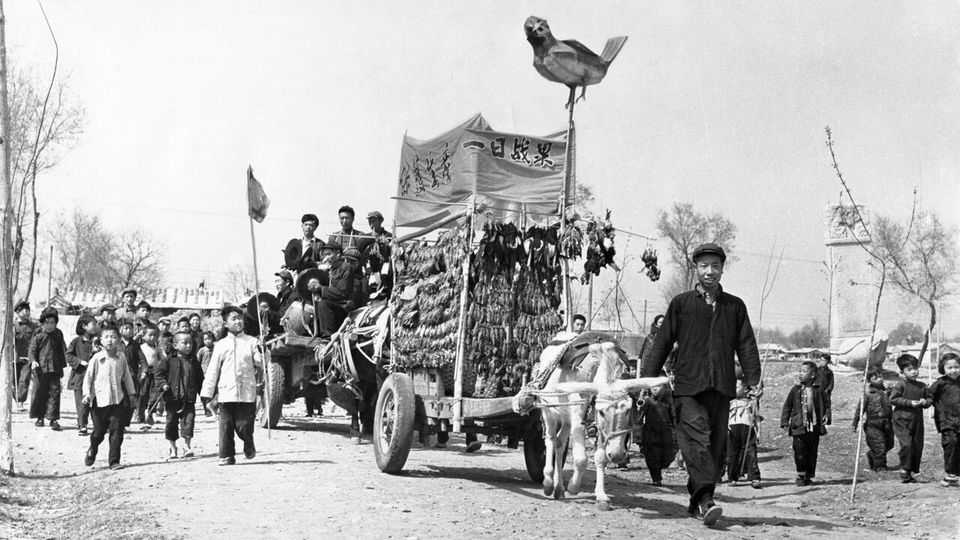
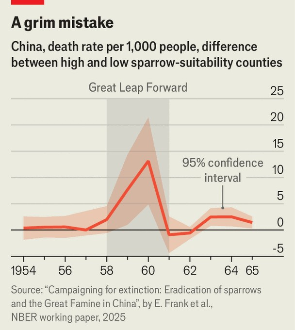

科学与技术 | 中国的麻雀屠杀
对麻雀的迫害如何杀死了200万人
这些鸟在中国的大跃进期间几乎被消灭
2025年10月23日

摘要：1958年，在毛泽东的统治下，中国开始了大跃进，这是一个为期四年的尝试，旨在将国家从农业社会转变为现代工业化社会。这是一场灾难：工业化胎死腹中，农业集体化造成了有记录以来最大的饥荒之一。据认为有1500万至5000万人死亡。在美国组织国家经济研究局的工作论文中，芝加哥大学的环境经济学家埃亚尔·弗兰克和他的同事研究了大跃进的一个更严峻的怪癖。"四害"运动旨在消灭中国的苍蝇、蚊子、老鼠——和麻雀。

1958年，在毛泽东的统治下，中国开始了大跃进，这是一个为期四年的尝试，旨在将国家从农业社会转变为现代工业化社会。这是一场灾难：工业化胎死腹中，农业集体化造成了有记录以来最大的饥荒之一。据认为有1500万至5000万人死亡。在美国组织国家经济研究局的工作论文中，芝加哥大学的环境经济学家埃亚尔·弗兰克和他的同事研究了大跃进的一个更严峻的怪癖。"四害"运动旨在消灭中国的苍蝇、蚊子、老鼠——和麻雀。该运动的前三个目标没有太大争议。但麻雀被单独挑出来消灭，因为毛泽东听到了农民关于这些鸟吃他们的谷物和破坏作物生产的抱怨。

科学家警告不要这个计划。著名生物学家朱冼引用了18世纪普鲁士的麻雀屠杀尝试，这导致了其他害虫的爆发。但毛泽东没有听，四害运动被热情地采纳。人们摧毁了他们能找到的任何麻雀巢，并敲打锅碗瓢盆吓走那些无法触及的鸟。在两年内，大约有20亿只鸟被杀。弗兰克博士的论文表明，该政策的后果也会杀死约200万人。

虽然麻雀确实吃谷物，特别是在其他食物稀缺的冬季，但它们也吃昆虫，如蝗虫和稻螟，这些同样攻击作物。在夏季，这些昆虫占麻雀饮食的大部分。正如生态学家可能预测的那样，一旦麻雀消失，那些害虫的数量就爆炸了，国家的许多地区经历了严重的虫害。

集中重新分配作物的政策使情况变得更糟。由于政府确信杀死麻雀意味着更多谷物，它感到有理由从消灭最多鸟类的地方拿走更多作物。这两个力量结合起来严重挤压了某些地区的食物供应，包括东部的安徽省和南部的贵州省。

弗兰克博士和他的同事使用气候数据，如温度和降雨，来计算中国1000多个县（省以下的行政划分）中每个县对麻雀生活的适宜程度。他们推理，一个县越适合居住，当地麻雀数量可能就越大，在四害运动期间被杀死的就越多。然后，研究人员比较了麻雀适宜性高的县与适宜性低的县的农业生产、人口生育率和死亡率。

结果令人不安。在高度适宜居住的县，与较少适宜居住的县相比，谷物产量和生育率下降，死亡率上升（见图表）。总的来说，弗兰克博士和他的同事估计，反麻雀运动本身占饥荒期间作物产量下降的近20%。他们估计，这种损失，加上再分配制度的影响，直接杀死了约200万人。食物短缺可能阻止了另外40万人的出生。

最终，麻雀屠杀造成严重损害的消息传到了党的高层。1960年，毛泽东决定将麻雀从"四害"中移除，用臭虫代替。到这个时候，麻雀几乎灭绝了，中国不得不从苏联进口25万只，试图恢复它们的数量。中国在1980年代实际上放弃了共产主义，再也没有经历过类似规模的饥荒。至于麻雀，它们的数量最终恢复了。这些天，这些鸟再次成为在城市和乡村中飞来飞去的常见景象。■

【一｜大跃进灾难】1958年中国开始了大跃进，试图将国家从农业社会转变为现代工业化社会，这是一场灾难，工业化胎死腹中，农业集体化造成了有记录以来最大的饥荒之一，有1500万至5000万人死亡。

【二｜四害运动】"四害"运动旨在消灭中国的苍蝇、蚊子、老鼠和麻雀，麻雀被单独挑出来消灭，因为毛泽东听到了农民关于这些鸟吃谷物和破坏作物生产的抱怨。

【三｜科学家警告】科学家警告不要这个计划，朱冼引用了18世纪普鲁士的麻雀屠杀尝试，这导致了其他害虫的爆发，但毛泽东没有听，在两年内大约有20亿只鸟被杀。

【四｜后果严重】虽然麻雀确实吃谷物，但它们也吃昆虫如蝗虫和稻螟，一旦麻雀消失，那些害虫的数量就爆炸了，集中重新分配作物的政策使情况变得更糟，严重挤压了某些地区的食物供应。

【五｜杀死了200万人】弗兰克博士的论文表明，该政策的后果也会杀死约200万人，反麻雀运动本身占饥荒期间作物产量下降的近20%，这种损失加上再分配制度的影响，直接杀死了约200万人。

总的来说，对麻雀的迫害如何杀死了200万人。大跃进是灾难，四害运动旨在消灭麻雀，科学家警告但毛泽东没有听，后果严重，害虫数量爆炸，食物供应严重挤压，杀死了200万人。最终麻雀被从四害中移除，用臭虫代替，中国不得不从苏联进口25万只，试图恢复它们的数量。
