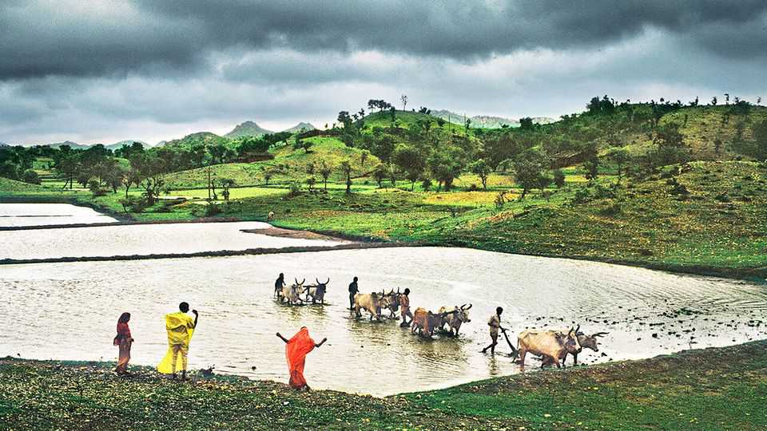

科学与技术 | 气象学崛起
AI模型在预测印度季风降雨方面表现出色
一些天气预报现在可以在笔记本电脑上完成
2025年10月23日

摘要：印度季风通常在6月初开始缓慢向北推进，带来该国四分之三的年降雨量。这对农业至关重要，近一半的印度人依赖农业。但季风以难以预测而闻名。它由陆地和海洋之间的温度差异、喜马拉雅山的积雪量、土壤湿度以及许多其他遥远的影响驱动。气候变化使猜测游戏变得更加困难。

印度季风通常在6月初开始缓慢向北推进，带来该国四分之三的年降雨量。这对农业至关重要，近一半的印度人依赖农业。但季风以难以预测而闻名。它由陆地和海洋之间的温度差异、喜马拉雅山的积雪量、土壤湿度以及许多其他遥远的影响驱动。气候变化使猜测游戏变得更加困难。印度气象局（IMD）尽其所能，使用数值天气预报（NWP）模型，这些模型几十年来一直是气象学的主要内容。在超级计算机上运行，这些模型将世界划分为三维网格，用代表温度、压力、风速等的变量填充每个盒子，然后进行大量计算以尝试模拟事物如何随时间演变。这些模型允许IMD提前一个月左右提供广泛的指导——比如预期降雨量是比往常多还是少。但关于降雨每天将做什么的详细信息，超过大约五天就被认为不可靠。

然而今年，印度政府尝试了一些新东西。约3800万农民收到了不是由NWP模型生成，而是由人工智能（AI）驱动的模型生成的预报。这些以不同的方式工作：不是麻烦地尝试逐方程模拟大气中到底发生了什么，它们主要通过将它们看到的天气数据中的模式与历史天气记录中的先前类似模式进行比较来进行预测，这些历史天气记录是它们训练的基础。

这些模型在测试中表现出色。在一些地区，它们提前30天预测了降雨何时到达。它们还预测降雨将在季节中期停滞——就像它确实做的那样，持续20天——尽管这没有出现在NWP预报中。几乎一半关注这些信息的农民后来表示，这些信息影响了他们关于种植什么和何时种植的决定——尽管评估这是否会影响他们的最终收益还为时过早。

即使五年前，这一切都不可能。但在2022年，美国芯片设计师英伟达发布了FourCastNet的第一个结果，这是一个在几十年天气数据上训练的AI天气程序。该公司声称，它准确地提前一周预测了飓风和降雨，仅需两秒钟的计算时间——比NWP模型需要的时间少数千倍。科技公司和气象机构开始竞相构建自己的。

很快就变得明显，仅依赖AI会带来自己的问题。不受物理定律约束，预报可能变得令人担忧的不现实。只喂食过去的数据，模型经常难以预测罕见或极端事件——与困扰无人驾驶汽车的相同"边缘情况"问题。

因此，焦点转向尝试结合新旧的最佳。用于预测今年季风的两个模型之一是由欧洲中期天气预报中心（ECMWF）开发的，该机构被广泛认为是世界上最好的，用于与现有NWP软件一起使用。另一个是谷歌NeuralGCM的版本，它仍然通过计算来表示大尺度大气过程，但然后使用AI来填充细节。

芝加哥大学的AI和极端天气研究员佩德拉姆·哈桑扎德认为，AI模型可能导致"天气预报的民主化"。数值预报需要超级计算机和大量气象观测站为它们提供数字。贫穷国家往往两者都缺乏。

以人为中心的天气预报倡议（HCF），哈桑扎德博士帮助领导，鼓励政府使用AI来克服这两个障碍。印度的季风项目由HCFI协调，使用的模型一旦训练，可以在高端笔记本电脑上运行。它们也可以调整以专注于可用的最佳质量数据。在印度的情况下，这意味着来自雨量计的长期读数集。

HCF有资金（来自大慈善机构盖茨基金会和阿拉伯联合酋长国）用于在东部和西部非洲进行类似工作。像印度一样，这两个地区都经历明显的雨季。它正在教授来自孟加拉国、智利、埃塞俄比亚、肯尼亚和尼日利亚的气象和农业官员如何为自己的特定需求使用AI天气模型。

其他瓶颈也在缓解。像数值模型一样，AI模型仍然依赖数据同化——将来自卫星和气象站的混乱观测转换为大气的有序快照的过程。这项工作仍然集中在有资源这样做的富裕国家机构中。

因此，当ECMWF在10月宣布它将免费提供其最新预报和同化数据时（它已经开放了其历史档案），引起了兴奋。其中一些将被使用AI天气预报来预测其供应链中断或做出交易决策的私营公司使用。但它也将帮助许多以前难以获得良好预报的人。■

【一｜季风难以预测】印度季风带来四分之三的年降雨量，对农业至关重要，但以难以预测而闻名，气候变化使猜测游戏变得更加困难，IMD使用NWP模型但超过大约五天就被认为不可靠。

【二｜AI模型表现出色】今年印度政府尝试新东西，约3800万农民收到AI驱动的模型生成的预报，这些模型在测试中表现出色，提前30天预测降雨何时到达，预测降雨在季节中期停滞，几乎一半农民的信息影响了他们的决定。

【三｜AI天气预测发展】2022年英伟达发布FourCastNet，准确提前一周预测飓风和降雨，仅需两秒钟计算时间，比NWP模型少数千倍，科技公司和气象机构开始竞相构建自己的。

【四｜结合新旧最佳】仅依赖AI会带来问题，预报可能变得不现实，模型难以预测罕见或极端事件，焦点转向尝试结合新旧最佳，ECMWF开发模型，谷歌NeuralGCM使用AI填充细节。

【五｜天气预报民主化】AI模型可能导致天气预报的民主化，数值预报需要超级计算机和大量气象观测站，贫穷国家往往两者都缺乏，HCF鼓励政府使用AI克服这两个障碍，一些天气预报现在可以在笔记本电脑上完成。

总的来说，AI模型在预测印度季风降雨方面表现出色。季风难以预测，但AI驱动的模型在测试中表现出色，提前30天预测降雨，预测降雨在季节中期停滞。AI天气预测正在发展，结合新旧最佳，可能导致天气预报的民主化，一些天气预报现在可以在笔记本电脑上完成。
