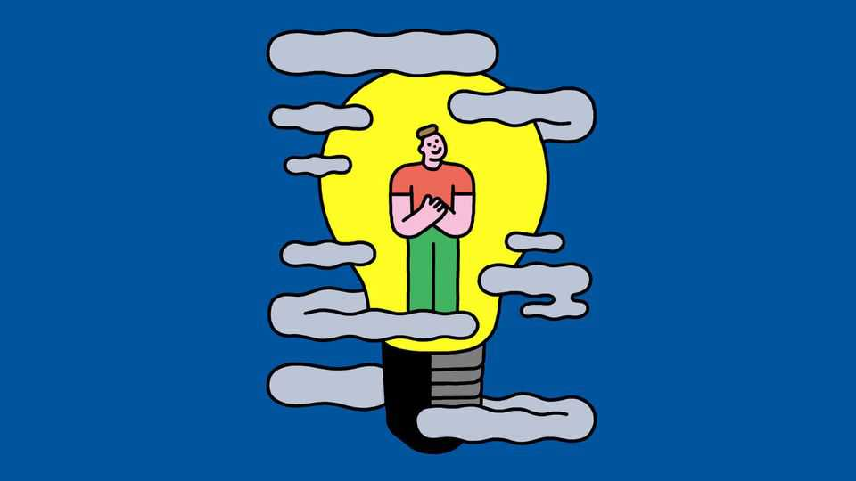

科学与技术 | 信息良好
明亮的光线能驱散冬季抑郁症吗？
似乎如此。它也可能对其他类型的抑郁症有效
2025年10月23日

摘要：很少有人喜欢世界高纬度地区冬季带来的阴郁。在多达十分之一的人口中，长夜可能引发一种称为季节性情感障碍（SAD）的抑郁症。该障碍的确切生理基础尚不清楚。可能的罪魁祸首包括较低水平的褪黑激素（一种调节睡眠模式的激素）；血清素（一种神经递质）水平的下降；以及身体内部昼夜节律时钟的破坏，它控制各种身体过程。抗抑郁药可能有所帮助。但那些往往有副作用。许多人更喜欢通过购买旨在发出明亮光线的设备来治疗根本原因，希望首先驱散导致SAD的阴郁。

很少有人喜欢世界高纬度地区冬季带来的阴郁。在多达十分之一的人口中，长夜可能引发一种称为季节性情感障碍（SAD）的抑郁症。该障碍的确切生理基础尚不清楚。可能的罪魁祸首包括较低水平的褪黑激素（一种调节睡眠模式的激素）；血清素（一种神经递质）水平的下降；以及身体内部昼夜节律时钟的破坏，它控制各种身体过程。抗抑郁药可能有所帮助。但那些往往有副作用。许多人更喜欢通过购买旨在发出明亮光线的设备来治疗根本原因，希望首先驱散导致SAD的阴郁。各种设备都可用，从看起来像普通台灯的设备到像支架上的平板电脑或智能手机的设备。许多医生推荐它们作为该障碍的一线治疗。

它们实际效果如何很难测试。例如，在药物试验中，给一些患者真实的东西，给其他人安慰剂糖丸相对简单。但用光疗法进行这种试验将意味着阻止一大群人长时间接触任何类似日光的东西。即使你能找到志愿者，这样做也只在医院和护理院等大型机构中真正可行。已经沿着这些思路进行了一些研究。然而，大多数必须满足于不太严格的对照。

考虑到这些警告，证据看起来很好。去年，由中国荆州精神卫生中心的涂哲明领导的21项研究的回顾得出结论，光疗法确实似乎有效。3月，罗马尼亚锡比乌卢西恩·布拉加大学的心理学家米哈埃拉·布库塔和她的同事发表了另一项回顾。它得出结论，60%至90%的患者通过日常使用看到"症状缓解"。

至于哪些设备最有效，那些主要发出蓝色、绿色或白光的所有似乎都有类似的影响。强度可能不如灯广告中声称的那样重要。许多人吹嘘它们可以达到约10000勒克斯的亮度——比标准室内照明亮得多，接近相当好的一天室外的亮度。但强度较低的光似乎也有效，尽管灯可能需要打开更长时间。

似乎也没有很多缺点。尽管一些用户报告经历头痛、眼睛刺激和视力模糊，但这样的抱怨很少。

好处似乎足够显著，以至于已经进行了大量研究，研究光疗法是否可以帮助患有其他非SAD形式的抑郁症的患者。在这里，再次，发现似乎很有希望。布库塔博士的回顾得出结论，光疗法本身可以在44%的病例中帮助抑郁症。当它与抗抑郁药结合时，这个数字上升到76%。这样的观察导致研究人员进行实验，比较单独使用药物或光疗法的结果与两者结合的结果。结果再次表明，两者一起做似乎比单独服用药物产生更好的结果。

所有这一切都为秋季夜晚来临时的快乐想法做出了贡献。对于那些患有冬季抑郁症的人，隧道尽头的灯光可能从灯中发出。■

【一｜季节性情感障碍】很少有人喜欢世界高纬度地区冬季带来的阴郁，长夜可能引发季节性情感障碍，生理基础尚不清楚，许多人购买发出明亮光线的设备来治疗根本原因。

【二｜很难测试】它们实际效果如何很难测试，在药物试验中给一些患者真实的东西给其他人安慰剂相对简单，但用光疗法进行这种试验将意味着阻止一大群人长时间接触任何类似日光的东西。

【三｜证据看起来很好】考虑到这些警告，证据看起来很好，涂哲明领导的21项研究的回顾得出结论光疗法确实似乎有效，布库塔的回顾得出结论60%至90%的患者通过日常使用看到症状缓解。

【四｜设备效果】哪些设备最有效，那些主要发出蓝色、绿色或白光的所有似乎都有类似的影响，强度可能不如灯广告中声称的那样重要，强度较低的光似乎也有效，尽管灯可能需要打开更长时间。

【五｜其他类型抑郁症】好处似乎足够显著，光疗法本身可以在44%的病例中帮助抑郁症，当它与抗抑郁药结合时这个数字上升到76%，两者一起做似乎比单独服用药物产生更好的结果。

总的来说，明亮的光线能驱散冬季抑郁症吗？似乎如此。季节性情感障碍难以测试，但证据看起来很好，设备效果类似，光疗法也可能对其他类型的抑郁症有效，对于那些患有冬季抑郁症的人，隧道尽头的灯光可能从灯中发出。
