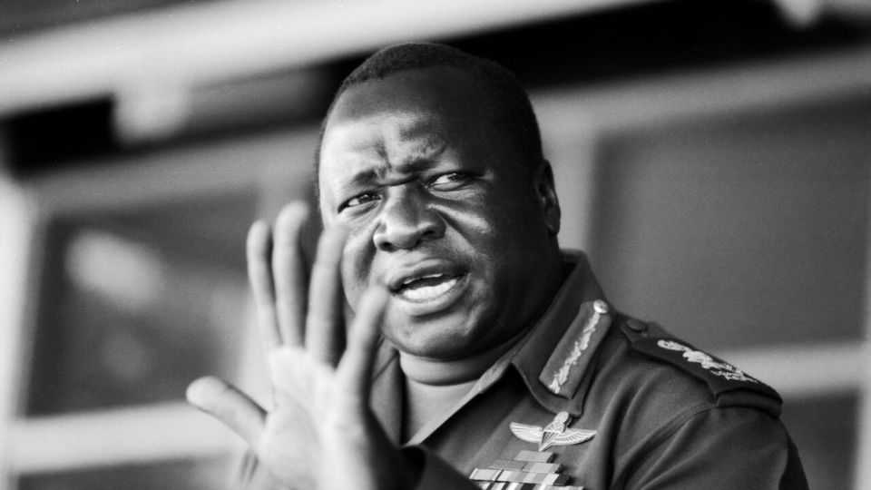
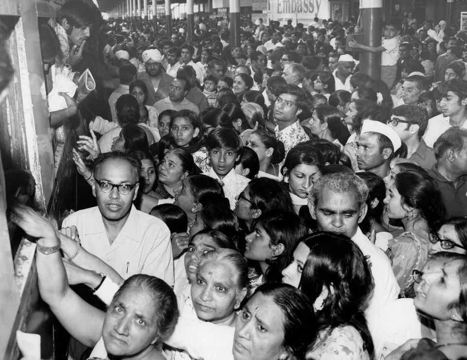
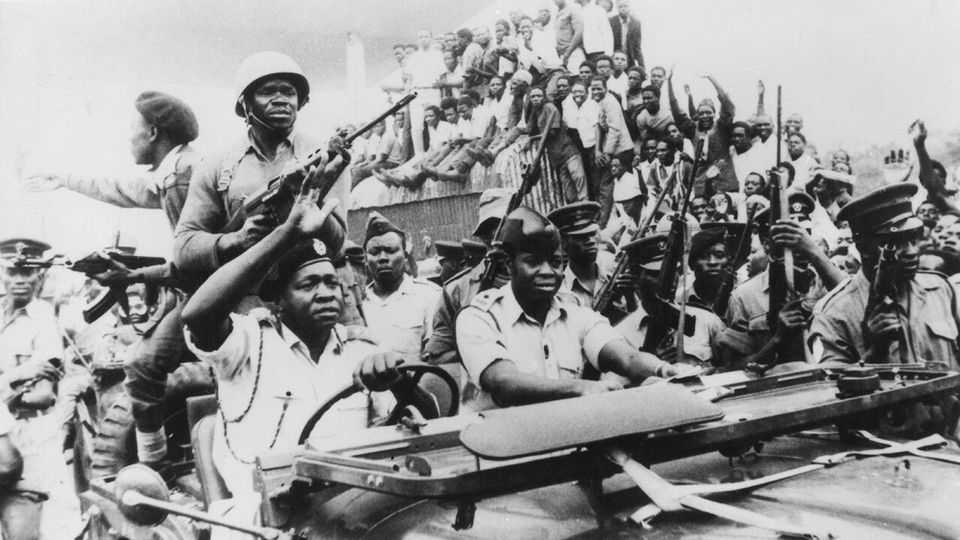

文化 | 白痴统治
伊迪·阿明，大规模驱逐的先驱
驱逐亚洲人出乌干达很受欢迎。结果如何？
2025年10月23日

摘要：1976年，伦敦的蜡像博物馆杜莎夫人蜡像馆要求参观者说出其收藏中最讨厌的人物。伊迪·阿明排在第二位，仅次于阿道夫·希特勒。乌干达独裁者的邪恶行为的故事当时充斥着英国报纸。有些是真的：他真的是一个大规模杀人犯。其他是可疑的——他可能没有把头部放在冰箱里。那些把他视为邪恶小丑的人可以引用大量证据，从他吹嘘的演讲到他声称是"苏格兰最后一位国王"。然而，西方对他的看法也带有种族主义色彩：亨利·基辛格曾经将他描述为"没有受过教育的猿"。

1976年，伦敦的蜡像博物馆杜莎夫人蜡像馆要求参观者说出其收藏中最讨厌的人物。伊迪·阿明排在第二位，仅次于阿道夫·希特勒。乌干达独裁者的邪恶行为的故事当时充斥着英国报纸。有些是真的：他真的是一个大规模杀人犯。其他是可疑的——他可能没有把头部放在冰箱里。那些把他视为邪恶小丑的人可以引用大量证据，从他吹嘘的演讲到他声称是"苏格兰最后一位国王"。然而，西方对他的看法也带有种族主义色彩：亨利·基辛格曾经将他描述为"没有受过教育的猿"。

两本新书提出了认真对待他的理由。他是民粹主义的先驱。他把自己塑造成一个直言不讳的人民之子，对旧帝国领主嗤之以鼻，挫败外国破坏者。他确定了据称阻碍乌干达的敌人，如其亚洲人口，并提供了简单、戏剧性的解决方案，如将他们全部驱逐。他说服他的支持者他正在使乌干达强大，但作为总统八年后，他留下了更贫穷、更恶劣、更无法无天的国家。

阿明是一个来自边缘的人。出生为卡克瓦人，一个被其他乌干达人轻视的种族，他作为拳击冠军和殖民军队的士兵找到了目标。根据家族传说，他曾经在白人军官食堂被拒绝服务后，抓住一名英国服务员的衣领将他拖过吧台。无论真假，这个故事显示了阿明认为自己是的那个人。独立后，他升任军队指挥官。当他在1971年的政变中夺取权力时，人群在街道上庆祝。

第二年，他宣布乌干达约5万名南亚裔人必须在90天内离开。这项残酷的政策很受欢迎，因为阿明巧妙地煽动种族不满。"非洲人被这些外国人视为在自己国家的二等公民，"他说。许多亚洲人已经在乌干达生活了几代，但他们在殖民主义种族等级制度中坐在非洲黑人之上，他们的经济成功受到怨恨。阿明宣布他们的离开是"救赎日"。

这也是他所谓的"经济战争"的开始，以清除乌干达所有殖民主义的痕迹。在他零和思维中，来自亚洲的移民正在从真正的乌干达人手中夺走机会。他没收了他们的企业，并将它们交给了他的支持者，后者将它们经营到破产。事实证明，亚洲人拥有宝贵的技能，从簿记到经营工厂到牙科。

阿明发誓通过以"超音速"行动"让乌干达再次前进"。这涉及诸如通过法令微观管理商业等事情。他指责非洲小商贩走私和价格欺诈。许多人被枪杀。

这一切对经济都不好，经济崩溃了。但这很令人兴奋。阿明的政权将"政府枯燥、技术性的工作转变为激动人心的种族和政治解放之战"，美国历史学家德里克·彼得森写道。种植棉花或修建道路的运动因爱国主义而活跃。

国际关系也是如此。许多乌干达人喜欢阿明刺痛西方人自负的方式。他提出在北爱尔兰斡旋和平，并设立了一个拯救英国基金，在经济衰退中发送援助。他向理查德·尼克松写道，美国的"无尽的种族冲突"和"不幸的水门事件"。

南非喜剧演员特雷弗·诺亚曾经将阿明吹嘘他的大脑和受欢迎程度的片段与唐纳德·特朗普做同样事情的片段并列。对彼得森先生来说，相似之处更深。"不仅是吹嘘，"他写道，还有"对社会和种族少数群体的妖魔化、对移民的瞄准、专家的边缘化"。通过广播，阿明发布了一系列法令。不要再有青少年跳舞！停止戴假发！彼得森先生将他散弹般的专横比作特朗普先生的社交媒体帖子。

这个比较不应该太远。阿明要残酷得多。乌干达的首席大法官被从议事厅拖出并被谋杀；一位大主教被给予表演审判并被枪杀。有一次，阿明命令一群牧民被屠杀，仅仅因为他们拒绝穿衣服。死亡人数的估计从12000到500000不等。但与"非洲希特勒"的神话相反，恐怖不是系统性的。士兵们被给予了自由。他们使用了它。

阿明的恐惧统治产生了广泛的影响。在他驱逐的亚洲人中，最大的群体去了英国。其中包括马哈茂德·马姆达尼，现在是哥伦比亚大学的政府学教授（以及佐兰·马姆达尼的父亲，可能的下一任纽约市长）。他动人地写道，那些被驱逐的人无论走到哪里都感到像陌生人，甚至在自己的家里也是客人。尽管英国重写了法律以试图阻止非白人前帝国臣民，但到达那里的乌干达亚洲人繁荣了。

1979年，阿明被坦桑尼亚军队推翻，他愚蠢地入侵了坦桑尼亚。七年后，一位名叫约韦里·穆塞韦尼的叛军战斗到乌干达总统职位，并尚未离开。穆塞韦尼先生正在1月寻求连任，他吹嘘他已经恢复了稳定。虽然不是民主主义者，但他远没有阿明那么糟糕。但马姆达尼先生对他的"感激的走卒"感到愤怒，并指责他通过腐败、政治暴力和种族分裂监督国家的"慢性毒药"。今天乌干达许多最大的企业都是外国拥有的。阿明利用的挫败感仍然存在。

历史在押韵。穆塞韦尼先生的儿子和可能的继承人穆胡齐·凯内鲁加巴在社交媒体上采用了一个借自阿明和特朗普先生的人设：嘲笑他的批评者并吹嘘在他的地下室折磨反对派活动家。与此同时，坎帕拉的出租车司机在他们的窗户上贴阿明的照片，怀念一个从未存在的黄金时代。■

【一｜认真对待阿明】1976年杜莎夫人蜡像馆要求参观者说出最讨厌的人物，阿明排在第二位，两本新书提出了认真对待他的理由，他是民粹主义的先驱，他把自己塑造成一个直言不讳的人民之子。

【二｜大规模驱逐】第二年他宣布约5万名南亚裔人必须在90天内离开，这项残酷的政策很受欢迎，因为阿明巧妙地煽动种族不满，许多亚洲人已经在乌干达生活了几代，但他们的经济成功受到怨恨。

【三｜经济战争】这也是他所谓的"经济战争"的开始，以清除乌干达所有殖民主义的痕迹，他没收了他们的企业，并将它们交给了他的支持者，后者将它们经营到破产，事实证明亚洲人拥有宝贵的技能。

【四｜与特朗普相似】南非喜剧演员特雷弗·诺亚曾经将阿明吹嘘与特朗普做同样事情的片段并列，相似之处更深，不仅是吹嘘，还有妖魔化少数群体、瞄准移民、专家的边缘化，彼得森先生将他比作特朗普先生的社交媒体帖子。

【五｜恐惧统治的影响】阿明的恐惧统治产生了广泛的影响，在他驱逐的亚洲人中最大的群体去了英国，尽管英国重写了法律，但到达那里的乌干达亚洲人繁荣了，今天乌干达许多最大的企业都是外国拥有的，挫败感仍然存在。

总的来说，伊迪·阿明，大规模驱逐的先驱。他是民粹主义的先驱，宣布约5万名南亚裔人必须在90天内离开，这项残酷的政策很受欢迎，这也是经济战争的开始，没收企业经营到破产。与特朗普相似，恐惧统治产生了广泛的影响，驱逐的亚洲人去了英国并繁荣了，但挫败感仍然存在，历史在押韵。
