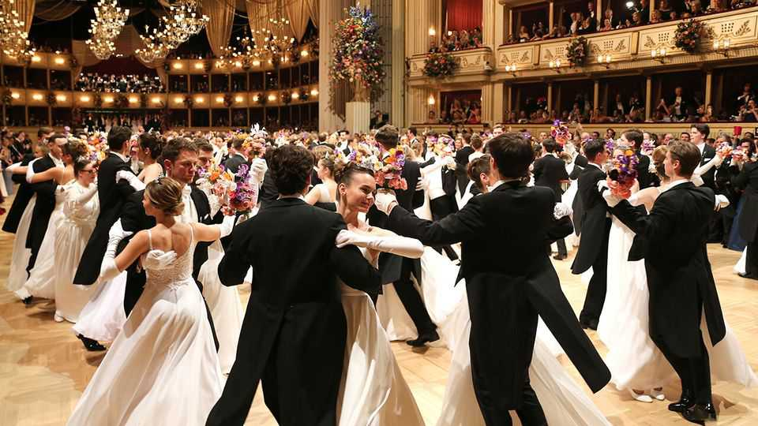

文化 | 三的力量
在维也纳，华尔兹与时代同步
年轻人和老年人都喜欢随着约翰·施特劳斯二世的曲调跳舞
2025年10月23日

摘要：维也纳国家歌剧院每年举办一次奢华的舞会。当你进入宏伟的礼堂时，你感觉仿佛回到了过去：香槟流淌，数百名穿着礼服的女性和穿着燕尾服的男性在舞池中翩翩起舞。没有人不跳华尔兹就离开，通常是由"华尔兹之王"约翰·施特劳斯二世创作的。10月25日，维也纳将举行仪式和演出庆祝施特劳斯诞辰200周年。

维也纳国家歌剧院每年举办一次奢华的舞会。当你进入宏伟的礼堂时，你感觉仿佛回到了过去：香槟流淌，数百名穿着礼服的女性和穿着燕尾服的男性在舞池中翩翩起舞。没有人不跳华尔兹就离开，通常是由"华尔兹之王"约翰·施特劳斯二世创作的。10月25日，维也纳将举行仪式和演出庆祝施特劳斯诞辰200周年。他可能是19世纪奥地利最接近流行明星的：他创作了歌剧、芭蕾舞和交响作品，但最让人记住的是他的华尔兹（他写了150多首）。维也纳华尔兹开始是一个简单的农民舞蹈；施特劳斯给它一个贵族的气息。这座城市的冬季舞会重新捕捉了仪式和优雅的感觉。

这么多年后，华尔兹正在蓬勃发展。与维也纳炸肉排和精神分析一起，它是维也纳最珍贵的文化出口之一。（2017年，联合国教科文组织将维也纳华尔兹添加到奥地利非物质文化遗产名录中。）施特劳斯的"蓝色多瑙河"的轻快旋律仍然是世界上最可识别的曲调之一，并在从"辛普森一家"到"鱿鱼游戏"的电视节目中亮相。像艾丽西亚·凯斯这样的流行明星借用了华尔兹简单的三拍节奏。数百万人收看观看名人在"严格来跳舞"和"与星共舞"等节目中掌握维也纳华尔兹。

其长寿的部分原因是其清晰度。易于跟随的重复旋律和对第一拍的强烈强调使音乐易于跳舞。这可能就是为什么华尔兹仍然是新婚夫妇第一支舞的热门选择（尽管维也纳版本很快，需要连续旋转）。"当你看到美丽华尔兹的简单性时，它会让你屏息，""严格来跳舞"的创意总监杰森·吉尔基森说。"就像热刀切黄油一样。"

维也纳在保持华尔兹传统活力方面发挥了关键作用。维也纳爱乐乐团每年元旦演奏施特劳斯的华尔兹：通过抽签分配的音乐会门票可以高达1200欧元（1400美元）。孩子们在全市的工作室学习跳华尔兹。当地人和游客都可以参加每年举办的400多个舞会之一。被认为是最高贵的维也纳歌剧舞会的标准入场费超过400欧元，但近年来门票需求激增。

一些华尔兹爱好者正在取消严格的着装规定，转而支持更轻松和现代的东西。近年来，名单上增加了新活动，如LGBT+人群的彩虹舞会。"年轻人对此疯狂，"维也纳旅游局首席执行官诺伯特·克特纳断言。对于寻求联系的人来说，华尔兹是"约会应用程序的魅力替代品"。在最近的一个周五晚上，穿着连衣裙和牛仔裤的年轻人聚集在屋顶酒吧喝鸡尾酒和聊天。当他们随着弦乐四重奏演奏的施特劳斯华尔兹摇摆时，也许有些人希望找到那个人就像一、二、三一样容易。■

【一｜维也纳华尔兹舞会】维也纳国家歌剧院每年举办一次奢华的舞会，当你进入宏伟的礼堂时感觉仿佛回到了过去，没有人不跳华尔兹就离开，通常是由"华尔兹之王"约翰·施特劳斯二世创作的。

【二｜华尔兹正在蓬勃发展】这么多年后华尔兹正在蓬勃发展，与维也纳炸肉排和精神分析一起，它是维也纳最珍贵的文化出口之一，施特劳斯的"蓝色多瑙河"仍然是世界上最可识别的曲调之一。

【三｜其长寿的原因】其长寿的部分原因是其清晰度，易于跟随的重复旋律和对第一拍的强烈强调使音乐易于跳舞，华尔兹仍然是新婚夫妇第一支舞的热门选择。

【四｜维也纳保持传统】维也纳在保持华尔兹传统活力方面发挥了关键作用，维也纳爱乐乐团每年元旦演奏施特劳斯的华尔兹，孩子们在全市的工作室学习跳华尔兹，标准入场费超过400欧元但需求激增。

【五｜现代华尔兹】一些华尔兹爱好者正在取消严格的着装规定，转而支持更轻松和现代的东西，年轻人对此疯狂，华尔兹是约会应用程序的魅力替代品，年轻人和老年人都喜欢随着约翰·施特劳斯二世的曲调跳舞。

总的来说，在维也纳，华尔兹与时代同步。维也纳华尔兹舞会奢华，华尔兹正在蓬勃发展，其长寿的原因是清晰度，维也纳在保持传统活力方面发挥了关键作用，现代华尔兹更轻松和现代，年轻人和老年人都喜欢随着约翰·施特劳斯二世的曲调跳舞。
