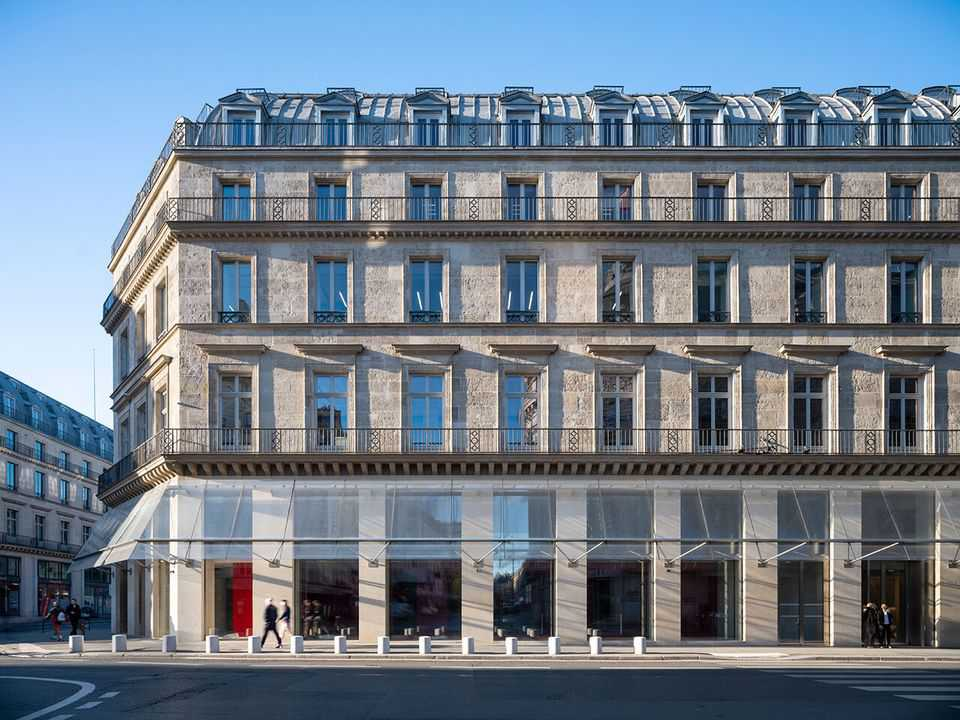

文化 | 带来闪亮
新的卡地亚基金会正在帮助重塑巴黎市中心
但游客会喜欢吗？
2025年10月23日

摘要：在其历史的大部分时间里，卢浮宫对面、在繁华的里沃利街上的建筑是一家受欢迎的百货公司。它甚至出现在埃米尔·左拉的小说中，他喜欢为穷人写颂词；他将其描述为"一座寺庙，有诱惑的燃烧祭坛"。现在这座建筑将诱惑一种不同类型的信徒：艺术爱好者。10月25日，由法国珠宝商支持的博物馆卡地亚基金会经过多年的翻新后搬到那里。这座建筑可能在外面看起来是经典的奥斯曼风格，但里面感觉非常2025年——大量使用玻璃、混凝土和钢材。

在其历史的大部分时间里，卢浮宫对面、在繁华的里沃利街上的建筑是一家受欢迎的百货公司。它甚至出现在埃米尔·左拉的小说中，他喜欢为穷人写颂词；他将其描述为"一座寺庙，有诱惑的燃烧祭坛"。现在这座建筑将诱惑一种不同类型的信徒：艺术爱好者。10月25日，由法国珠宝商支持的博物馆卡地亚基金会经过多年的翻新后搬到那里。这座建筑可能在外面看起来是经典的奥斯曼风格，但里面感觉非常2025年——大量使用玻璃、混凝土和钢材。开幕展，展出至8月，展示了约100位艺术家的作品，这些艺术家在基金会41年的历史中参加过展览，包括琼·米切尔、詹姆斯·特瑞尔和其他不太知名的名字。（博物馆的前一个地点在几公里之外。）

展览是折衷的。这里是一个基座上的大理石猫雕塑；那里是数万根羽毛形成一棵树的形状。楼上是"超现实主义"雕塑，一个荒凉的女人拿着塑料袋，不远处是一个自画像，显示世界地图在闪光中倒置。一些人想知道博物馆是否更多地是为法国前卫品味而不是全球游客设计的。它不会成为每个人的茶。

尽管如此，开幕有三个重要原因。首先，它是法国奢侈品公司通过私人博物馆在艺术上留下印记的更广泛趋势的一部分，理论是与艺术家的联系反映良好地体现在他们的品牌上。卡地亚基金会几十年前通过资助在世艺术家创作原创作品开创了这一趋势。今天，人们的消费主义（以及公司由此产生的利润）改变了访问巴黎的人消费艺术的方式。路易威登基金会和皮诺收藏举办的展览与国有博物馆举办的展览竞争，有时甚至超过它们。

其次，卡地亚基金会显示巴黎市中心如何巩固其作为"文化中心"的地位，艺术咨询公司Twentieth的联合创始人奥雷莉·柯西观察到。只有几分钟的步行距离是皮诺收藏，它在2021年在商业交易所开放，更不用说卢浮宫、装饰艺术博物馆和网球场国家画廊了。

最后，卡地亚基金会是一个关于现代博物馆可能看起来如何的迷人实验。建筑师让·努维尔设计了空间，有五个可移动的平台，从200到约360平方米（2150到3875平方英尺）不等。"每次访问者回到基金会时，内部建筑都会看起来完全不同，"展览策展人贝阿特丽斯·格勒尼耶解释说。移动地板的巨大滑轮是可见的：几乎本身就是艺术品，也是提醒这座新博物馆所需的投资。它的价格标签估计为数亿欧元。"成本是荒谬的——而且是保密的，"卡地亚基金会主席阿兰·多米尼克·佩兰说，听起来很像一个刚刚花钱买了一个闪亮新珠宝的人。■

【一｜卡地亚基金会搬家】卢浮宫对面、在繁华的里沃利街上的建筑是一家受欢迎的百货公司，现在这座建筑将诱惑艺术爱好者，10月25日卡地亚基金会经过多年的翻新后搬到那里，这座建筑外面看起来是经典的奥斯曼风格，但里面感觉非常2025年。

【二｜开幕展】开幕展展示了约100位艺术家的作品，这些艺术家在基金会41年的历史中参加过展览，展览是折衷的，一些人想知道博物馆是否更多地是为法国前卫品味而不是全球游客设计的。

【三｜奢侈品公司趋势】它是法国奢侈品公司通过私人博物馆在艺术上留下印记的更广泛趋势的一部分，卡地亚基金会几十年前通过资助在世艺术家创作原创作品开创了这一趋势，人们的消费主义改变了访问巴黎的人消费艺术的方式。

【四｜巴黎市中心文化中心】卡地亚基金会显示巴黎市中心如何巩固其作为文化中心的地位，只有几分钟的步行距离是皮诺收藏，更不用说卢浮宫、装饰艺术博物馆和网球场国家画廊了。

【五｜现代博物馆实验】卡地亚基金会是一个关于现代博物馆可能看起来如何的迷人实验，建筑师让·努维尔设计了空间，有五个可移动的平台，每次访问者回到基金会时内部建筑都会看起来完全不同，成本是荒谬的——而且是保密的。

总的来说，新的卡地亚基金会正在帮助重塑巴黎市中心。卢浮宫对面的建筑经过多年的翻新后搬到那里，里面感觉非常2025年。它是法国奢侈品公司通过私人博物馆在艺术上留下印记的趋势的一部分，显示巴黎市中心如何巩固其作为文化中心的地位，是一个关于现代博物馆可能看起来如何的迷人实验，但游客会喜欢吗？
