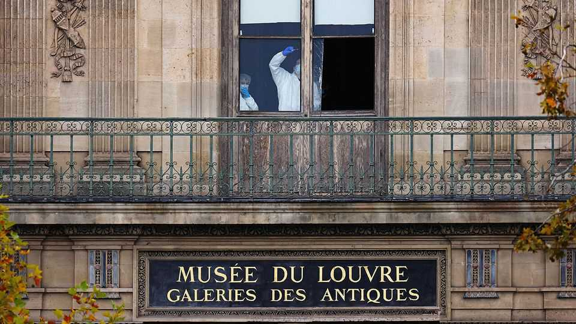
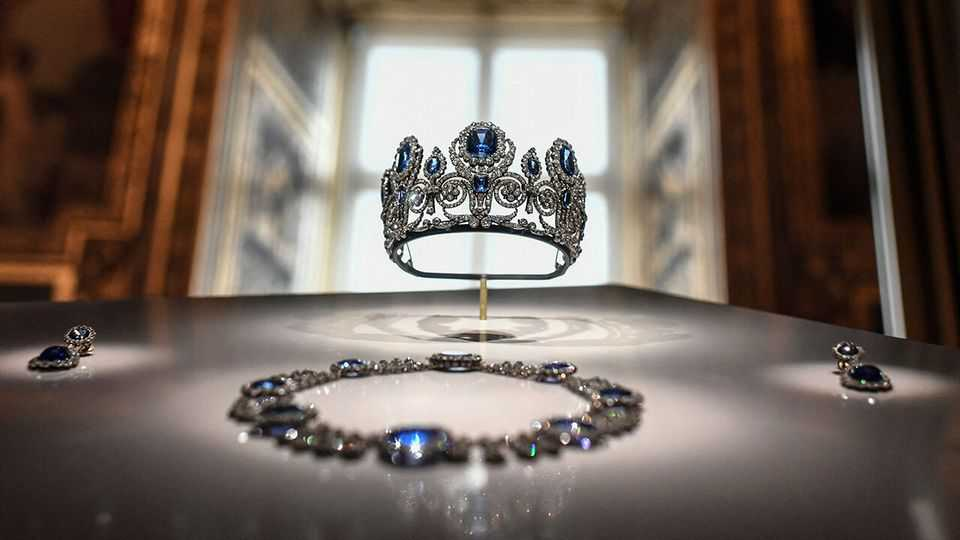
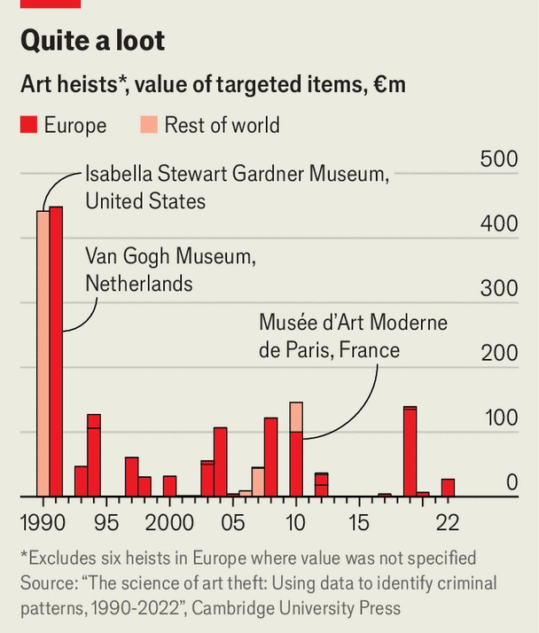
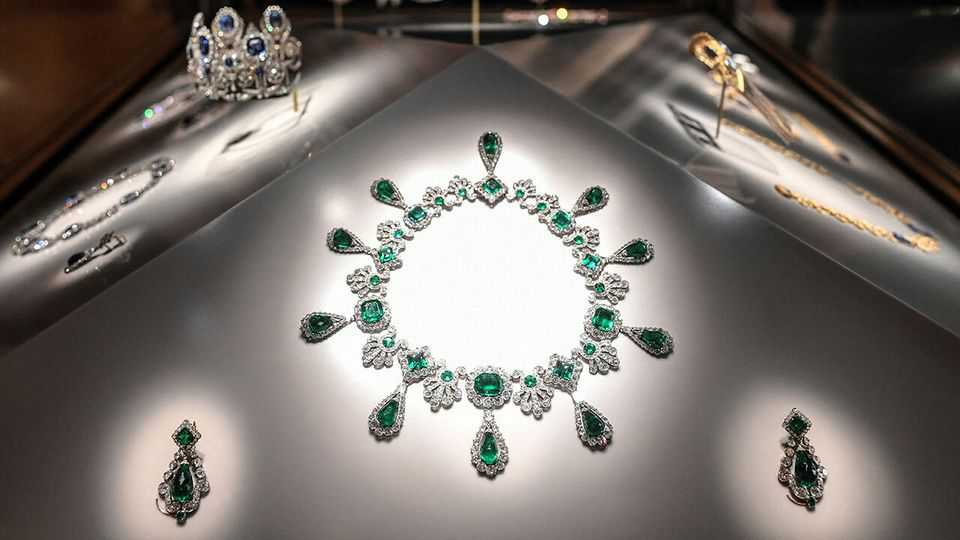

文化 | 盗窃的艺术
从卢浮宫的大胆抢劫中吸取的教训
博物馆盗窃出人意料地常见
2025年10月23日

摘要：两个蒙面小偷只用了七分钟就溜过阿波罗画廊的窗户，使用圆盘切割器刺穿两个展示柜的安全玻璃，并带走了九件拿破仑和皇家珠宝。10月19日上午9点30分，这对使用卡车安装的梯子闯入卢浮宫；他们以同样的方式离开，然后在踏板车上与两个同伙一起逃跑。匆忙中他们掉下了一件赃物。这次袭击击中了法国国家和艺术世界的核心。

两个蒙面小偷只用了七分钟就溜过阿波罗画廊的窗户，使用圆盘切割器刺穿两个展示柜的安全玻璃，并带走了九件拿破仑和皇家珠宝。10月19日上午9点30分，这对使用卡车安装的梯子闯入卢浮宫；他们以同样的方式离开，然后在踏板车上与两个同伙一起逃跑。匆忙中他们掉下了一件赃物。这次袭击击中了法国国家和艺术世界的核心。2024年有近900万游客，卢浮宫是任何地方最受欢迎的博物馆。位于巴黎历史中心的原皇家宫殿，它由400多个画廊组成，展示35000件艺术品。横跨从美索不达米亚到欧洲的文明，收藏还将法国的皇家和帝国过去与其共和现在联系起来。总统埃马纽埃尔·马克龙称这次抢劫是对"我们的历史"的攻击。

被拿走的八件物品，根据法国官员的说法价值8800万欧元（1.02亿美元），是国家皇冠珠宝收藏的一部分。保存在博物馆最豪华的画廊中，它们包括拿破仑在1810年婚礼上送给玛丽-路易丝的镶有祖母绿的项链和耳环，以及由212颗珍珠、1998颗钻石和992颗玫瑰切钻石组成的头饰，属于拿破仑三世的妻子尤金妮皇后。小偷从蓝宝石收藏中拿走了一只耳环、一条项链和一个头饰。

卢浮宫以前曾被瞄准——最著名的是1911年，当时"蒙娜丽莎"被偷——但规模没有这么大。荷兰艺术盗窃专家亚瑟·布兰德将这次抢劫比作1990年从波士顿伊莎贝拉·斯图尔特·加德纳博物馆抢夺13件艺术品，包括维米尔的"音乐会"和伦勃朗的"基督在加利利海的风暴中"。第二年，在阿姆斯特丹进行了一次更大胆的尝试。罪犯带走了20幅画，包括梵高的"吃土豆的人"，尽管艺术品很快被追回。但"卢浮宫是终极抢劫，"布兰德先生说。"没有人认为有人敢从卢浮宫偷东西。"这种大胆值得好莱坞剧本。确实，在"亚森·罗宾"中，一部热门法国犯罪系列，主角从博物馆偷走了一条曾经属于玛丽·安托瓦内特的钻石项链。

在现实中，博物馆盗窃出人意料地常见。法国最近看到了一些来自较小博物馆的抢劫。桑德拉·克洛佩斯和马克·巴尔塞尔斯在4月发表的对1990年至2022年40起案件的分析，将主要类型的袭击分为五类。最常见的是隐形袭击，占15起抢劫：小偷在不提醒安全人员的情况下带走艺术品。"砸抢"袭击是第二常见的，占分析的11起。被拿走的物品中超过一半是画作；只有4%是珠宝。不到一半被追回。卢浮宫小偷，

巴黎的一位艺术品估价师说，将试图拆解这些物品，出售黄金并重新切割宝石。他说，这些物品本身没有市场。

在巴黎，人们的注意力现在集中在出了什么问题以及如何阻止它再次发生。司法部长热拉尔·达尔马宁说，这次袭击给了法国"一个可怕的形象"。一辆卡车可以在星期天早上在繁忙街道上停在卢浮宫外而不引起怀疑是令人担忧的；小偷可以在触发警报的情况下带着皇冠珠宝撤离，这提出了关于博物馆安全的严重问题。

"诀窍是放慢小偷的速度，"布兰德先生说。在大多数情况下，克洛佩斯女士和巴尔塞尔斯先生指出，"小偷偷走物品的速度比传感器提醒安全部队的速度快。"在一份泄露的报告中，法国国家审计员指出卢浮宫在部署现代安全设备方面存在"持续"延误。博物馆馆长洛朗斯·德·卡尔斯在2021年接管时提出了这个问题。但是，就像所有公共博物馆一样，预算紧张。法国文化部长拉希达·达蒂本周谈到了"40年的忽视"。没有人想承担责任，但政治压力正在上升，要求有人掉头。■

【一｜大胆抢劫】两个蒙面小偷只用了七分钟就溜过阿波罗画廊的窗户，使用圆盘切割器刺穿两个展示柜的安全玻璃，并带走了九件拿破仑和皇家珠宝，这次袭击击中了法国国家和艺术世界的核心。

【二｜被拿走的物品】被拿走的八件物品价值8800万欧元，是国家皇冠珠宝收藏的一部分，包括拿破仑送给玛丽-路易丝的镶有祖母绿的项链和耳环，以及由212颗珍珠、1998颗钻石和992颗玫瑰切钻石组成的头饰。

【三｜博物馆盗窃常见】卢浮宫以前曾被瞄准但规模没有这么大，荷兰艺术盗窃专家将这次抢劫比作1990年从波士顿博物馆抢夺13件艺术品，在现实中博物馆盗窃出人意料地常见，法国最近看到了一些来自较小博物馆的抢劫。

【四｜安全问题】一辆卡车可以在星期天早上在繁忙街道上停在卢浮宫外而不引起怀疑是令人担忧的，小偷可以在触发警报的情况下带着皇冠珠宝撤离，这提出了关于博物馆安全的严重问题。

【五｜教训】诀窍是放慢小偷的速度，小偷偷走物品的速度比传感器提醒安全部队的速度快，法国国家审计员指出卢浮宫在部署现代安全设备方面存在持续延误，预算紧张，40年的忽视，没有人想承担责任。

总的来说，从卢浮宫的大胆抢劫中吸取的教训。两个蒙面小偷只用了七分钟就带走了九件拿破仑和皇家珠宝，价值8800万欧元。博物馆盗窃出人意料地常见，卢浮宫以前曾被瞄准但规模没有这么大。这次袭击提出了关于博物馆安全的严重问题，诀窍是放慢小偷的速度，但40年的忽视，预算紧张，没有人想承担责任。
