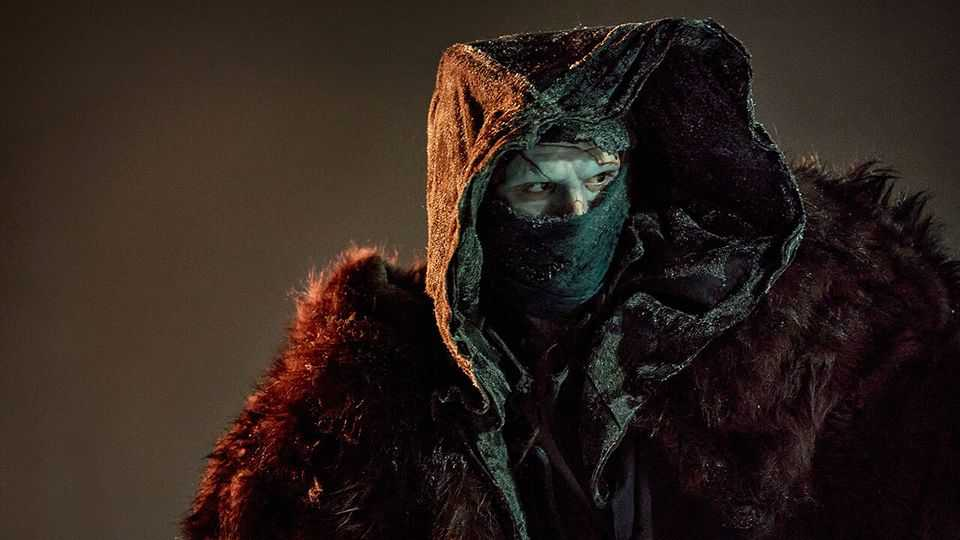
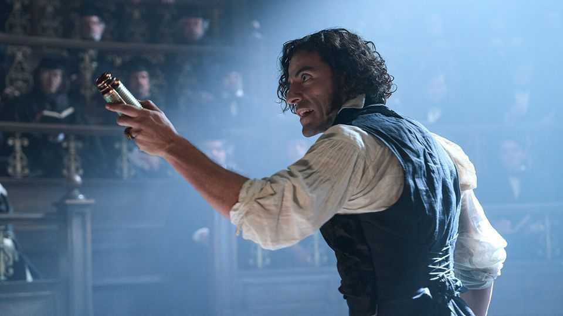

文化 | 背景故事
Instagram时代的美丽"科学怪人"
在吉尔莫·德尔·托罗的电影中，一切——包括怪物——看起来都很华丽
2025年10月23日

摘要：他有一双水汪汪的眼睛、飘逸的头发、黄色的皮肤和黑色的嘴唇。他身高八英尺。十几岁的玛丽·雪莱在"科学怪人"中梦想的生物生动地具体。但是，对于电影制作人来说，他也是一个诱人的轮廓。她希望"对我们天性中神秘恐惧说话"的故事提供了一个强大的主题调色板：上帝和科学、自然和养育、忽视和过失、命运和自由意志。导演选择和混合这些色调来为他们时代的怪物制作。最新复活他的是吉尔莫·德尔·托罗，他的"科学怪人"现在在电影院上映，11月7日在Netflix上。

他有一双水汪汪的眼睛、飘逸的头发、黄色的皮肤和黑色的嘴唇。他身高八英尺。十几岁的玛丽·雪莱在"科学怪人"中梦想的生物生动地具体。但是，对于电影制作人来说，他也是一个诱人的轮廓。她希望"对我们天性中神秘恐惧说话"的故事提供了一个强大的主题调色板：上帝和科学、自然和养育、忽视和过失、命运和自由意志。导演选择和混合这些色调来为他们时代的怪物制作。最新复活他的是吉尔莫·德尔·托罗，他的"科学怪人"现在在电影院上映，11月7日在Netflix上。在他无数的银幕出场中，这个生物以你能想象的每一种伪装出现，还有一些你可能无法想象的。他已经被与西部片、太空冒险、恶搞、音乐剧和（像许多新技术一样）色情杂交；他催生了高雅的即兴作品如"可怜的东西"和低俗的如"怪诞科学"。即使如此，德尔·托罗先生对这个神话故事的着色是独特和说明问题的。

它看起来很华丽。展开在19世纪中期，书出版几十年后，这部电影是拜伦式发型和天鹅绒长袍的狂欢节。在对雪莱框架装置的一个调整中，维克多·弗兰肯斯坦（由奥斯卡·伊萨克扮演）向一位丹麦船长讲述了他令人毛骨悚然的历史，后者从极地冰中救了他。他在一座哥特式塔中组装他的人形生物，相机血腥地停留在他对眼球、骨锯和收缩皮肤的技艺上。

这个"科学怪人"本身似乎部分由电影碎片组成。主角利用闪电，就像"回到未来"一样。被他的制造者憎恶并被困在谷仓里，这个生物（雅各布·埃洛迪，如图）像大个子白雪公主一样与一些老鼠交朋友。他在兰博式的暴行中打击人和（出于某种原因）狼。医生和怪物一起出现在镜子中，这是对第一次银幕改编中一个镜头的致敬，托马斯·爱迪生1910年的无声版本。

但这个也有新的触感。它异常关注弗兰肯斯坦实验的资金——和身体部位——来自哪里。一个军火商资助它们；尸体从绞刑和战场上收获。这是一个带有现代良知的幻想，嵌入在更广泛的死亡经济中。

至于那些搜刮部分的总和：在道德和身体上，他远没有雪莱可怕的原始和许多他的电影前辈那么可怕。在小说中，他谋杀了弗兰肯斯坦的兄弟、未婚妻和最好的朋友。在这里，他手上的血大多属于群众演员。与1931年鲍里斯·卡洛夫脖子螺栓的食尸鬼相比，他是一个有雕刻身材和美丽眉毛的粗糙帅哥；一个Instagram时代的身体意识怪物。

也是直升机式父母时代。对于那些丰富的主题，德尔·托罗先生强调父权。而在文本中弗兰肯斯坦的父亲是慈爱的，在这里他是疏远和严厉的。起初医生自己被自己的神奇后代迷住了，但失眠和疲惫，他很快就暴躁和残忍——一个不称职的父亲和一个死肉父亲。看在上帝的份上，你最终会想，给他的生物找一个治疗师。

同时，弗兰肯斯坦的基本使命发生了转变。在书中，他的主要、傲慢的目标是发现"长生不老药"。他在新电影中也想这样做，但他的最终目标是生命周期的另一端：使用他杀不死的创造物来"征服死亡"。在这方面，他更不像古代的亡灵法师，而像今天追求不朽的亿万富翁和科学家。

所以德尔·托罗先生的是一个非常当代的"科学怪人"。然而，毫无疑问会有更多的重新制作（从明年上映的"新娘！"开始，其中玛吉·吉伦哈尔将行动搬到1930年代的芝加哥）。科学本身也需要重新启动。毕竟，创造生命的追求不再局限于像弗兰肯斯坦那样的实验室，它们运行在有机组织和细胞上。这些天，希望和令人不安的恐惧集中在人工智能（AI）上。在最黑暗的预言中，AI将在自我延续的循环中增强自己，使人类变得过时。

在小说中，弗兰肯斯坦和他的怪物有很多共同点：痴迷、复仇的渴望、对遗忘的渴望和灼热的孤独。也许在雪莱不朽寓言的未来迭代中，他们可能分享其他东西。在真正的前沿版本中，这个生物不会是穿着血肉的人类框架，而是由芯片制成的AI模型。医生也会如此。■

【一｜Instagram时代的科学怪人】他有一双水汪汪的眼睛、飘逸的头发、黄色的皮肤和黑色的嘴唇，身高八英尺，十几岁的玛丽·雪莱在"科学怪人"中梦想的生物生动地具体，最新复活他的是吉尔莫·德尔·托罗。

【二｜看起来很华丽】它看起来很华丽，展开在19世纪中期，这部电影是拜伦式发型和天鹅绒长袍的狂欢节，维克多·弗兰肯斯坦在一座哥特式塔中组装他的人形生物，相机血腥地停留在他对眼球、骨锯和收缩皮肤的技艺上。

【三｜新的触感】这个也有新的触感，它异常关注弗兰肯斯坦实验的资金和身体部位来自哪里，一个军火商资助它们，尸体从绞刑和战场上收获，这是一个带有现代良知的幻想。

【四｜强调父权】他远没有雪莱可怕的原始和许多他的电影前辈那么可怕，与1931年鲍里斯·卡洛夫相比，他是一个有雕刻身材和美丽眉毛的粗糙帅哥，一个Instagram时代的身体意识怪物，也是直升机式父母时代，德尔·托罗先生强调父权。

【五｜当代科学怪人】弗兰肯斯坦的基本使命发生了转变，他的最终目标是使用他杀不死的创造物来征服死亡，在这方面他更不像古代的亡灵法师，而像今天追求不朽的亿万富翁和科学家，这是一个非常当代的科学怪人。

总的来说，Instagram时代的美丽"科学怪人"。在吉尔莫·德尔·托罗的电影中，一切——包括怪物——看起来都很华丽。它异常关注实验的资金和身体部位来自哪里，强调父权，弗兰肯斯坦的基本使命发生了转变，目标是征服死亡，这是一个非常当代的科学怪人，也许在真正的前沿版本中，这个生物不会是穿着血肉的人类框架，而是由芯片制成的AI模型。
