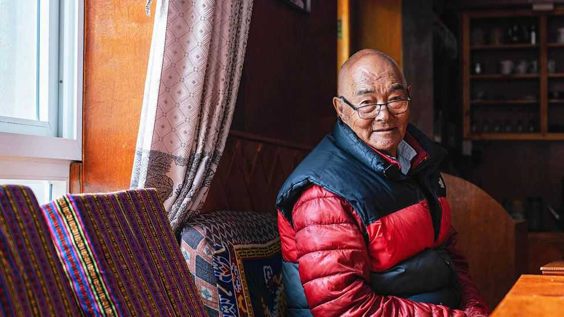

讣告 | 女神还是摇钱树？
康查·夏尔巴对珠穆朗玛峰有着复杂的感情
希拉里探险队最后幸存的成员于10月16日去世，享年92或93岁
2025年10月23日

摘要：当埃德蒙·希拉里和丹增·诺尔盖于1953年5月29日到达珠穆朗玛峰顶部时，当时19岁的康查·夏尔巴在下方的营地。另外两个夏尔巴人和他在一起，像他一样被选中，因为他们可以在没有补充氧气的情况下爬到27000英尺。不仅仅是爬，在渗入骨头的冰冷风和伤害他们脚的前军靴中。他们还必须背着睡袋、绳索、备用氧气瓶和登山者需要的所有其他装备。在南峰，他们搭起了希拉里和丹增过夜的帐篷；直到两个人下来到他们那里，兴高采烈，他们才听到这个消息。

当埃德蒙·希拉里和丹增·诺尔盖于1953年5月29日到达珠穆朗玛峰顶部时，当时19岁的康查·夏尔巴在下方的营地。另外两个夏尔巴人和他在一起，像他一样被选中，因为他们可以在没有补充氧气的情况下爬到27000英尺。不仅仅是爬，在渗入骨头的冰冷风和伤害他们脚的前军靴中。他们还必须背着睡袋、绳索、备用氧气瓶和登山者需要的所有其他装备。在南峰，他们搭起了希拉里和丹增过夜的帐篷；直到两个人下来到他们那里，兴高采烈，他们才听到这个消息。在那纯粹的喜悦时刻之后，拥抱和一点舞蹈，他们把东西收拾好，再次带到大本营。

在整个探险过程中，一旦攀登对牦牛来说太陡，他的主要职责就是携带煤油和炉子。登山者用这些来烹饪他们奇怪的西方食物，都在罐头里。他试过，粉末橙汁是他唯一能接受的。像他这样的夏尔巴人和搬运工只吃他们通常的糌粑，大麦粥，热的或冷的，与融化的雪混合。对他来说，这就像氧气一样好。

除了搬运之外，他还必须帮助数十名其他夏尔巴人建造六个营地并在山上铺设一条道路。在一个地方，坤布冰瀑，最近的降雪打开了一个巨大的裂缝，挡住了他们的路。没有梯子几乎无法攀爬3000英尺，他们无法继续，所以十个人徒步回到他的家乡村庄南池巴扎，砍下了十棵高大的树来造桥。每个夏尔巴人然后把一棵树带到冰瀑。生活在尼泊尔这个地区，通往珠穆朗玛峰的大门，的优势是它有很多树。他的祖父，帮助建立了定居点，也通过袭击森林幸存下来，在他的情况下是为了块茎和荨麻。

然而，话虽如此，南池不是一个容易生活的地方。除了种植土豆，几乎没有什么可做的，这些土豆几乎可以换取一切：盐、糖，甚至康查家在小农场种植的玉米和小米。他从童年开始的工作（从未上过学）就是交易家里拥有的任何东西，步行数天穿过巨大的山脉到印度或西藏。他的第一次旅行是带30公斤尼泊尔纸到西藏做转经轮。后来，凭借他敏锐的青少年眼光寻找机会，他将多余的喜马拉雅牧羊犬（在村子里收集的流浪狗）卖给印度的热切买家，每只八卢比。山脉是他的市场。

然而，他仍然没有像他希望的那样繁荣。其他村庄的男人有更好的衣服和更多的钱。相当快，他意识到他们的秘密在于大吉岭，他们在那里找到了引导登山者的工作。他的父亲，本身就是一名登山者，认识丹增，所以康查出发去大吉岭（步行五天）见他；丹增雇用他作为希拉里探险队的搬运工。这份工作是为期90天，每天八卢比，巨大的钱。他还得到了冰爪、最新的攀登装备和超厚的衣服，所有这些他后来都卖了来养活他的六个孩子。因此，在接下来的二十年里，当他的整个村庄在他周围变得富有时，他作为登山者的高海拔助手工作并不令人惊讶。

然而，这一切还有另一面困扰着他。作为一个孩子，他被教导珠穆朗玛峰是最神圣的山：卓玛朗玛，世界之母女神。他从未近距离看到她，但从老一辈那里听到了故事。在那些日子里，没有村民会梦想踏足那里。当他第一次这样做时，在探险中，他小心地说他的佛教法会，他对正确道路的承诺，并带着尊重攀登。随着他获得高度，他越来越惊叹于山峰的原始美丽和他可以看到的冰川数量。但当卓玛朗玛被"征服"时，他铺设的那条道路很快吸引了数十人，然后是数百人，朝着顶峰。他们留下了帐篷、床垫、食品包装、烟头和他们自己的污物，弄脏了女神。这太可怕了。

山脉也在改变。在大本营周围曾经有茂盛的草，牦牛在吃草。逐渐地，它变成了压实的土和岩石。曾经白雪覆盖的山峰变成了黑色；冰川几乎在他眼前融化。他不认为这是全球变暖，尽管他听说过。原因更简单，女神和诸神被踩踏了；他们很愤怒。

他的答案是每年只有一个攀登季节。但他不能假装他抱歉游客涌入南池。没有他们，人们会做什么？这将回到坐着靠土豆生活；回到贫穷，或非法交易。有一段时间，他卖瑞士手表，在加尔各答以300卢比购买，以3000卢比卖给驻扎在西藏的中国士兵。这些方便的利润使他入狱。

最终，他在南池经营了一家酒店，涅槃小屋，特色是夏尔巴蔬菜炖菜和游客与他交谈的机会，而他的妻子提供牛奶甜茶。（徒步旅行者教他喝酒，但他已经停止了。）他的孩子不是登山者；两个儿子经营酒店，根据他坚定的建议。然而，当游客打电话来听他的记忆时，许多人这样做，他会安静地继续拨弄他的念珠。当他早上散步时，作为一个非常老的人，穿过满是咖啡馆和攀登装备商店的街道，他慢慢地转动他的转经轮。

每天几次，他去当地的四个寺院祈祷，希望登山者和徒步旅行者能够安全地避开雪崩。

他自己从未到达珠穆朗玛峰的顶峰。他最好的攀登仍然短327英尺。七次，他请求政府许可走更高，但被拒绝了。也许，毕竟，他没有犯下那个最终侵犯是更好的。■

【一｜希拉里探险队】当埃德蒙·希拉里和丹增·诺尔盖于1953年5月29日到达珠穆朗玛峰顶部时，当时19岁的康查·夏尔巴在下方的营地，他的主要职责就是携带煤油和炉子，他还必须帮助数十名其他夏尔巴人建造六个营地并在山上铺设一条道路。

【二｜南池不是容易生活的地方】南池不是一个容易生活的地方，除了种植土豆几乎没有什么可做的，他从童年开始的工作就是交易家里拥有的任何东西，步行数天穿过巨大的山脉到印度或西藏，山脉是他的市场。

【三｜大吉岭工作】他意识到其他村庄男人的秘密在于大吉岭，他们在那里找到了引导登山者的工作，丹增雇用他作为希拉里探险队的搬运工，这份工作是为期90天，每天八卢比，巨大的钱，在接下来的二十年里他作为登山者的高海拔助手工作。

【四｜复杂的感情】作为一个孩子，他被教导珠穆朗玛峰是最神圣的山：卓玛朗玛，世界之母女神，当卓玛朗玛被征服时，他铺设的那条道路很快吸引了数百人朝着顶峰，他们留下了帐篷、床垫、食品包装、烟头，弄脏了女神，这太可怕了。

【五｜涅槃小屋】最终他在南池经营了一家酒店，涅槃小屋，特色是夏尔巴蔬菜炖菜和游客与他交谈的机会，他的孩子不是登山者，两个儿子经营酒店，每天几次他去当地的四个寺院祈祷，希望登山者和徒步旅行者能够安全地避开雪崩。

总的来说，康查·夏尔巴对珠穆朗玛峰有着复杂的感情。他是希拉里探险队最后幸存的成员，帮助建造六个营地并在山上铺设一条道路，大吉岭工作使他作为登山者的高海拔助手工作二十年，但他对珠穆朗玛峰有着复杂的感情，因为当卓玛朗玛被征服时游客弄脏了女神，最终他在南池经营了涅槃小屋，每天几次去寺院祈祷，希望登山者和徒步旅行者能够安全地避开雪崩。
