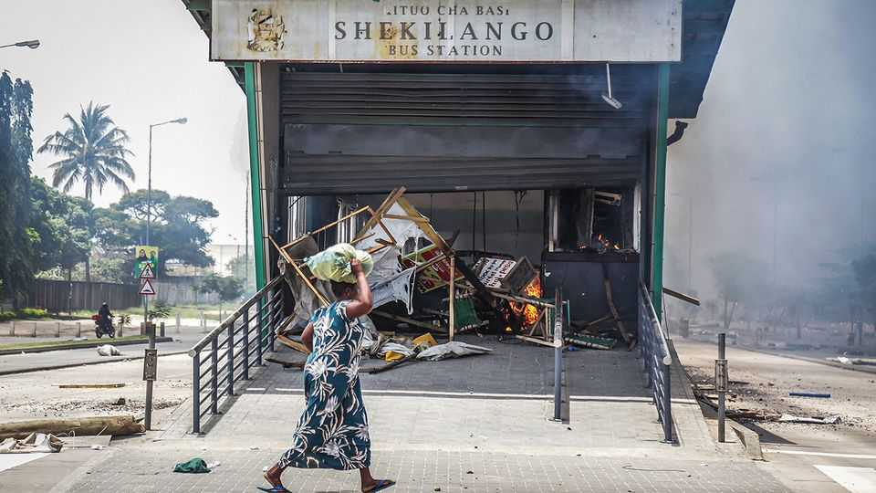

The world this week
Politics
November 6th 2025

Zohran Mamdani, a self-described democratic socialist, won New York’s mayoral race, and will be the first Muslim to lead the city. Despite polls suggesting the race was tightening, Mr Mamdani took 50% of the vote, compared with 42% for his main challenger, Andrew Cuomo. Mr Mamdani campaigned on making New York a more affordable place to live for workers, extolling policies such as rent freezes and free universal child care. Turnout was high. He was the first candidate for mayor to win over a million votes since John Lindsay in 1969. It was a good night for Democrats elsewhere in the smattering of elections that were held in America. Abigail Spanberger won the governor’s race in Virginia, taking the office back from the Republicans (governors cannot serve consecutive terms in the state). She is the first woman to hold the job.

And Mikie Sherrill chalked up a sizeable margin of victory to become New Jersey’s governor, holding the office for the Democrats.

In California voters overwhelmingly approved Proposition 50, a proposal to redraw the state’s congressional districts, which could see the Democrats gain five seats. Backed by the governor, Gavin Newsom, the blatantly partisan redistricting plan is intended to counter the Republicans’ blatantly partisan efforts to redraw congressional boundaries to their advantage elsewhere in America. In Maine a ballot measure that would have required voter ID at voting stations and restricted early access to voting was roundly rejected.

The Trump administration warned that it would have to reduce air traffic by 10% at America’s 40 busiest airports because the government shutdown has caused problems staffing traffic control. The shutdown passed the 35-day mark, making it the longest ever, breaking the previous record that had been set nearly seven years ago.

Dick Cheney died at the age of 84. Said to be the most powerful vice- president in American history, Mr Cheney was pivotal in helping to craft George W. Bush’s national-security policies in the aftermath of September 11th 2001, and was an unrepentant defender of America’s invasion of Iraq. He was defence secretary when Iraq invaded Kuwait in 1990. Often portrayed as a Machiavellian figure, Mr Cheney embraced his portrayal as the Darth Vader of the Bush government.

At least 142 people were killed as Typhoon Kalmaegi tore through the Philippines. Most of the deaths were due to drowning caused by the flooding that swept through towns in central Cebu province.

Major General Yifat Tomer-Yerushalmi, the Israel Defence Forces’ most senior lawyer, resigned and was then arrested after she took responsibility for the leaking of a video purporting to show the abuse by Israeli soldiers of a Palestinian detainee. Allies of Binyamin Netanyahu, the prime minister, seized on the scandal to renew their attack on Israel’s legal establishment.

Donald Trump said that America’s armed forces would take action in Nigeria to stop the “mass slaughter” of Christians by Islamist militants. His

comments caused alarm in Nigeria, though it was unclear what any specific action would entail. Terrorist groups in Nigeria often target civilians, both Christians and Muslims. There is no evidence of a Christian genocide.

More reports emerged of mass executions in el-Fasher, a city in Sudan’s Darfur region, carried out by the Rapid Support Forces, a rebel group that evolved from Arab militia. The World Health Organisation has condemned the reported killing of 460 people at one hospital alone. Other reports suggest men are being separated from women before being taken away to be shot.

Samia Suluhu Hassan was sworn into office for a second term as Tanzania’s president, following an election in which her opponents were all but disqualified from running. The opposition has rejected the result. Early estimates suggest that many hundreds of people have been killed during post-election violence, a figure that the government claims has been exaggerated.

The European Union published a progress report on countries that aspire to join the bloc. Albania and Montenegro are “on track” to close accession negotiations, it said, and Moldova’s reforms are “achievable”. It praised Ukraine for its progress, but said the pace of reforms to stamp out corruption

would have to quicken if it wanted to complete negotiations by late 2028. The report noted that more work was required on judicial reforms or stabilising politics in Bosnia, Kosovo, North Macedonia and Serbia if they want to join. It described Georgia as “a candidate country in name only”.

Russia claimed it was close to capturing Pokrovsk, a small city and transport hub in eastern Ukraine. Volodymyr Zelensky acknowledged that Ukrainian forces were being pressed hard but denied that Russia had taken full control of the area. If Pokrovsk falls it would be Russia’s biggest battlefield success since Avdiivka in February 2024.

Germany’s chancellor, Friedrich Merz, said that Syrians should no longer claim asylum because their country’s civil war is over, and that repatriations of Syrians should begin. At least 1m live in Germany after fleeing their home country. Mr Merz’s comments are intended to counter the rise of the populist-right Alternative for Germany (AfD) ahead of state elections next year.

Peru suspended diplomatic relations with Mexico, after a former prime minister took refuge in the Mexican embassy in Lima and requested asylum. Betssy Chávez was briefly prime minister in late 2022 at the end of the presidency of Pedro Castillo. She faces criminal charges in relation to Mr Castillo’s attempt to dissolve the legislature, which resulted in his ousting from office.

The minority Liberal government in Canada presented its first budget since Mark Carney became prime minister in March. The fiscal blueprint includes a big increase to investment in infrastructure that is intended in part to offset the economic damage from America’s tariffs. Defence spending will rise to 2% of GDP this year, increasing to NATO’s target of 5% by 2035. The budget deficit is set to balloon.

After two decades and at a cost of $1bn the Grand Egyptian Museum opened in Giza. It is described as the world’s largest archaeological collection. Among the 100,000 artefacts on display are the contents of the tomb of Tutankhamun.

This article was downloaded by zlibrary from [https://www.economist.com//the-world-this-week/2025/11/06/politics](https://www.economist.com//the-world-this-week/2025/11/06/politics)

