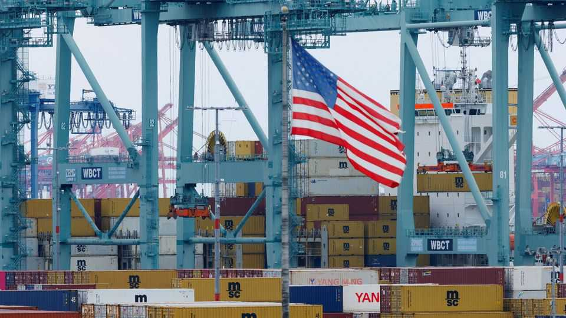
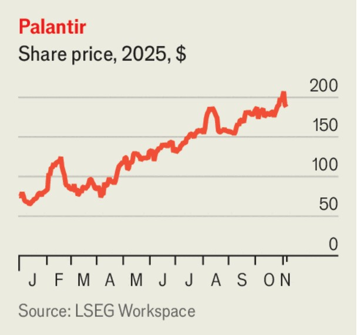

The world this week
Business
November 6th 2025

America’s Supreme Court heard arguments for and against the legality of Donald Trump’s tariffs. The case focuses on levies that Mr Trump imposed using his emergency powers, such as duties in relation to fentanyl trafficking, reciprocal levies and punitive tariffs, including those imposed on Brazil. Duties levied on certain industries, including car parts and chips, are not part of the case. The justices seemed inclined to doubt the legality of the tariffs. They may rule later this year or next year. Mr Trump renominated Jared Isaacman to head NASA. The president withdrew his original nomination in May, the White House suggesting at the time that Mr Isaacman was not in “complete alignment” with Mr Trump’s agenda. In part that was because Mr Isaacman, a space entrepreneur, is close to Elon Musk, with whom Mr Trump fell out. It had also emerged that Mr

Isaacman had donated to Democrats, though he describes himself as “relatively apolitical”.

The Bank of England kept its benchmark interest rate on hold at 4%, but noted that consumer-price inflation is “judged to have peaked” (at an annual rate of 3.8% in September). The vote to hold rates was 5-4, with four members of the policy committee opting for a quarter-percentage-point cut. It was the bank’s last decision before the government unveils a budget on November 26th that is expected to raise taxes. Markets think the bank will plump for a cut in December.

Unilever set December 8th as the date it will start selling shares in Magnum Ice Cream. The spin-off of the conglomerate’s ice-cream assets has been delayed by a month because of the government shutdown in America, which held up regulatory approval of the IPO. The stock will trade in a primary listing in Amsterdam and secondary listings in New York and London.

Orsted reported a quarterly net loss. The developer of offshore wind power blamed the “negative development” on tariffs and the Trump administration’s order to stop working on a big project off Connecticut and Rhode Island (a court has since reversed the order). Meanwhile, Orsted sold a 50% stake in the world’s largest wind farm, still under development off the coast of east England, to Apollo, a private-equity firm, for $6.5bn.

More evidence emerged of the effect of Mr Trump’s decision to scrap tax credits for new sales of electric vehicles. The incentive ended on September 30th; Ford said its sales of EVs in October fell by 25% compared with October last year. Jim Farley, the company’s chief executive, has predicted that sales of EVs will drop from around 10-12% to 5% of America’s car market in October.

One of the main beneficiaries of the boom in artificial intelligence, Palantir, reported a 63% year-on-year rise in quarterly revenue. The company develops data-analytics software and does a lot of military work. But Palantir’s share price fell sharply after it emerged that Michael Burry, an investor based in Silicon Valley, had placed a bet against its stock. Mr Burry is best known for predicting and profiting from the collapse of the subprime- mortgage market.

Amazon’s share price reached a record high after it announced a $38bn deal to provide OpenAI with data-centre capacity through Amazon Web Services. Amazon had earlier reported a 20% rise in quarterly revenue, year on year, at its cloud-computing business. That helped push net profit up by nearly 40%, to $21.2bn.

Struggling to compete against low-cost rivals in China, Starbucks decided to sell a majority stake in a new joint venture to Boyu Capital, a private-equity firm with headquarters in Hong Kong. Starbucks said the deal would help it expand in China, from today’s 8,000 coffee shops to an eventual goal of 20,000.

Kimberly-Clark, a consumer-goods company best known for its Andrex, Huggies and Kleenex brands, agreed to buy Kenvue, the maker of Tylenol,

in a deal valued at $48.7bn. Kenvue’s stock has struggled since being spun out of Johnson & Johnson in 2023. Its share price fell sharply in September when Donald Trump suggested that pregnant women shouldn’t take Tylenol, a pain-relief medication, claiming without good evidence that it has links to autism.

As it battles to retain its market share in America for weight-loss treatments, Novo Nordisk reported a 37% increase in sales at its obesity-care business for the first nine months of the year, but lowered the range of its expected annual revenue and profit. The Danish company could get a boost from the Trump administration’s ambition for Medicare and Medicaid to cover weight-loss medications for the first time.

The opening of Shein’s shopping outlet in Paris, its first physical store in the world, was overshadowed by news that France is investigating it for selling childlike sex dolls on its website (the wider investigation includes other ultra-cheap shopping platforms that are mainly based in China). The government said it would block Shein’s website for also selling weapons. The firm is co-operating. The news didn’t stop shoppers from queuing for Shein’s opening day, under the watchful eye of riot police.

This article was downloaded by zlibrary from [https://www.economist.com//the-world-this-week/2025/11/06/business](https://www.economist.com//the-world-this-week/2025/11/06/business)