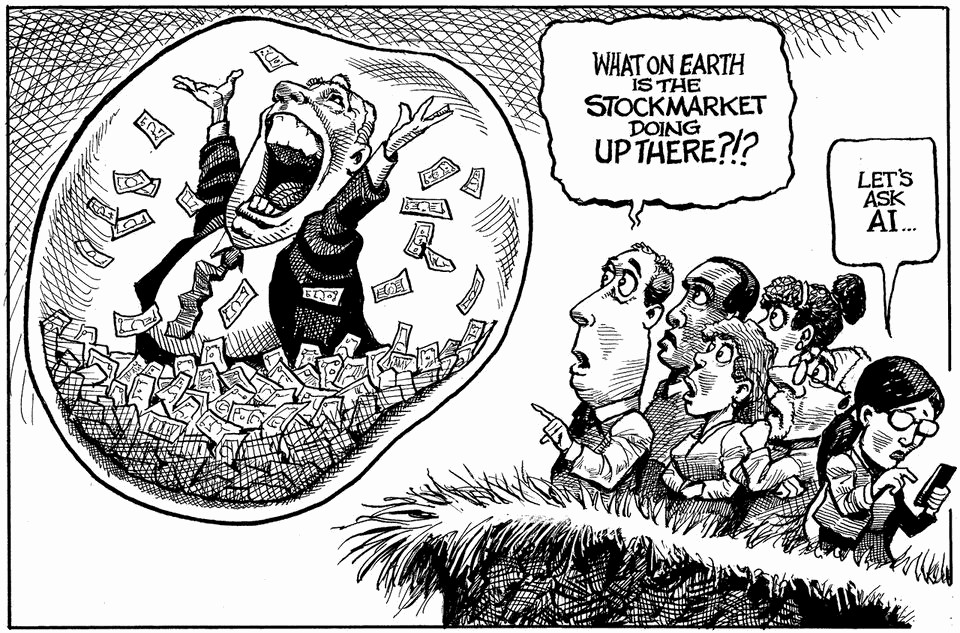

The world this week
The weekly cartoon
November 6th 2025

Dig deeper into the subject of this week’s cartoon: Why Wall Street won’t see the next crash comingHow much wealth would be destroyed by an AI stockmarket crash?The stockmarket is fuelling America’s economy The editorial cartoon appears weekly in The Economist. You can see last week’s here. This article was downloaded by zlibrary from https://www.economist.com//the-world-this-week/2025/11/06/the-weekly-cartoon

Leaders

The rise of singlehood is reshaping the world China’s clean-energy revolution will reshape markets and politics Democrats risk drawing the wrong lessons from one good day America should not push other countries to adopt the dollar Nigel Farage’s newfound fiscal prudence is welcome, if unproven America’s plans for a Golden Dome are dangerously obscure