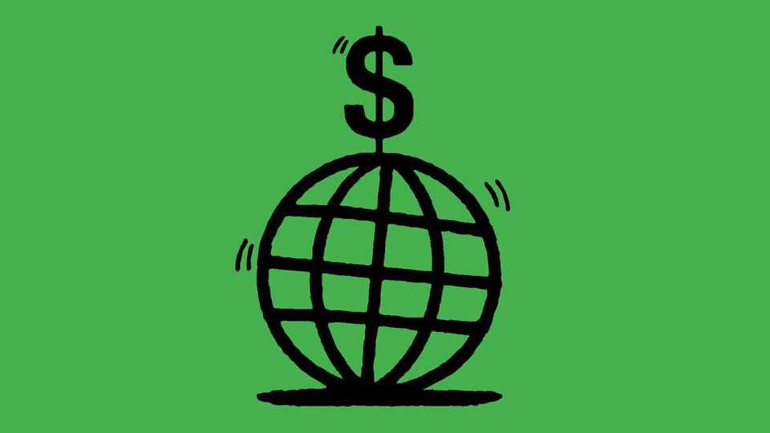
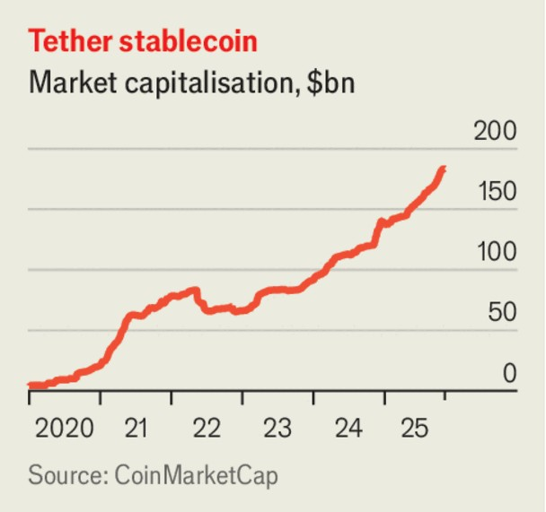

Leaders | Too much of a good thing
America should not push other countries to adopt the dollar
More dollarisation would be a double-edged sword
November 6th 2025

When DONALD TRUMP returned to the White House there was widespread fear that his administration would seek to undermine the international role of the dollar. Today that seems like a distant memory. The administration is hailing dollar stablecoins (a kind of cryptocurrency designed to maintain a stable value) as an opportunity to expand the currency’s realm, because each coin is backed by a dollar-based safe asset. The White House is reportedly weighing whether to encourage other countries to switch to the greenback. The idea goes beyond deeply troubled economies like Argentina—the typical candidates for the policy. Even big, rich countries are becoming nervous. Officials at the Bank of England and the ECB have warned of the dangers of digital dollarisation.

The appeal to America is simple. More dollar users would reduce borrowing costs for its government and its businesses. The greenback’s primacy already reduces the returns foreigners demand to invest in America by 1-2 percentage points per year. This “exorbitant privilege” would grow as more countries adopt the dollar or more foreigners hold dollar stablecoins.

Abroad, the possibility of dollarisation can be a useful source of discipline. The dollar offers a store of value for those fleeing inflation caused by lax economic policies, such as the many Argentines with mattresses stuffed full of hard currency. The more accessible that stablecoins make the dollar, the harder it will be for governments to control capital movement and to inflate away their debt. In some places dollarisation is the only route to long-term price stability. Both Ecuador and El Salvador, which are dollarised, have enjoyed low inflation even when led by populist left-wingers.

Nevertheless, America should not pursue a pro-dollarisation agenda. In stable economies dollarisation is unnecessary; it also brings costs. Dollarised economies import the Federal Reserve’s monetary policy rather than setting their own, making it tougher to fight recessions. Because they cannot create money, it is harder to support the financial system temporarily during a crisis. A transition to dollar stablecoins could be chaotic, involving bank

runs and crashes. Countries are right to defend their monetary sovereignty; and it is not in America’s interest to be blamed by its allies for turmoil.

Dollarisation also has a dark side for America. Ironically, the dollar’s status is the main reason it can run a carefree fiscal policy, with net debts of 100% of GDP and a budget deficit of around 6%. If more of the world used dollars, it would delay the moment when a fiscal adjustment is necessary. That may sound like a good thing if you are sat in the Treasury today. However, the more debt America accumulates, the worse an eventual crisis might be. America itself could face the very thing others fear—a run on its currency—but on an epic scale.

Fixing the budget beats finding more buyers for American debt. It would avoid the danger of crisis and make America’s reserve-currency status more likely to endure. It would also dodge a glaring contradiction in Mr Trump’s agenda: that a model of high debt and global dollarisation almost certainly means bigger trade deficits, which the president loathes. Inflows of capital are in large part the mirror image of the trade deficit. That is why the administration’s trade hawks are suspicious of the dollar’s global status.

It is a relief that the pro-dollar camp within the administration has prevailed. The greenback has not recovered much from the panic that followed Mr Trump’s “Liberation Day” tariffs, and investors are warier of unhedged dollar risk than they used to be. (At one point, taxes on foreign investors were on the cards.) Yet that does not mean the White House should overcorrect and seek dollarisation where it is unnecessary and unwanted. The best way to make your currency attractive is to run good economic policy at home. ■

Subscribers to The Economist can sign up to our Opinion newsletter, which brings together the best of our leaders, columns, guest essays and reader correspondence.

This article was downloaded by zlibrary from https://www.economist.com//leaders/2025/11/06/america-should-not-push-other- countries-to-adopt-the-dollar