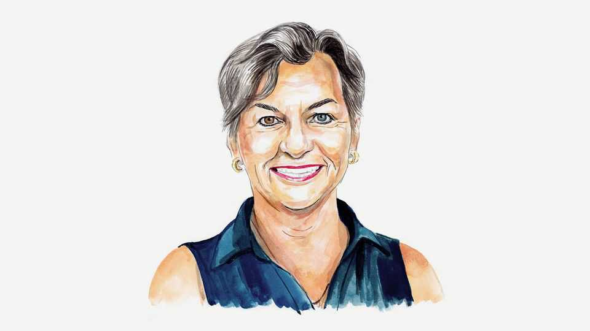

By Invitation | Winds of change
The climate action that matters is in the global south, argues an architect of the Paris agreement
But, writes Christiana Figueres, innovation still has to outpace climate impacts
November 6th 2025

AS WE APPROACH COP30 in Belém, Brazil, we stand at a hinge in history. On the one hand, emissions are still rising, with devastating consequences, and national climate plans are woefully behind where they need to be. But these plans reflect political calculation rather than economic reality—because, on the other hand, the exponential curves of technology, economics and human ingenuity are bending towards a future where affordable, clean energy for all can finally be a reality. Even as the politics have stalled, it is the economy and the hope of people everywhere that keep pulling change forward.

Ten years ago in France, 195 countries stood together and chose a clear direction. Against long odds, in the Paris agreement—the negotiations which I led as executive secretary of the UN Framework Convention on Climate Change—they committed themselves to limit global heating, protect the most vulnerable and unleash an unprecedented economic transformation. That transformation is now unmistakably under way, despite a global pandemic, war, Brexit and two Trump presidencies.

In 2015 global CO₂ emissions were still rising by almost 2% per year; that growth has since slowed to 0.3%. Fossil-fuel demand has plateaued and is falling in several large economies, including China. Then, the world was on course for about 4°C of warming by 2100. Today, projections hover near 2.6°C—still dangerously high, but a profound course correction that must now deepen, and fast.

Even as the warnings from scientists grow more urgent, the economic transformation is accelerating—and shifting global power dynamics. The world’s clean-energy future is no longer being decided in the boardrooms of the old energy powers, but in the bustling cities and industrial corridors of the global south. A new economy—a new kind of growth—is rising, powered by clean electricity, digital innovation and new energy technologies.

The Trump administration clearly sees this as a threat to the fossil-fuel sector and its own dominance, hence its attempts to quash the rise of renewables at home and aggressively intervene in multilateral climate talks. But the transformation is unstoppable. A new industrial sunbelt is fast being born, from Latin America to Australia through Africa and Asia. This sunbelt now hosts nearly half of investment-ready clean-industry projects outside China, sparking new industries—for green ammonia, fertiliser and clean fuels—creating skilled jobs, strengthening energy security and opening up new export markets .

The global south holds 70% of the world’s wind and solar potential, and 50% of the minerals necessary for the energy transition. China sees the opportunity. Its solar exports to the global south have doubled in the past two years, surpassing sales to the global north for the first time since 2018. Shipments to Africa alone surged by 60% last year. These panels don’t just

generate electricity; they generate huge savings for people and businesses. In Nigeria, for example, savings from avoiding expensive diesel can repay the cost of a solar panel within six months.

Pakistan, only recently almost entirely dependent on fossil fuels, now expects solar to supply 20% of its electricity by next year. Iran has just committed $2.3bn to expand solar power as a “strategic necessity”. In Oman the share of renewables in electricity production more than doubled in a frenetic first five months of 2025, helping the country’s efforts to turn itself into a global green-steel hub, powered by locally produced green hydrogen.

Meanwhile, advances in battery storage for solar energy are rapidly displacing gas expansion, leaving the “bridge fuel” theory looking increasingly outdated. This is the “self-propelling global uptake with exponential growth of installed capacity” that Tim Lenton, a climate scientist, has identified as a positive tipping point. Each step forward in deployment accelerates the next.

Renewables are growing at record speed: the world installed 15 times more solar capacity in 2024 than the IEA had predicted it would in a forecast in 2015; wind has exceeded the forecast three-fold. Clean energy now employs more people than fossil fuels.

The oil-and-gas sector has underperformed the broader stockmarket for the past 15 years, measured by shareholder returns. Unable to compete in the electrotech revolution, it remains highly dependent on public subsidies and is now prioritising shareholder returns and debt reduction—a sign of structural retreat. When the Paris agreement was gavelled, heavy upstream investment in fossil fuels was the norm and energy security focused on boosting supply. Today, nearly 90% of upstream capital in the oil sector goes towards maintaining current production, not increasing supply.

The question now is whether this exponential curve of clean-energy innovation can outpace the exponential curve of climate impacts. Nowhere is this more urgent than in Africa—home to 60% of the world’s “best solar resources”, according to the World Solar Council, yet recipient of less than 3% of global clean-energy investment. It is also subject to some of the worst

effects of climate change. By 2030 investment in cleaner energy must triple to around $2trn annually in emerging and developing economies.

There is not time to leave this to the market alone. Governments must align public and private finance behind national climate plans that prioritise bankable projects with clear goals.

So as the world marks Paris+10, COP30 must be both a celebration and a reckoning: a moment to honour progress, and to recommit, with clear eyes and steady resolve, to the steeper climb ahead. The era when American politics could make or break global climate co-operation is over. The world is no longer waiting for Washington. This time the global south is leading the way. ■

Christiana Figueres is a Costa Rican diplomat and co-host of the Optimism + Outrage podcast on climate change.

This article was downloaded by zlibrary from https://www.economist.com//by-invitation/2025/11/03/the-climate-action-that- matters-is-in-the-global-south-argues-an-architect-of-the-paris-agreement

Briefing

All over the rich world, fewer people are hooking up and shacking up