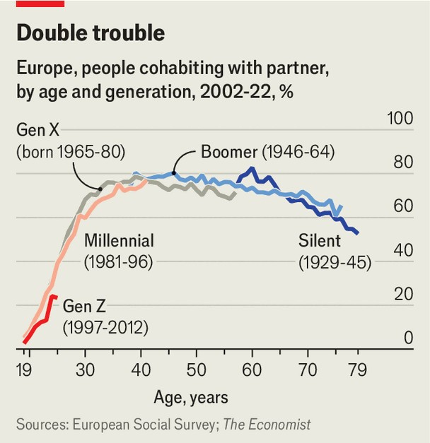
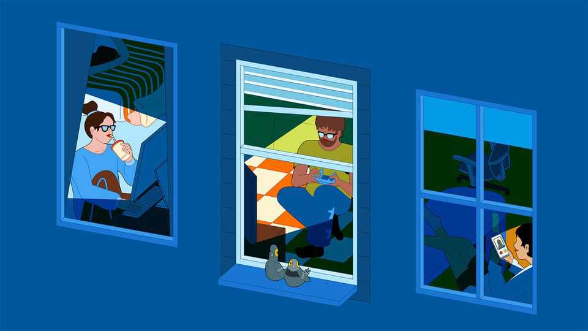

Briefing | Generation single
All over the rich world, fewer people are hooking up and shacking up
Social media, dating apps and political polarisation all play a part
November 6th 2025

“Idon’t date conservative or moderate men,” says Nancy Anteby, a 30-year- old New Yorker who works in social media. “I only date liberal men.” Politics is not her only concern. She is also looking for someone ambitious, with a stable career, who is Jewish and, perhaps most important, shares her desire to start a family. Finding dates who tick all of these boxes is not easy. “Very often a man will disappoint you,” she laments. Then again, she recently realised, “I don’t need to rely on a man to have the life that I dream of.”

Ms Anteby is far from unusual. Across America 41% of women and 50% of men in her age band (25-34) were single in 2023, a share that has doubled over the past five decades. Nor is America exceptional in this regard. Between 2010 and 2022 the share of people living alone (an admittedly imperfect measure of singlehood, but one for which data are more widely available) rose in 26 of the 30 members of the OECD, a club mostly of rich countries. Marriage rates are falling across much of Asia, including in China and India and especially Japan, South Korea and Taiwan. And singlehood is accelerating across different age cohorts. In Europe each new generation is less likely to be married or living with a partner than previous ones at the same age (see chart).

This relationship recession is hitting not just those wanting to marry or move in with a steady partner, but also those looking for a date or casual sex. Younger people are socialising less, dating less and starting to have sex later in life than previous generations. They are also having less sex in general (as, alas, are most of us).

Michael Rosenfeld, a sociologist at Stanford University, has found that the reduction in dating owing to the covid-19 pandemic produced 13.7m more singles in America in 2022 than if the singlehood rate (conservatively defined) had stayed at the level of 2017. To generate an estimate of the

global increase in plus-nones, The Economist extrapolated from his data, while also taking into account sharp falls in marriage rates in a number of Asian countries, which predate the pandemic. We calculate that over the past decade such effects have swollen the ranks of single people around the world by at least 100m.

Dating, sex, marriage and divorce are all intensely personal choices, and their effects are felt most directly by those making them. The fact that more people feel able to choose to be single now than in the past, when there was far greater social and economic pressure to marry, could be considered one of the great emancipations of the past half century. Untold numbers have been liberated from unhappy unions.

But not all those who remain single have chosen to do so. A study of singles in 14 countries found that only 40% said they were “not interested in being in a relationship”. A smaller survey of single Americans by the Pew Research Centre in 2019 did find that 50% were not interested in dating. Yet only 27% said they were not dating because they enjoyed being single. The rest gave reasons including being too busy, too old, or because no one would want to date them. No less than 34% of singles in the 14-country study said they did not want to be alone but found it “difficult to attract a mate”, with 26% describing themselves as “between relationships”. In short, there are growing numbers of lonely hearts, pining for a partner but unable to secure one.

There is an alarming mismatch in this regard between women and men. In the Pew survey, 62% of single women did not want to date, whereas only 37% of single men felt the same way. America and South Korea, among other countries, have big, vocal movements of young men who feel they have been unfairly deprived of romantic opportunities. All over the world, a high proportion of unmarried young men is strongly associated with elevated levels of violence and crime.

Even relatively small shifts in coupling rates, when multiplied across a whole population, can have far-reaching effects on society as a whole. The biggest impact will be on fertility rates, since married women tend to have more children than single ones. This will be especially marked in East Asian countries such as Japan and South Korea, where only 2-4% of babies are

born to unmarried mothers. All the world over, however, the rise of singlehood will be a further drag on already slowing birth rates. The effects will also be felt in property markets (more demand for housing, since more people will be living alone) and government finances (less public spending on maternity wards and schools and, in time, more on care homes).

The fact that a large proportion of single people would rather be in a relationship (whether they are still looking for one or have given up hope) suggests that either there is some sort of dating-market failure that is preventing compatible people from finding one another, or that society is changing in ways that are making large numbers of singles incompatible. In practice, it seems to be a bit of both.

In Asia, where singlehood is growing fastest, a mix of structural and cultural changes is increasing incompatibility. Start with demography. China’s one- child policy has created a huge imbalance in the ratio of men to women. When it comes to those of peak marriageable age, the country will have 119 men for every 100 women by 2027. In all, there may be 30m-50m “excess men” in China, reckons Xiaoling Shu of the University of California, Davis. Singlehood in China, like most places, is not evenly distributed. Instead, it is disproportionately concentrated among men who are poorer and poorly educated, and thus less attractive as mates, and among highly educated women (of which more later).

China’s one-child policy makes it an outlier, but heterosexual men in other countries with a strong cultural preference for sons will also struggle to find partners. Sex-selective abortions resulted in 111 boys being born in India in 2011 for every 100 girls, according to census data. The natural ratio is about 105. Although the distortion has since become less extreme, we calculate that around 20m more boys than girls were born in India in 2000-15.

Improved opportunities for women to go to university and enter the workplace are also fuelling the growth in singlehood in East Asia, argues Wei-Jun Jean Yeung of the National University of Singapore. As women gain financial independence, they no longer need a husband to support them. They also have more to lose by getting married. “There’s still a culture of patriarchy in Asia where women carry most of the responsibilities of caring for children and domestic housework,” says Dr Yeung. “The opportunity

cost of getting married may be high: women think that if they get married they may have to give up working to take care of their in-laws, parents and children, plus do housework.”

One result of this is that well-educated women are also disproportionately likely to be single in a number of Asian countries. “The best-educated, urban, college-educated women are becoming more egalitarian in their gender attitudes,” says Dr Shu of women in China. “Many college-educated men are hostile towards feminist ideas or even feminists…[they] think these women are hurting their prospects and interests at a personal level.”

In South Korea the gap between women’s opportunities and men’s sexist expectations is particularly wide. Around half of young Korean men think they are discriminated against (other than having to do military service, they are not). Some 60% complain that feminism demeans them. They also tend to be terrible slouches when it comes to housework. Little wonder, then, that ambitious young women are far less keen on marriage than they are.

A similar pattern of singlehood pertains in America and Europe, despite their less ingrained gender roles. Until roughly the middle of the 20th century, far more men went to university than women. As a result there were far more couples in which the man was better educated than the other way round. More recently, however, women have surpassed men in studiousness. Across the OECD on average 51% of women aged 25-34 had a university degree in 2019, compared with 39% of men. That makes the old pattern impossible to sustain. “Highly educated women who still want to marry up won’t find enough candidates,” says Albert Esteve, the director of the Centre for Demographic Studies in Barcelona. “So the question is, are they going to start marrying down?”

If mathematics were the only driving force, rather than cultural norms, there would have been a big rise in the share of couples where the woman is better educated. Yet the expectation that women should marry up is hard to dispel. Researchers in Germany, for example, found that highly educated women over the age of 30 were more likely to remain single than settle for a man with less education.

There is some evidence that more women are beginning to marry down in terms of education, but it is not happening to nearly the degree that might have been expected. What is more, Mr Esteve has found that educated women are “picking the best non-educated men” by coupling with those who earn more than they do. In effect, they are simply switching from one form of marrying up to another.

Educated women’s hesitance to marry down is not wholly irrational. In a number of countries, men are not adapting well to changing times. In Australia, for example, those who earn less than their female partners are more likely to beat or berate them. But people can change. A study in America found that marriages where the woman is better educated than the man were more likely to break down among older cohorts, but not among younger ones.

Changes in relative levels of education explain some of the increase in singlehood in Western countries, but not all of it. Another part of the explanation lies in technology, and the huge shifts it has brought in how people meet their mates. For about 60 years after the end of the second world war, the most common way that heterosexual couples met was through friends, according to a study published in 2019 by Mr Rosenfeld and colleagues. But after the introduction of smartphones in the late 2000s, the proportion who met online surged. In 2013 that became the most common way for couples to get together.

Yet online dating is fundamentally different from the old-fashioned sort. When looking for a date, Kristian Del Rosario, a 27-year-old lawyer who lives in New York City, is able to winnow down matches on Hinge, a popular app, using all manner of criteria. She looks at a man’s age (no more than six years older than her, but “beggars can’t be choosers”), job, religion, political views, whether they smoke marijuana (“I cross them off”) and how tall they are, which is important to her. “I’m five-six and I’ve literally had men who were like five-five, who tried to match with me,” she says. “Well, that’s definitely not happening.”

People have always been finicky when choosing a long-term mate, at least when sober. But social media and online dating have turbo-charged pickiness, allowing people to filter candidates not just for the sorts of things

that have always been important (age, religion, ethnicity and education), but also for all sorts of other attributes, such as their political views or narcotic preferences, not to mention their height and weight. One consequence is that many people now lie: researchers in Germany found that online daters claim to be a little taller and a little less overweight than the average person. Another is that many struggle to find dates.

Reporting in the Wall Street Journal suggests that most women on Bumble, an online dating app, screen out all men who are less than six feet tall. That rules out about 85% of men at a stroke. To be sure, women have long tended to prefer taller men—but not to such an extreme. Most young British women say that kindness, honesty and a sense of humour are far more important in a partner than looks, according to polling by Ipsos. So why do so many online daters write off all kind, honest, funny men of average height?

Part of the answer is found in online and social-media cultures that promote unrealistic ideals. In the “manosphere”, online communities united by the idea that men are oppressed, young “incels” (involuntarily celibate men) complain that women are selfish and manipulative for not sleeping with them. Misogynistic social-media influencers such as Andrew Tate advise them to become hyper-masculine and to dominate women.

Women have their own (less nasty) version of this echo chamber. Some vet potential dates on private social-media forums where others post the names and pictures of men they say have cheated on them or are abusive. That may help make dating safer, but some women use them simply to complain about bad dates or men who spurned them. This can be off-putting for the 41% of women who say they often come across videos or social-media posts in which women share negative dating experiences. It is also daunting for men, who are afraid of asking women out in case they are publicly shamed, says Daniel Cox of the Survey Centre on American Life, part of the American Enterprise Institute, a conservative think-tank.

Some social-media personalities with big followings create unrealistic expectations about courtship, says Sabrina Zohar, a dating coach based in Los Angeles with 1.3m followers on TikTok. She charges clients $9,999 for a three-month membership, during which she feels obliged to spell out such

basic principles as, “If somebody doesn’t text you every day, it doesn’t mean that they don’t like you.”

Unrealistic expectations are probably as old as dating and relationships, but a generation of young people who have grown up with personalised music playlists and online entertainment may be less willing to set their preferences aside. “You can filter your news feeds, right? You can curate your online life,” says Mr Cox. “How easy is it to do that when you’re thinking about prospective relationships?” That also extends to ideology. As men have drifted to the right and women have become more liberal in America and parts of Europe, politics is getting in the way of pillow-talk, he says.

New technology not only fosters pickiness about whom to date, it also absorbs a lot of time, leaving less for socialising and group activities—tried- and-tested ways of meeting partners. In America the amount of time 15-to- 24-year-olds spend hanging out face-to-face has fallen by more than a quarter over the past decade, whereas the amount of time spent gaming has increased by about half (and nearly doubled for young men).

Time spent streaming, surfing or gaming even seems to be displacing sex. Almost everywhere in the rich world people are having sex less often than

before, and many more are having none at all. Brits aged 18-44, for instance, have gone from copulating five times a month in 1990 to twice a month in 2021, notes Soazig Clifton of University College London. Researchers have posited, variously, that this is because they are too busy, more stressed, are watching porn instead, or are simply distracted by Netflix. As artificial intelligence (AI) becomes more adept, growing numbers of people are turning to it, rather than humans, for intimate relationships.

People who spend their late teens and 20s watching television, playing computer games or chatting with AIs may be reducing their chances of ever finding a mate, since they are missing their best chance to hone their dating skills and learn how to weather the ups and downs of relationships. “Dating is really not like riding a bike,” says Mr Rosenfeld. “You need constant practice to be good at it and if you are out of practice for a while, it’s harder.”

In other words, singlehood, which is already reshaping Western society, is likely to keep growing for some time to come, with all the consequences— good and bad—that it entails. At some point it will surely plateau, but it shows no signs of doing so yet. Until recently, demographers had thought that, once men’s attitudes caught up with women’s emancipation, a new equilibrium would be reached. “Men would do a bit of cleaning and housework to be attractive, and happy families would be produced again,” says Mr Esteve. Yet even in egalitarian Scandinavia, he notes, “regardless of how beautiful are the men”, marriage and fertility rates are still falling. “Why is this happening?” he asks. It is the 100m plus-nones question. ■

This article was downloaded by zlibrary from https://www.economist.com//briefing/2025/11/06/all-over-the-rich-world-fewer- people-are-hooking-up-and-shacking-up

United States

A night of big wins for the Democrats The Supreme Court seems sceptical of Donald Trump’s tariffs How the sheriff of St Louis ended up in jail The rise and fall of America’s model mobile crisis service America’s health-care costs are shooting up Donald Trump’s alarming muddle about nuclear-weapons testing Gerrymandering is now the wind beneath Gavin Newsom’s wings