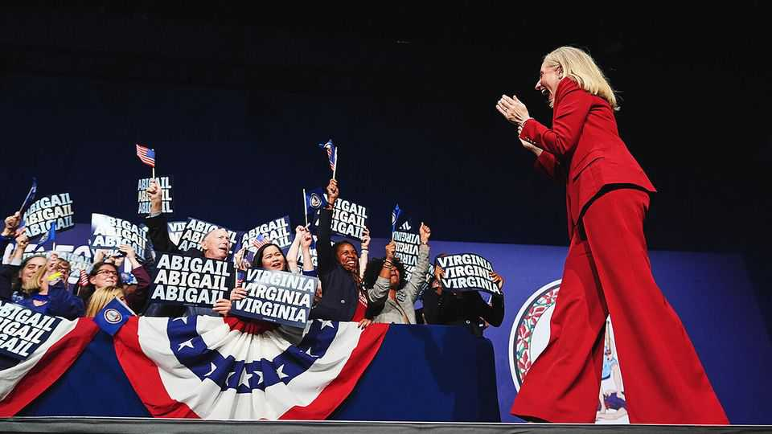
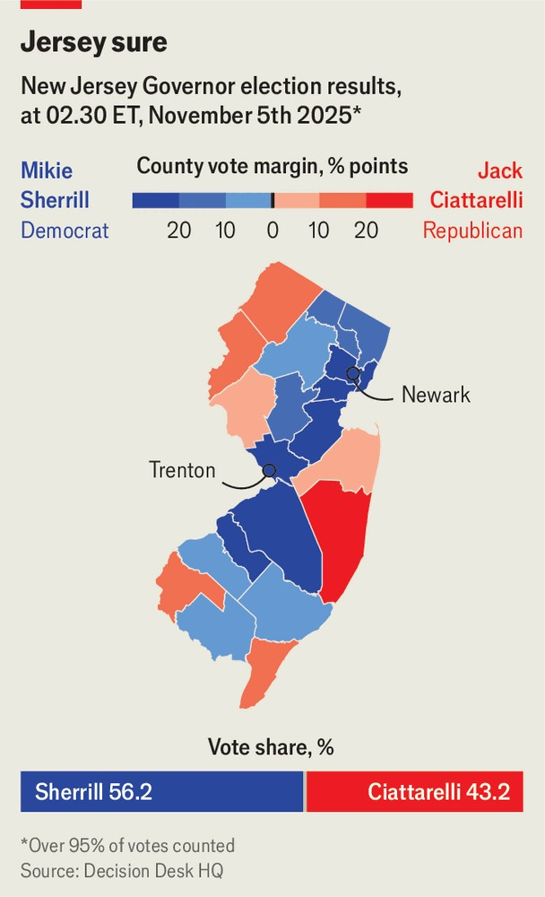
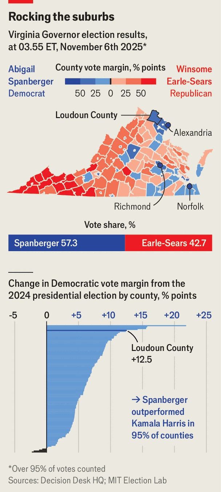
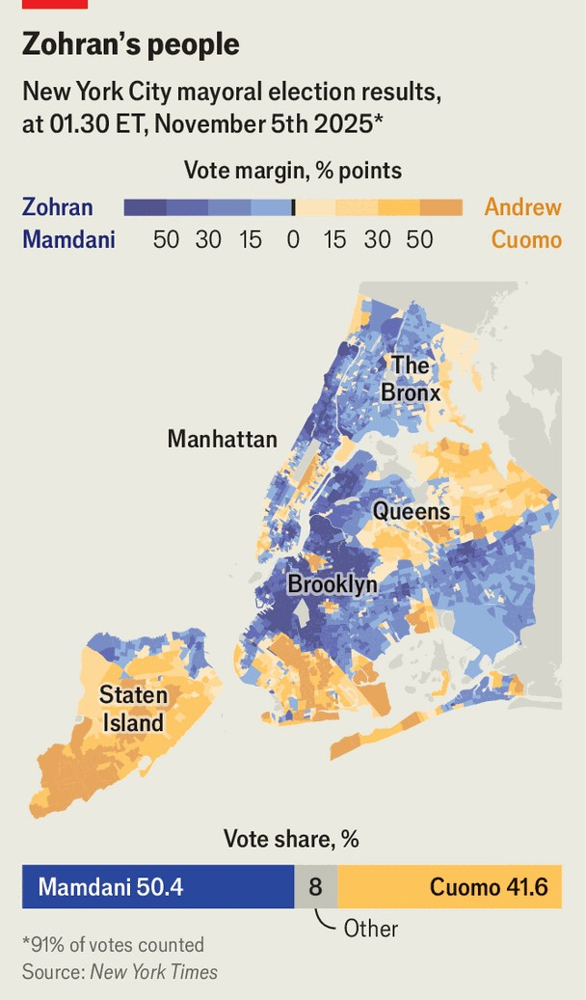

United States | Off-year, on it
A night of big wins for the Democrats
Having Donald Trump in the White House but not on the ballot is ideal for the party
November 6th 2025

Democrats were bound to have a good election night. The prevailing question on November 4th was more a matter of degree: would it be merely good, or would it be great? The results of the night’s four big contests suggest an excellent one indeed for the opposition party. Voters in two blue-ish states sent centrist, pragmatic Democrats to their governor’s mansions: Mikie Sherrill in New Jersey and Abigail Spanberger in Virginia. New Yorkers turned out at in their highest numbers in nearly six decades to elect as mayor Zohran Mamdani, a 34-year-old Democratic Socialist with ambitions to soak the rich, freeze rents and provide free services. Meanwhile a ballot initiative in California passed that will allow

Democrats there to redraw congressional districts in to suit them. That will have implications for next year’s midterms.

Democrats were operating in a favourable national environment. Off-year elections usually mean a turnout advantage for the opposition party. Such races draw the most engaged voters, many of whom want nothing more than to punish the president. And Donald Trump is acutely unpopular with Democrats and left-leaning independents. The share of Americans who disapprove of the president is 19 points higher than the share who approve. That marks a nadir for Mr Trump’s second term, and is lower than almost any point in his first.

Added to the Democrats’ advantage was a favourable electoral map. Both New Jersey and Virginia reliably vote Democratic in presidential races, although both also regularly elect Republican governors. Looking ahead to the midterms, the test was how Ms Spanberger’s and Ms Sherrill’s showing would compare with Kamala Harris’s win in those states last year—whether they would beat her spread.

They did, decisively. Ms Spanberger outperformed Ms Harris’s margin in Virginia by about nine percentage points, flipping the governor’s office.

Democratic enthusiasm ensured that even a scandal-ridden candidate for attorney-general, Jay Jones, claimed a more narrow victory.

Ms Sherrill faced a tougher race in New Jersey. In 2024 the state saw the second-largest swing towards Mr Trump. That Ms Sherrill was running to succeed an unpopular Democratic incumbent offered her no help; no candidate from a party seeking a third consecutive term had won since 1961. Ms Sherrill not only managed to beat Jack Ciattarelli, her MAGA-friendly challenger, whom Mr Trump endorsed, she also outperformed Ms Harris by seven points. Her victory marked a return to the double-digit margins enjoyed by Democratic presidential candidates in New Jersey between 2008 and 2020.

Turnout powered the Democrats. In Georgia, they won landslide victories in two low-profile elections for the Public Service Commission, which attracted fewer than a third of the votes cast in last year’s presidential election in the state. Overall, turnout was relatively high for off-year elections—Virginia saw a record number of people vote in a gubernatorial race.

Along with favourable turnout, persuasion mattered, too. Exit polls indicate that Democrats converted a substantial number of last year’s Trump voters.

Indeed the geography of their victories suggests Democrats rebuilt the coalition that voted for Joe Biden in 2020. In New Jersey they made particularly pronounced gains in counties with large Hispanic populations, such as Passaic County and Hudson County, which swung 18 and 22 points, respectively. An exit poll conducted by CNN showed that 18% of Hispanic voters in New Jersey who supported Mr Trump in 2024 voted for Ms Sherrill this time around. In Loudoun county, an affluent and populous suburb of Washington, DC, Ms Spanberger exceeded Mr Biden’s margin of victory by four points—a 13-point improvement over Ms Harris.

Ms Spanberger and Ms Sherrill are ex-congresswomen with backgrounds in national security: the former was a CIA officer, the latter a Navy helicopter pilot. Both steered clear of culture-war quagmires and said sensible things about their support for law enforcement. Their pitch was risk-averse competence. “We sent a message to the whole world that in 2025 Virginia chose pragmatism over partisanship,” Ms Spanberger told cheering supporters.

By contrast Mr Mamdani offered a light CV alongside heavy criticism of Israel and a history of impolitic comments about the police. The electorates of New Jersey and Virginia better resemble America writ large than that of deep-blue New York City, meaning Mr Mamdani’s success says little about

the appetite for progressivism among voters elsewhere. If his remarkable, lightning-quick rise contains a broader lesson, it is about the art of campaigning. Mr Mamdani focused relentlessly on affordability, which he did with vim, conviction and a gameness to make his case anywhere and everywhere, be it on Fox News or in numerous nightclubs. His nearest challenger, Andrew Cuomo, a former governor laden with baggage, was leaden and aloof on the campaign trail.

Mr Mamdani’s policy prescriptions—government-run grocery stores, free buses and child care, and affordable housing—would be hugely expensive. His promise to freeze rents for a quarter of the city’s housing stock would raise housing costs for everyone else. His ability to deliver on this agenda will depend on the willingness of Kathy Hochul, New York’s governor, to increase taxes, which she seems disinclined to do. The result may well be a less ambitious tenure than many of his voters hope.

An equally pressing question for the city is how Mr Trump deals with Mr Mamdani: whether he punishes New York by withholding federal money or inflames it with an immigration crackdown. Before the election Mr Trump said a win by Mr Mamdani would make it “highly unlikely” that New York would get federal funds beyond “the very minimum as required”.

Democrats’ rebound will reassure the party, offering a signal that last year’s impressive Republican gains among young and minority working-class voters may not endure. Yet it would also be rash to read too much into a handful of races in which Democrats enjoy structural advantages. The midterm elections next year will be more consequential, with control of Congress up for grabs. There Democrats have a harder task owing to Republicans’ gerrymandering schemes and their numbers advantage in the Senate. California’s redistricting counter-attack, known as Proposition 50, will partially neutralise the Republican advantage in midterm House races. The passage of that measure means that Democrats enter 2026 with as much momentum as they could have hoped from these off-year elections. ■

Stay on top of American politics with The US in brief, our daily newsletter with fast analysis of the most important political news, and Checks and Balance, a weekly note from our Lexington columnist that examines the state of American democracy and the issues that matter to voters.

This article was downloaded by zlibrary from https://www.economist.com//united-states/2025/11/05/a-night-of-big-wins-for-the- democrats