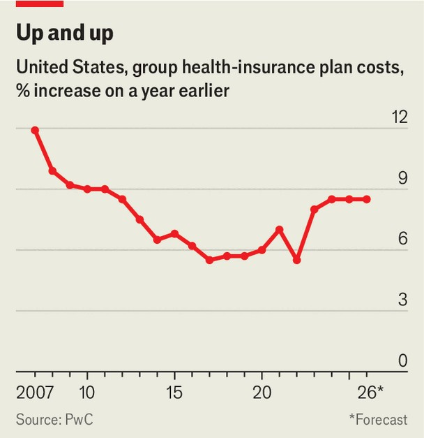
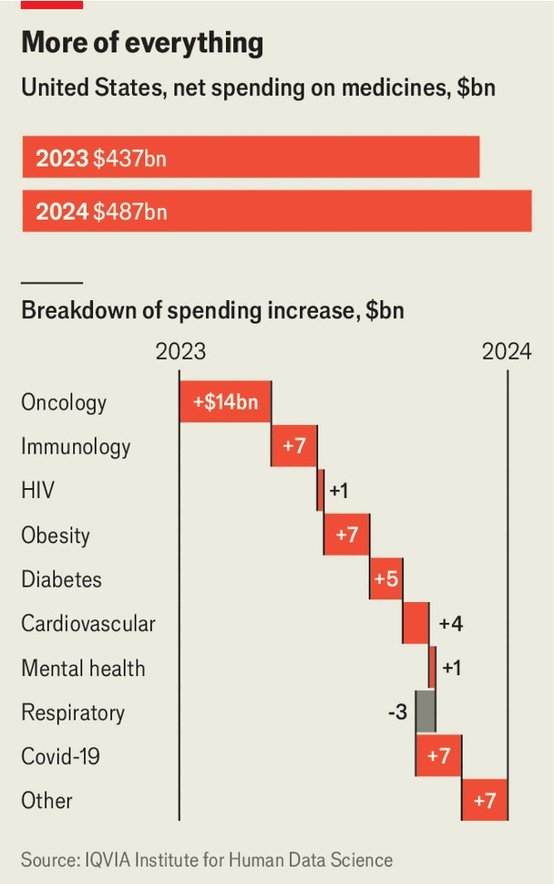

United States | Medicine haul
America’s health-care costs are shooting up
One big reason is that people are seeking more treatment
November 6th 2025

AMERICANS HAVE a deep-seated dedication to their autumnal rituals, whether apple-picking or tailgating (having a barbecue in a stadium parking lot) before American football games. But there is also a less-festive fall routine: open enrolment, the annual window when employees pick their health insurance plans. This year, the choices will deliver sticker shock. Medical costs for those on group insurance are set to go up by 8.5%, according to PWC, a consultancy (see chart).

Other industry watchers predict similar price rises will soon hit. Costs for plans purchased through the Affordable Care Act marketplace will also shoot up in 2026 as enhanced pandemic-era subsidies expire, unless the subsidies are extended as part of negotiations to reopen the federal government, as Democrats are seeking.

Prices for group plans, mainstays of the employer-provided insurance a majority of Americans use, are rising for reasons also seen in the wider economy. A labour shortage in recent years has pushed up wages. Consolidation among hospitals and clinics has added to price pressures. But there is also a trend specific to medicine: Americans are using more health care.

The change is seen in all sorts of ways. By late 2024, some common cancer screenings were up 60-80% compared to 2019. The use of prescription medications increased 14% in the same period. “Just across the board, people are engaging with the health system more,” says Michael Chernew, a professor of health policy at Harvard Medical School. A majority of the expected price rise in employer-sponsored plans comes from greater use, reckons Sunit Patel of Mercer, a consultancy. This is a change from before the pandemic, he says. Part of the recent increased use may have been catch-

up from delayed care, but five years on from the pandemic, the greater use now seems to be baked-in.

It is not clear exactly what is behind the increase, but there are at least three big trends that seem to be at play: new medicines, an ageing population and a surge in mental-health treatment.

Net spending on medicines grew by 11.4% in 2024 alone (see chart), driven by a few particularly high-cost treatments. About one in eight Americans has now tried GLP-1s, the expensive weight-loss drugs. New and eye-wateringly expensive cancer and immunology drugs are also entering the market. The median annual cost of new cancer drugs approved is about $200,000. “We learn how to treat things every day that we didn’t treat before, and that tends to cost money,” says Gary Claxton of KFF, a health-research outfit.

Additionally, baby boomers are getting ever more care as they grow older. Eventually, nearly all will migrate to Medicare, a government health insurance system for the over-65s, but in the meantime, many are still using employer-provided coverage.

For all workers, one area of medicine has seen claims shoot up. Between January 2023 and December 2024, inpatient mental-health claims grew by

80%, while outpatient claims were up 40%. The greatest increase was for claims due to anxiety, depression and developmental disorders.

In theory all this spending ought to mean healthier people. In practice, America spends more on health than other rich countries, but without better outcomes. ■

Stay on top of American politics with The US in brief, our daily newsletter with fast analysis of the most important political news, and Checks and Balance, a weekly note from our Lexington columnist that examines the state of American democracy and the issues that matter to voters.

This article was downloaded by zlibrary from https://www.economist.com//united-states/2025/11/06/americas-health-care-costs-are- shooting-up