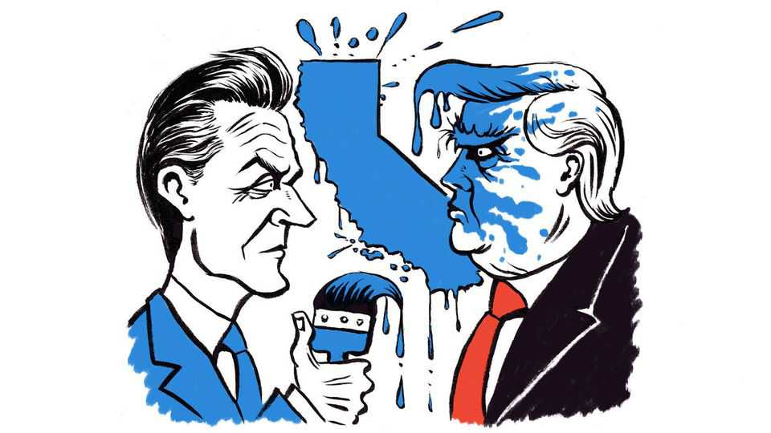

United States | Lexington
Gerrymandering is now the wind beneath Gavin Newsom’s wings
His winning gamble to counter Donald Trump’s brazen redistricting may make him the next Democratic nominee for president
November 6th 2025

When Willie brown was running for mayor of San Francisco 30 years ago, he did not immediately detect a future politician in the wine merchant volunteering on his campaign, the young man with the improbable hair and teeth. “I saw him more as a movie star,” Mr Brown says. When he asked what role the businessman would like in the administration, Gavin Newsom suggested he serve on the film commission, if there was one. “He didn’t even know,” Mr Brown recalls. By the time the mayor got around to offering Mr Newsom a position, the only spot left was on the decidedly less glamorous parking and traffic commission.

But after Mr Newsom accepted without complaint and got right to work, Mr Brown quickly concluded he had the discipline to go far. Now that California voters have backed Proposition 50, Governor Newsom’s bid to redraw congressional districts to further favour Democratic candidates, he has jumped to the front of the campaign about the next presidential campaign, the contest ever murmuring among Democratic insiders about who will be the party’s next nominee. Among the great mentionables, prediction markets rate Mr Newsom’s chances at better than one in three, far ahead of other contenders.

Mr Brown, at 91 among the canniest of Democrats, predicts half a dozen serious candidates will vie for the nomination, most running traditional campaigns. “There’ll be only one that’s independent of that, and unique,” he says. “And it’s going to be Newsom.” Which may seem surprising, because based on résumé alone, Mr Newsom would appear a most conventional option. He eventually succeeded Mr Brown as mayor, then won the office of lieutenant-governor, then of governor. He has done politics for a living for 30 years, and he has never lived anywhere but California.

But he has shown a knack for getting a step ahead of his peers. As mayor in 2004 he began issuing marriage licences to same-sex couples, 11 years before the Supreme Court legalised gay marriage. As lieutenant-governor in 2016 he backed legalising marijuana. More recently, as he has positioned himself for a national run, he has sidled towards the centre, urging cities and counties to ban homeless encampments and calling it “deeply unfair” for male transgender athletes to compete with women and girls.

His leadership on Proposition 50 was another gamble, one that may sufficiently endear him to the party’s leftists to grant him room to run towards the centre. Some observers, including Lexington, doubted the wisdom of this move, which could yield five seats for Democrats. Mr Newsom wanted to bluff Donald Trump into dropping his demand that Texas, where Republicans dominate the government, redraw its districts to favour themselves in five more seats. Mr Trump instead raised his bet, insisting that other Republican-dominated states also redraw their districts. That prompted Democrats nationally to rally behind Mr Newsom, and other Democratic state leaders to follow his lead. With Mr Trump barely lifting a finger to help Republicans in California, Mr Newsom outspent opponents of

the proposition by two to one. He added more than 100,000 donors to his list of potential backers for a 2028 bid, Politico has calculated.

Mr Newsom’s sophistication about the media-political complex most differentiates him from other potential candidates. He is Trumpian in his zeal for media ubiquity. Severe dyslexia makes him struggle with a prepared text, prompting him throughout his career to prepare intensely and maybe accounting now for his comfort in extemporising. He is at pains to counter what he sees as Democrats’ image of weakness. “We’re punchin’, and we’re punchin’ back hard,” he recently told a YouTube influencer who calls himself ConnorEatsPants while the two men played Fortnite together remotely on Twitch, a streaming platform (words that have not previously characterised a shadow presidential campaign). ConnorEatsPants had praised an amusing initiative by Mr Newsom to troll Mr Trump by mimicking his vainglorious all-caps social-media posts and kitschy AI- generated memes.

Early this year Mr Newsom started his own podcast, “This is Gavin Newsom”, interviewing politicians and media figures, including, pointedly, from the right. In his first interview he solicited advice from Charlie Kirk, the founder of Turning Point USA who was later assassinated, on salvaging “the Democratic brand”. It was in that conversation that Mr Newsom lamented the unfairness of transgender competitors in female sports, agreeing with Mr Kirk on the politics. “We’re getting crushed on it,” he said of the Democrats. “Crushed.”

As that exchange suggests, Mr Newsom has Mr Trump’s habit of providing his own political commentary, supplying a meta-narrative for his politicking that somehow can—in the same strange spirit as open, proud gerrymandering—pass as transparency and authenticity. Though Mr Newsom also talks about policy, on his podcast the medium itself is often the message. On October 30th he interviewed Ben Meiselas of MeidasTouch, “an independent news network”. As Mr Meiselas gave the governor tips on how to make YouTube videos and boasted of his own success generating resistance to Mr Trump, a listener might have wondered: who was the politician, and who the journalist? Are the roles now the same?

America has elected two Republicans from California as president but never a Democrat. The state’s troubles would haunt Mr Newsom, as a former governor, even more than they did the last Democratic nominee, another graduate of Willie Brown’s political dojo in San Francisco. Mr Brown leaves no doubt which one he considers the stronger candidate. “I don’t want to see her hurt again,” he says of Kamala Harris. She would, he says, make a great chief justice of the Supreme Court. ■

Subscribers to The Economist can sign up to our Opinion newsletter, which brings together the best of our leaders, columns, guest essays and reader correspondence.

This article was downloaded by zlibrary from https://www.economist.com//united-states/2025/11/05/gerrymandering-is-now-the-wind- beneath-gavin-newsoms-wings

The Americas

War looms in Venezuela as Trump tests an “Americas First” doctrine An EU-Mercosur trade deal looks close to ratification