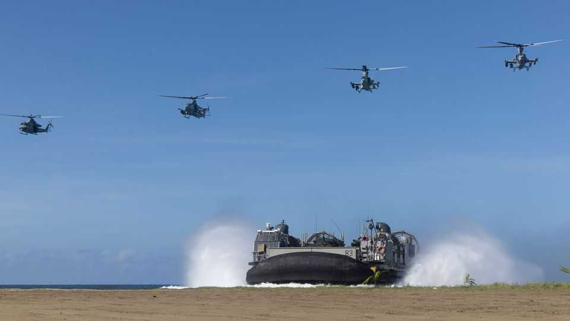
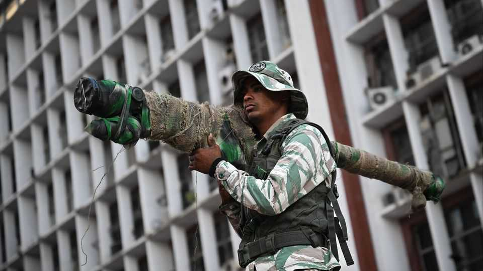
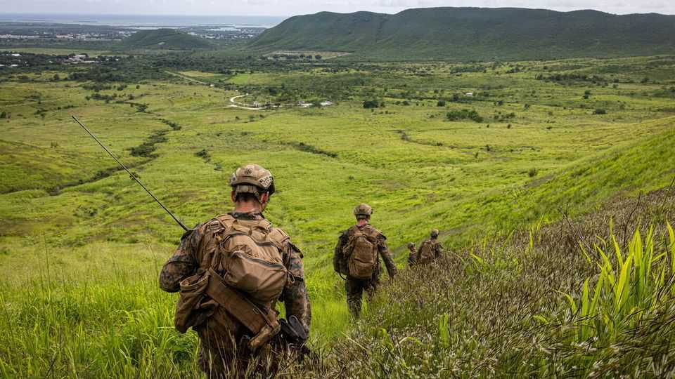
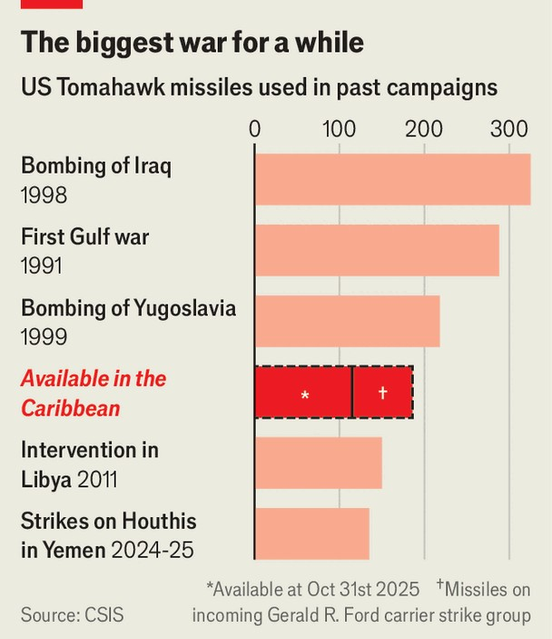

The Americas | Regime change, again
War looms in Venezuela as Trump tests an “Americas First” doctrine
A gathering armada risks repeating the mistakes of the “war on terror”
November 6th 2025

“WE HAVE deployed US assets and interests all over the planet, but when we do it in our own hemisphere… everyone sort of freaks out.” Thus Marco Rubio, the American secretary of state, dismissed alarm about the gathering military campaign against “narco-terrorists”. Since September American forces have repeatedly struck alleged drug-running boats. Now they are massing a formidable naval force in the Caribbean and threatening to bomb Venezuela. The effort to overthrow the country’s strongman, Nicolás Maduro, is scarcely disguised. Asked if Mr Maduro’s days are numbered, President Donald Trump told CBS News: “I would say yeah. I think so, yeah.”

An aircraft-carrier strike group is on its way to join the Caribbean force. A dormant base in Puerto Rico has been reopened. Bombers buzz Venezuela while marines rehearse amphibious landings. The CIA has been authorised to run covert operations.

America’s gunboat diplomacy revives a dark history of military intervention and coup-mongering in Latin America, often motivated by fear of hostile powers, which abated after the cold war. Its return stems partly from worries that Iran, Russia and especially China are gaining influence. But it is mostly about Mr Trump’s obsession with securing the homeland, coupled with his urge to come across as a powerful statesman. Months earlier he worried about China taking over the Panama Canal and America’s need to take Greenland. Now he turns to Venezuela, helped by a dubious new doctrine.

The Trump administration has redefined drug gangs as terrorists rather than criminals in an effort to justify the use of military force against them. It has linked Mr Maduro directly to the gangs to justify the pressure on his regime. Mr Rubio calls drug gangs the “al-Qaeda of the western hemisphere”. Like the “global war on terror”, the new war on narco-terror comes with the risk of costly military entanglement—this from a president who vowed to end America’s “forever wars”. A YouGov poll last month found a plurality of Americans opposed military action in Venezuela. (Another, by AtlasIntel, showed a majority of Latin Americans supported the idea.)

America’s actions are strangely contradictory. If Venezuela is a terrorist state, why has the United States ended the “temporary protected status” of some 600,000 Venezuelan asylum-seekers and sent some back to the narco- jihadists? Flights laden with deportees land in Venezuela twice a week, even as B-1s and B-52s threaten to bomb the place. Chevron-chartered tankers still sail from Lake Maracaibo, laden with oil bound for American refineries.

Earlier this year relations with Venezuela appeared to be improving. The country freed several Americans from prison. Chevron was allowed to resume oil shipments in July. But almost immediately after that came the big about-turn. The Treasury labelled a shadowy outfit called Cartel de Los Soles (Cartel of the Suns), a drug-smuggling group linked to senior military

officers, as a “Specially Designated Global Terrorist”. Mr Maduro was identified as its head. The cartel was accused of helping another Venezuelan gang, Tren de Aragua, which had already been designated as a “Foreign Terrorist Organisation” in February. In August the State Department doubled the bounty for information leading to the arrest or conviction of Mr Maduro to $50m. Missiles began raining down on alleged drug-trafficking boats on September 2nd. More than 60 people have been killed so far. Charred body parts have washed up on the beaches of Trinidad & Tobago.

Officials say all this reflects Mr Trump’s evolution. The dealmaker gave diplomacy a chance, was disappointed by the results, then turned up the pressure. The shift also reflects the changing power balance among his aides. Ric Grenell, Mr Trump’s “special envoy for special missions”, led talks with Mr Maduro and is said to favour diplomacy. Mr Rubio, who also serves as national security adviser, pushes the hard line. A former senator of Cuban descent, he emphasises restoring America’s influence in its hemisphere.

Mr Rubio has thus fused his neoconservative instincts with Mr Trump’s America First nativism. He argues that many of America’s troubles, from migration to drug-smuggling, come from the Americas. As domestic policy extends into foreign policy, America First becomes “Americas First”. He

may spy a chance to remake the Caribbean to America’s liking. If Mr Maduro falls, then foes such as Cuba and Nicaragua will probably lose access to subsidised Venezuelan oil and be destabilised.

Yet the dominoes could fall the other way. A botched intervention could lead to chaos in Venezuela and beyond, fanning anti-Americanism and aggravating the drug and migration problems.

Optimists think intervention would be akin to the short, successful invasions of Grenada in 1983 and Panama in 1989. Critics charge that Venezuela is a bigger and more complex country, and that intervention could resemble debacles in Afghanistan, Iraq and Libya. Either way, there is little sign that the Trump administration has a coherent plan for ousting Mr Maduro, let alone for what happens after that.

America’s biggest asset is the unpopularity and illegitimacy of Mr Maduro and his regime. It has presided over political repression and economic meltdown, leading to one of the world’s biggest waves of refugees. Mr Maduro rigged the 2024 presidential election, banning the opposition leader, María Corina Machado, from running. Her stand-in, Edmundo González, still won, in a landslide, but the regime declared a fake result.

The best hope of ousting Mr Maduro is that loud sabre-rattling will crack his regime. The approach of the USS Gerald Ford, America’s largest and newest aircraft-carrier, may concentrate minds. “I assume that the CIA’s role is to deliver lots of messages to people in the regime and in the military, saying ‘Look, Maduro has to go. No reason for you to go down with him’,” says Elliott Abrams, special envoy to Venezuela in Mr Trump’s first term.

Concessions have been offered. One proposal, according to the Miami Herald, was to create a transitional government of senior chavistas minus Mr Maduro. Another, reported by the New York Times, offered privileged access to oil and mineral resources, and a reduced role for China, Russia and Iran. “He’s offered everything,” Mr Trump declared on October 17th. “You know why? Because he doesn’t want to fuck around with the United States.”

Yet Mr Maduro still controls the guns. With the help of Cuban intelligence, he is ramping up a purge of suspected opponents. Dozens of military officers deemed disloyal are in jail, many tortured, their families threatened and imprisoned too. Few will risk coming out against Mr Maduro until they are sure he is on his way out.

So Mr Trump may have to use force, not just threaten it. He prefers quick surprise attacks with little risk to American forces, like the bombing of Iran’s nuclear sites in June. With Venezuela, though, Mr Trump seems to be telegraphing his moves to build pressure. Leaks suggest he may first target remote sites, perhaps airfields linked to drug networks. If it turns into a sustained air campaign against the regime, air defences will have to be destroyed.

But air power alone has rarely, if ever, succeeded in toppling a government without a friendly force on the ground—which appears absent in Venezuela. Perhaps the Trump administration thinks it can kill Mr Maduro from the skies (assuming it is prepared to reverse executive orders that have banned the assassination of foreign leaders since 1976). That is hard, too. Saddam Hussein, Iraq’s dictator, was captured only after American forces occupied Iraq in 2003. Sending ground forces into Venezuela would be deeply unpopular.

Success for any intervention will turn on whether it improves the country, and whether that lasts. There are two crucial questions. First, can the opposition rule the mess that is Venezuela? Many of its leaders are in exile. Ms Machado, winner of this year’s Nobel peace prize, is hiding in Venezuela, but can communicate. She backs Mr Trump, telling Bloomberg: “I believe the escalation that’s taken place is the only way to force Maduro to understand that it’s time to go.” Not all opposition figures share that view. Still, Ms Machado says she has plans for the first 100 hours of a transition, and for the first 100 days.

It is also unclear whether any remnants of the regime—army units, the colectivos (armed militia-cum-community organisations) and state-security agents—not to mention criminal groups and Colombian insurgents operating

in Venezuela, would choose to fight. If they did, a short war could turn into a long counter-insurgency.

Ryan Berg of the Centre for Strategic and International Studies, a think-tank in Washington, sees three scenarios: the Venezuelan army dumps Mr Maduro and seizes power; the United States negotiates a transition with him or part of his clique; or the regime collapses under America’s military campaign. The first two, he says, offer stability but probably not much democracy. The third may bring the legitimate opposition to power, but is more volatile. It is also quite possible that Mr Trump loses interest and moves on, perhaps after declaring success following a superficial strike.

In January Mr Trump posted a meme of himself looking like a gangster next to a sign that read “FAFO”—short for “Fuck Around and Find Out”. It was a warning to Colombia as it (briefly) refused to take deportees. It could apply elsewhere, too. Is Mr Trump ready to find out the consequences of intervention in Venezuela? ■

Sign up to El Boletín, our subscriber-only newsletter on Latin America, to understand the forces shaping a fascinating and complex region.

This article was downloaded by zlibrary from https://www.economist.com//the-americas/2025/11/06/war-looms-in-venezuela-as-trump- tests-an-americas-first-doctrine