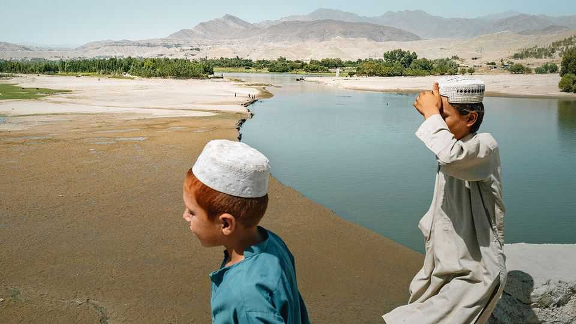
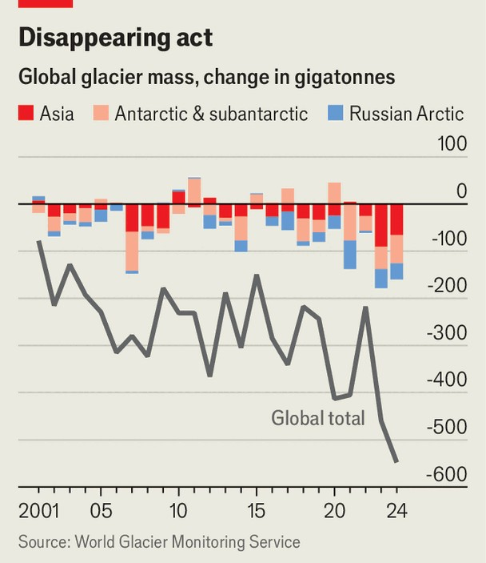

Asia | Liquid front lines
South Asia’s water wars
Climate change and rising energy demand could worsen conflict over rivers
November 6th 2025

RARELY CALM, the cross-border politics of South Asia’s great rivers have been roiling of late. In late October Afghanistan revealed plans to build dams on the Kabul river, rankling Pakistan, with which it had skirmished on the border just days before. Also last month, thousands of Bangladeshis took to the streets to protest against India’s influence over the flow of the Teesta river, a tributary of the Brahmaputra (known as the Jamuna in Bangladesh). India has yet to restore the Indus Water Treaty, a water-sharing deal with Pakistan since 1960 which it suspended in April following a terrorist attack in Kashmir. And Indian officials worry greatly about a new dam China plans to build 30km upstream from India’s border on the Brahmaputra (called the Yarlung Tsangpo in Tibet). This dam, at a cost $167bn, would be the world’s

largest if completed to plan. The consequences for downstream neighbours are bound to be huge, as will the dam’s ecological impact in an area rich in biodiversity.

It all suggests that the region’s water politics are getting more dangerous. Increasing demand for green baseload electricity is pushing countries across South Asia to expand investment in hydropower. At the same time, shrinking glaciers and erratic weather patterns caused by climate change are making river levels and water flows more unpredictable, with an impact on the livelihoods of some 2bn South Asians. To manage these risks and stop them sparking more conflict, countries in the region need to talk more and co-operate. But much stands in the way of that.

The politics of water in South Asia have long been fraught. The region’s mightiest rivers—the Indus, Ganges and Brahmaputra—flow from glaciers in the Himalayas. The Indus rises in China and passes through India’s Ladakh and disputed Kashmir, before running through Pakistan to empty into the Arabian sea. Though the Brahmaputra rises in China and runs through only India and Bangladesh, much of Nepal sits within the vast Ganges-Brahmaputra basin.

Sharing the waters is tricky in a region riven by distrust. India’s and Pakistan’s conflict over Kashmir is long-running. China and India fight over borders. Bangladesh and Nepal worry about undue influence from both India and China. That makes it tempting for countries to use water to exert pressure on their neighbours. Between 2019 and 2023, there were 191 water- related disputes in South Asia, according to the Pacific Institute, a research group in California. Barring the Middle East, no other region is as water- fraught.

Things will probably get worse. One problem is that, as well as for power generation, countries increasingly use the construction of dams to project strength, hammer down territory and coerce neighbours, says Hari Godara of O.P. Jindal Global University in Sonipat in India. China’s dams in Tibet help it exert influence over a restive region. Pakistan’s dam-building (increasingly helped by China) in the parts of Kashmir it controls serves to reinforce territorial claims and annoy India. In response to China’s new dam on the Brahmaputra, India plans to build its own mega-dam downstream

from the Chinese project. As it is, riparian Bangladeshis complain that India gives no warning when it releases torrents of water from existing dams, causing havoc downstream. Water tussles often overlap with other conflicts.

South Asia is one of the most water-stressed regions in the world, with water in short supply in many parts of it, at least for a good part of the year. A study published this year by researchers at Ludong University in China confirms that regions where water scarcity is a problem are more likely to experience disputes.

Greater demand for energy may make the situation worse. Growth, urbanisation and a boom in data centres have increased the need for reliable electricity. Hydropower, which does not suffer from the intermittence that ails solar and wind power, is an attractive renewable source. Pakistan already sources a fifth of its electricity from hydropower and aims to up that share. India wants to boost its hydropower capacity of 42GW by more than 50% by 2032, and perhaps build 200 new dams in the next decades. Nepal already produces more electricity from hydropower than it uses. But it continues to build capacity and hopes to export the surplus. It has long supplied electricity to India and recently started selling power to Bangladesh too, using India’s grid, though it took an age for everyone to agree.

To ward off outright conflict, diplomatic channels to manage the dams’ impact are essential. One of the clearest predictors of water-based disputes is when a country builds a dam without a treaty in place, says Aaron Wolf, an expert on transboundary water agreements at Oregon State University in America. Ecological concerns also arise. Dams fragment rivers, destroy habitats and displace communities—harms that are exacerbated in the fragile terrain of the Himalayas. For these reasons, India’s plans for the upcoming mega-dam attracted protests from communities in the area.

Increased diplomacy is all the more urgent because South Asia’s environment is becoming more fragile. Glaciers are melting at an accelerating rate (see chart). That can make river flows more erratic, destabilise the rock on which dams and houses are built and increase the risk of flooding. Monsoon rains are becoming less predictable. Rather than suspending or abandoning water accords, countries need to strengthen and update them to reflect this.

Some signs suggest that countries are aware of this. Despite the suspension in April of the Indus treaty, India still shared flood forecasts with Pakistan. No war has been fought directly over water in the past century, according to research by Mr Wolf. Yet water management in the region remains a messy patchwork of bilateral agreements that leaves countries free to treat rivers as bargaining chips, rather than as shared ecological systems. Closer co- operation would be a surer way to keep rivers flowing while keeping the peace. ■

For more coverage of climate change, sign up for the Climate Issue, our fortnightly subscriber-only newsletter, or visit our climate-change hub.

This article was downloaded by zlibrary from [https://www.economist.com//asia/2025/11/06/south-asias-water-wars](https://www.economist.com//asia/2025/11/06/south-asias-water-wars)

