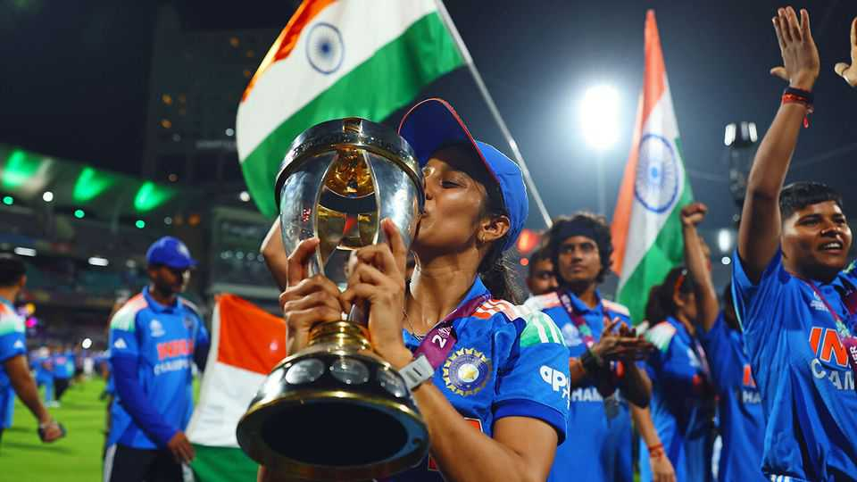

Asia | Hitting them for six
India’s women win the cricket World Cup
Their victory is a welcome boost for women’s sport—and for Indian women in general
November 6th 2025

Cricket IS INDIA’S passion, but for most of its history in the country it has been a one-sided love affair. Indians have obsessed over the fortunes of the men’s team, but largely ignored the women. That changed on November 2nd, when the women’s team won the World Cup for the first time. Some 45,000 people in a packed Mumbai stadium witnessed victory over South Africa; another 200m watched on screens. Celebrations erupted all over India, which became the first non-Western country to be crowned as the women’s world champions. For the cricketers, it vindicated life choices: many had to defy sceptical families to pursue the sport as a career.

The cricketers are the obvious heroes, though the Board of Control for Cricket in India (BCCI) deserves some credit too. The cricketing body is rarely considered an examplar of good sporting governance. Yet in the women’s arena the BCCI has performed increasingly well.

Three years ago it ordered gender parity in match fees between India’s male and female cricketers. A year later came another game-changer: the launch of the Women’s Premier League (WPL), the female version of the Indian Premier League, the sport’s most lucrative franchise tournament. The WPL has brought a flood of cash into the game, luring the world’s best cricketers to India and helping locals learn from top-class ones.

Victory in the men’s World Cup in 1983 put Indian male cricket on the map. The women will be hoping to accomplish as much, only faster. It took 28 years for the men to win their next World Cup. Girls watching the women win will be inspired to take to the field. But fans will hope girls pick up racquets and hockey sticks as well as bats. India is a global cricket force but lags in other global games.

Even better should be the social effects. After losses in the early stages of the World Cup, the Indian women faced hate and misogyny online. Such abuse has been muted since the win. But fans can be fickle and patriarchy in the country is still well entrenched. One glorious triumph will not change that, but it might help. ■

Stay on top of our India coverage by signing up to Essential India, our free weekly newsletter.

This article was downloaded by zlibrary from [https://www.economist.com//asia/2025/11/06/indias-women-win-the-cricket-world-cup](https://www.economist.com//asia/2025/11/06/indias-women-win-the-cricket-world-cup)