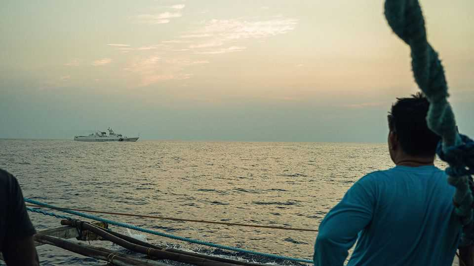
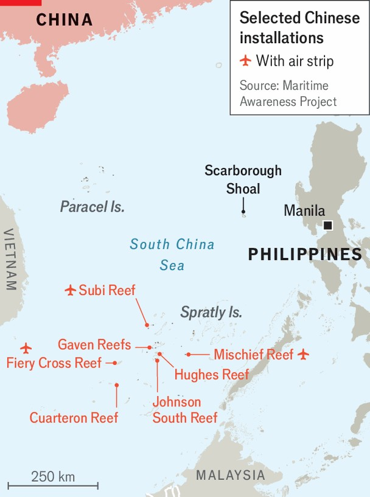

Asia | Dangerous grounds
America and China circle each other in the South China Sea
Naval tensions around Scarborough shoal are at their highest in years
November 6th 2025

IT HAS BEEN a tense final deployment for USS Nimitz, America’s oldest aircraft-carrier and one of the world’s largest. On October 26th one of its helicopters went down in the waters of the South China Sea. Half an hour later, an F-18 fighter jet launched from the Nimitz crashed, too. Military leaders are not saying what happened, but President Donald Trump, speaking to journalists, blamed it on “bad fuel”. Whatever the cause, the loss of two aircraft in short order will have pulled at nerves already frayed by one of the tensest moments in the sea, a regional flashpoint, in recent years. The presence of the Nimitz in the South China Sea comes amid tensions between China and the Philippines, an American ally, over Scarborough

shoal. There coral reefs enclose a large lagoon about 135 nautical miles (250km) west of Manila Bay, within the Philippines’ exclusive economic zone; it is the only maritime feature for a good distance. In 2012 China pushed Philippine vessels away from Scarborough shoal and has controlled the area since with a constant presence of coastguard and fishing vessels. Between 2013 to 2015 it built seven military bases, three of them large air bases, by reclaiming the sea around specks of land farther south in the South China Sea. But it has till now stopped short of terraforming to build a base on the shoal. In 2016 Barack Obama supposedly told President Xi Jinping that doing so would cross an American red line. That line, at least until now, has held.

Earlier this year China began to treat the presence of Philippine vessels around Scarborough and other contested rocks and reefs more aggressively. And on August 11th, while pursuing a Philippine coastguard vessel near the shoal, a Chinese coastguard vessel accidentally rammed one of its own naval ships. China has not acknowledged casualties, but the Centre for Strategic and International Studies, a think-tank in Washington, reports that two Chinese coastguards probably lost their lives in the accident. Philippine coastguards caught it all on video, greatly embarrassing China.

Tensions have since run high around Scarborough shoal. Aggressive vessel handling by China has persisted, raising the risk of Filipino lives being lost in another ramming incident. America has a difficult balancing act. It is bound by treaty to defend Philippine forces in the sea, a promise that the Trump administration repeats, signalling that it will come to the Philippines’ defence. Yet doing so might raise tensions between America and China to perilous levels.

Throughout October, American and Philippine forces have been exercising in the South China Sea, along with ships from allies such as Australia, France and Japan. The Nimitz is the latest, hefty, addition to an increased naval presence. Chinese vessels have shadowed the fleet from not far away. CBS, an American broadcaster, reports that the Pentagon is considering launching HIMARS rockets towards the shoal. America has launched them in the South China Sea before, but only as part of routine exercises and not aimed at Scarborough. The Pentagon has not denied the CBS report.

At least the two powers are talking. On November 1st America’s defence secretary, Pete Hegseth, met his Chinese counterpart, Admiral Dong Jun, on the sidelines of a security conference in Malaysia—a first meeting between the two men. And in an unusual step, they spoke again by phone the following day. As they did, satellite photographs showed the Nimitz just over 100 nautical miles south-east of Scarborough shoal. Tension over the reefs seems bound to continue. ■

Stay on top of our defence and international security coverage with The War Room, our weekly subscriber-only newsletter.

This article was downloaded by zlibrary from https://www.economist.com//asia/2025/11/06/america-and-china-circle-each-other-in- the-south-china-sea