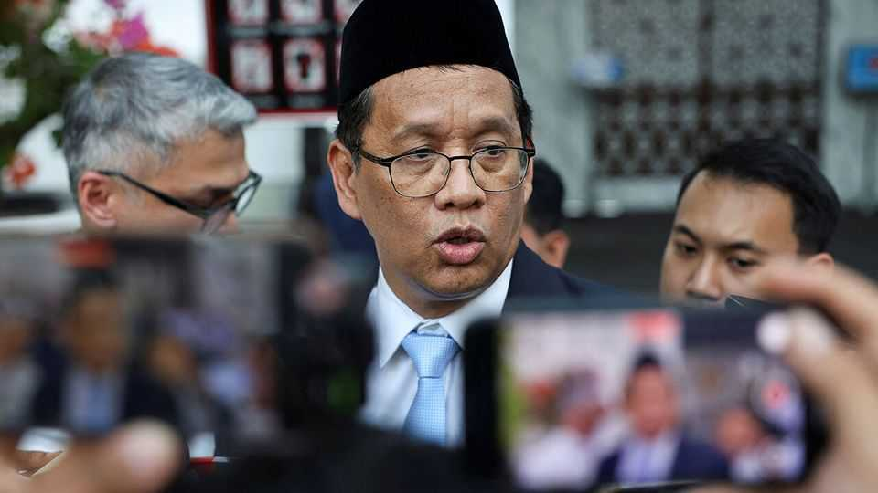

Asia | Budget shenanigans
Indonesia raids its rainy-day pot
And foreign investors head for the airport
November 6th 2025

JUST A YEAR in as Indonesia’s president, Prabowo Subianto has faced waning popularity, civil unrest, a slowing jobs market and other setbacks to his campaign promises of economic growth and social change. Now Mr Prabowo and his sidemen are raiding what kitties they can. The new finance minister, Purbaya Yudhi Sadewa, has taken aim at a $27bn cash hoard sitting in Indonesia’s government coffers and known as the Saldo Anggaran Lebih or accumulated budget surplus (SAL). The SAL is cash left over from past surpluses which Mr Purbaya’s prudent predecessor, Sri Mulyani Indrawati, held chiefly as a rainy-day fund. Mr Purbaya takes a different tack. He plans to spend more than half of the SAL by the end of 2025—having injected $12bn from the fund into Indonesia’s

underwhelming state-owned banks in September. Mr Purbaya argues that a much smaller SAL is all the government needs for cash-management purposes. The money for the banks is intended, in effect, as a stimulus to the economy.

Mr Prabowo elevated the technocrat after sacking Sri Mulyani, whose house was trashed during anti-government protests in August. Mr Purbaya is seen as less fiscally judicious than Sri Mulyani, a former World Bank managing director, and more pliant. In pursuit of Mr Prabowo’s fanciful goal of 8% growth, Mr Purbaya has pledged 6-7% growth next year, up from 5% now, in hopes of mollifying protesters “They’ll be busy working and eating well instead of protesting,” he said, soon after being sworn in.

Mr Purbaya is not wholly unorthodox, having last week defended central- bank independence, for instance. Meanwhile, the stockmarket has risen, and government bond yields are lower than at the start of the year.

For all that, the government’s finances are heading for a crunch. The budget deficit has risen to just under the legally mandated cap of 3% of GDP. That is partly because the prices of the commodities (coal, nickel) on which Indonesia depends have fallen; a weak economy has not helped, either. Budget projections for 2026 look too rosy. Mr Prabowo insists on carrying on spending on his priorities, including free school lunches and a sprawling programme of village loan co-operatives.

With fiscal guardrails undermined, foreign investors have sold $6bn worth of government bonds since August, though they had begun pulling out long before. Foreign holdings have fallen from a pre-pandemic peak of 39% of the total to just 14%. The central bank has filled the gap and now owns a quarter of rupiah-denominated government bonds. Less reliance on foreign capital may mean less risk of financial panic. But once confidence is lost, it will not be easy to regain. ■

This article was downloaded by zlibrary from [https://www.economist.com//asia/2025/11/06/indonesia-raids-its-rainy-day-pot](https://www.economist.com//asia/2025/11/06/indonesia-raids-its-rainy-day-pot)