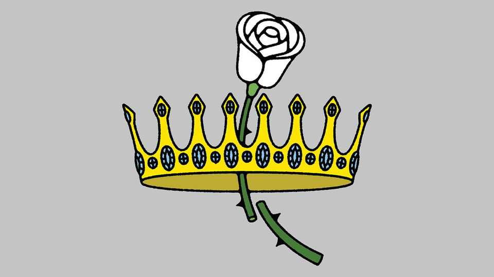

Asia | Banyan
Queen Sirikit’s death shows changing Thai views of the monarchy
Her mercurial son, as king, does not help
November 6th 2025

BACK IN 1960 New York threw a ticker-tape parade for Thailand’s young king, Bhumibol Adulyadej, an anti-communist ally of America’s. New Yorkers turned out in droves to see Bhumibol go by. Yet bystanders noticed that he never smiled. When a reporter asked why, the king gestured to his consort, Queen Sirikit, a 27-year-old spirited beauty. “She”, he said, “ is my smile.” The press called the young queen, who mixed Thai jewels with French couture, the Jackie Kennedy of Asia. Sirikit died on October 24th at the age of 93. She had been largely out of the public eye since a stroke in 2012; Bhumibol died in 2016.

Elderly Thais still remember the early years, when she charmed Western crowds. According to Thai tradition, a good king must model Buddha-like equanimity. The counterpose to Bhumibol’s stoicism was Sirikit’s glamour. The combination made the royal couple wildly popular among their subjects during their seven-decade reign.

The two modelled a monarchy for Thailand’s aspirational middle classes. To the rural poor, their charitable works made them appear to care, when politicians did not. Their popularity was not pre-ordained: on Bhumibol’s accession in 1946 the monarchy had been consigned by the moderates and fascists vying to lead Thailand to being a remote symbol. The royal couple’s winning personalities and charitable works—as well as aggressive public relations and strict laws against criticising them—meant the monarchy acquired unrivalled influence, an inseparable part of the Thai trinity of nation, religion and king.

Yet Thais also know Sirikit for something else: her interventions in the country’s turbulent politics. The palace interfered constantly. The king frequently intervened to bless coups and discourage violence. By the 1970s Sirikit was even more active, aligning herself with right-wing coup-makers in her own army unit, the Queen’s Guard. In 2008, when royalist demonstrations seeking to unseat the government of the day turned violent, Sirikit gave money to the movement and took the extraordinary step of attending the funeral of a protester killed by police. The government soon fell.

The desire for a politics free of the court’s influence has only grown. Several popularly elected governments have been deposed by the generals or the royalist establishment, who then made a mess of governing. Many younger Thais believe a quasi-feudal monarchy stands between their country and a modern, democratic politics. They are at best indifferent to the royal nostalgia that the establishment expected with Sirikit’s death.

When Bhumibol died, the then junta declared a full year of mourning. Thais earnestly complied, wearing black and white. Football matches were cancelled and television dramas taken off air. On Queen Sirikit’s death, many expected an outpouring of support for the monarchy. That would have been helpful to the (royalist) prime minister, Anutin Charnvirakul. His Thai

Pride Party is preparing to fight a tough election campaign next year against the People’s Party, for whom reforms to the monarchy and army are central tenets. Yet even opposition politicians have been surprised at the muted reaction to Sirikit’s death. Far fewer Thais are wearing mourning clothing than nine years ago. Nor have popular events been cancelled: a South Korean pop group, Blackpink, which includes a Thai member, played at the national stadium the day after the queen mother’s death (though the audience were asked to don black and white, which most did).

Though Sirikit was a consort, not the monarch, she was nearly as beloved. So the muted reaction suggests changed attitudes to the monarchy. Her 73- year-old son, Vajiralongkorn, who rules as Rama X, is a martinet playboy who has been married four times, taken an official mistress, disinherited offspring and lacks an obvious heir. His erratic behaviour has tarnished the monarchy.

The government may have worried about the economic fallout from a strict period of mourning for Sirikit, including a ban on popular entertainment. That would have harmed its electoral prospects more than the boost that royalist nostalgia might have brought.

Yet some interpretations of court customs would prohibit an election during a royal mourning period. If his popularity has not recovered by early next year, Mr Anutin could cite them as cause to delay the polls. Keeping a royalist party in power would be a last service to the monarchy, in death, from a queen who so defended it in life. ■

Subscribers to The Economist can sign up to our Opinion newsletter, which brings together the best of our leaders, columns, guest essays and reader correspondence.

This article was downloaded by zlibrary from https://www.economist.com//asia/2025/11/06/queen-sirikits-death-shows-changing- thai-views-of-the-monarchy

China

China’s Belt and Road Initiative is booming again What a leaked transcript reveals about China’s muscular statecraft Hong Kongers support gay marriage. Their leaders, not so much How a little Chinese island rose to global chemical dominance