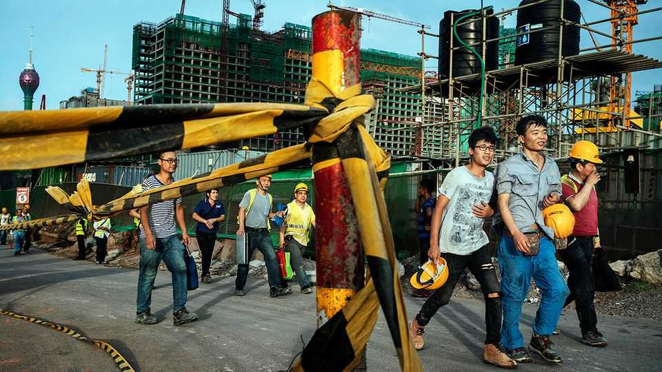
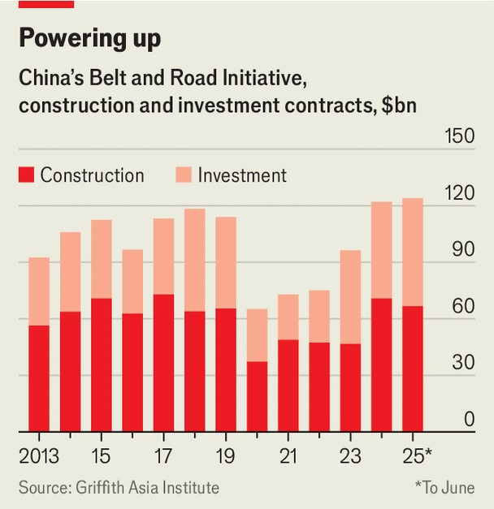
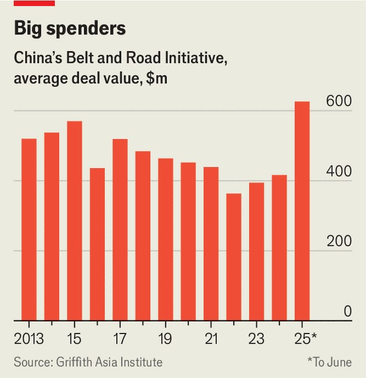

China | Buckle up
China’s Belt and Road Initiative is booming again
In a Trump-troubled world, China’s leader still sees opportunities in poor countries
November 6th 2025

CHINA’S LEADER, Xi Jinping, sees difficult times ahead. At a conclave of the Communist Party’s most senior officials that ended on October 23rd he warned that over the next five years the task of ensuring China’s development while maintaining its security would become “much harder” amid a “notable rise in uncertainties and unforeseen factors”. Mr Xi’s meeting a week later in South Korea with President Donald Trump produced an uneasy truce in the two countries’ fight over trade. But it will not have eased Mr Xi’s biggest headache. The cure for Trumpian instability, as he sees it, is an alternative order that draws the rest of the world a lot closer into China’s orbit.

Enter the Belt and Road Initiative (BRI). Not so long ago, some analysts wondered whether China might wind down this colossal infrastructure- building scheme, to which most of the 130 or so poor or developing countries collectively known as the global south have signed up. Mr Xi launched the project in 2013, aiming to boost growth and trade by building ports, railways, power plants and so on (and to land big deals for Chinese state firms, which got many of the contracts). The BRI was soon beset by claims that it was crippling countries with debt and damaging the environment. China began scaling back its loans. Yet though BRI activity ebbed during the pandemic, it has picked up sharply since 2023, reaching record levels. It is also helping stimulate trade between China and the global south, expanding markets for Chinese goods that Mr Trump’s tariffs are pricing out of America.

First, look at the trade numbers. America is still the single biggest destination for Chinese exports of goods. Yet its share of China’s shipments has fallen sharply since trade tensions soared during Mr Trump’s first term as president, from nearly 20% in the first nine months of 2018 to less than 12% in the same period this year. The global south is taking up the slack. Year-on-year exports to ten members of the Association of South-East Asian Nations (ASEAN) grew by 15% in September, as they did to countries in Latin America. China’s exports to Africa jumped by nearly 57%. According to S&P Global, a financial-data firm, the global south took 44% of China’s exports in 2024, up from 35% in 2015. This group of countries also accounts for more than half of China’s global trade surplus. (America’s share is 36%.)

Then consider BRI activities. These often involve projects that encourage trade. A Chinese factory built in a foreign country, for example, may rely on components or machinery shipped from China. It can thrive in local markets, or sometimes even in America’s by making goods appear to originate from a country other than China and thus evading China-related tariffs. In 2023, the first full year after China abandoned its “zero-covid” policy, the total value of BRI investments and construction contracts was $96.3bn, according to recently revised data compiled by Christoph Nedopil of Griffith University in Australia, working with the Green Finance and Development Centre at Fudan University in Shanghai (they count any Chinese state or private investment, as well as construction contracts, in countries that have joined

the scheme as BRI “engagement”—China does not publish an official list of BRI projects).

This was still below pre-covid levels, but a big rebound from the pandemic era (up from $75bn in 2022). In 2024 and 2025, BRI engagement surged. The rise of nearly 27% in 2024, to $122bn, was one of the largest annual increases in a single year in the history of the scheme. In the first half of this year the record was broken again, with more than $124bn of engagement, more than double the amount in the same period of 2024, Mr Nedopil calculates.

In 2021, responding to widespread misgivings about the BRI, Mr Xi called for more emphasis on a “small but beautiful” approach: less splurging on concrete-consuming infrastructure, and more spending on projects relating to health care, green energy, telecommunications and more; there would be no new Chinese investment abroad in coal-fired power.

But large projects still dominate. Of $40bn of BRI money directed to Africa in the first half of this year, a single deal accounted for nearly half: a $20bn contract awarded to a Chinese state firm for building oil and gas facilities in Nigeria. By value, fossil-fuel projects take the lead in BRI-related energy

ventures. Another big slice of BRI money has involved construction deals in Kazakhstan worth nearly $20bn tied to copper and aluminium production.

Megadeals involving state-owned companies mask another, more welcome trend, however: a surge in BRI activity, sometimes led by non-state firms, in just the kinds of business Mr Xi promised to encourage. Last year Chinese companies’ BRI engagements in solar, wind and waste-fuelled power amounted to $11.1bn. This rise of about 50% made it the greenest year (excluding hydropower projects) in the BRI’s history, says Mr Nedopil. Chinese firms poured another $8.9bn into non-hydro green energy in the first half of 2025.

All this is not just a fillip for Chinese firms facing turbulence from Mr Trump’s tariffs. As Mr Xi sees it, the BRI pays geopolitical dividends too. Since 2013 it has involved more than $1.3trn of Chinese investments and contracts in 150 countries. China hopes that this money will encourage governments to back it in multinational forums, starting with the UN. About 70 countries have already adopted language promoted by China declaring that “all efforts” should be made to achieve unification with Taiwan— implying that military force is acceptable. Most of these countries are signed up to the BRI.

There are also risks for China. Many BRI countries are seeing their trade deficits with China widen. Protectionist mutterings are growing louder in both Africa and South-East Asia. Reckless Chinese lending in earlier years leaves a sting, too. A report in May by the Lowy Institute, a think-tank in Sydney, said China had “transitioned from capital provider to net financial drain” on developing-country budgets, as debt-servicing costs on belt-and- road projects in the 2010s now “far outstrip new loan disbursements”. The institute warned of rising vulnerability to debt in many countries, especially in Africa.

Yet China knows these countries are a captive audience. Some may quietly grumble about trade imbalances or debt, but the technology and building skills offered by China are hard to find elsewhere. China hopes such countries see little choice other than to support it in its desire to be the architect of an alternative world order. As a Communist Party journal recently put it, the BRI will help create “a new paradigm of global governance”. In a Trump-troubled world, Mr Xi sees opportunities still. ■

Subscribers can sign up to Drum Tower, our new weekly newsletter, to understand what the world makes of China—and what China makes of the world.

This article was downloaded by zlibrary from https://www.economist.com//china/2025/11/02/chinas-belt-and-road-initiative-is- booming-again