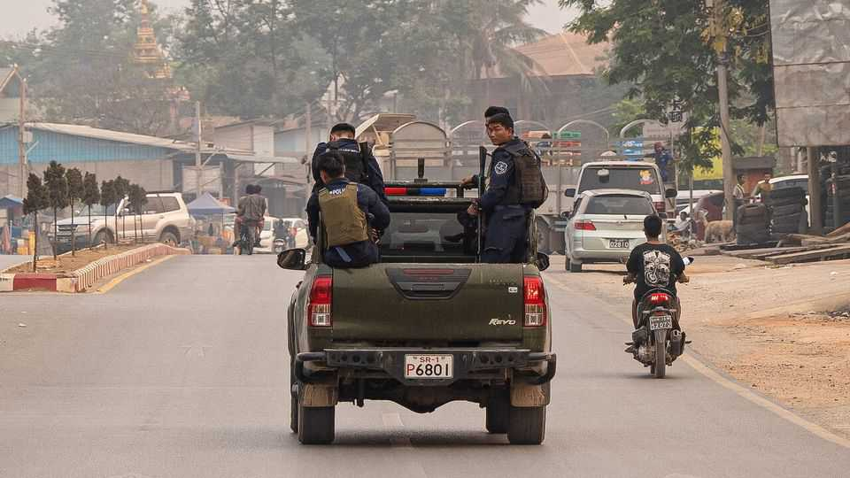
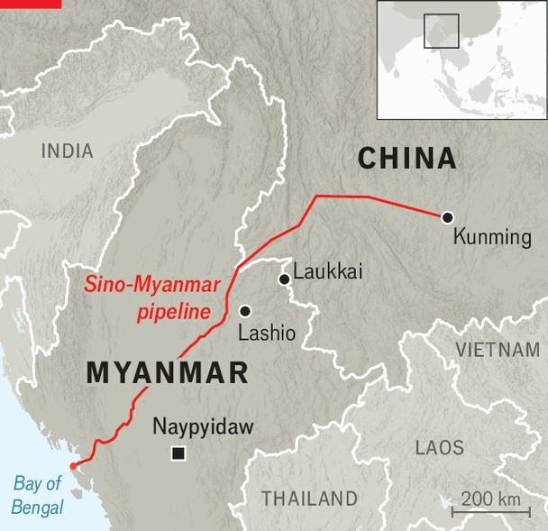

China | Behind the scenes
What a leaked transcript reveals about China’s muscular statecraft
It is determined to protect pipelines and rare-earth mines in Myanmar
November 6th 2025

Four years have passed since Myanmar collapsed into civil war, sparked by a military coup. Since then, hundreds of rebel groups have fought the ruling junta—and sometimes each other—to a messy stalemate. Western powers have largely kept out of the conflict. But China, which shares a 2,000km border with Myanmar, has not. Its firms have billions invested there, including in ventures that exploit the country’s rare earths and in a pipeline that brings China oil and gas from the Bay of Bengal. It has an incentive to mould whatever outcomes it thinks will best keep its interests secure. To better understand how China wields its influence in the country, consider a transcript—recently acquired by The Economist—that purports to record a

meeting last year between Chinese diplomats and leaders of the United Wa State Army, one of Myanmar’s most powerful rebel groups. Jason Tower, an expert on China and Myanmar, thinks it likely that the Wa produced the transcript and shared it with rebel allies, who leaked it more widely.

Verbatim accounts of Chinese diplomatic meetings are exceedingly rare. Neither the Wa nor China’s foreign ministry took up an invitation to comment on the document. But Mr Tower thinks the transcript is authentic. Nan Lwin of ISP, a Myanmar think-tank, thinks so too. Reporting on the meeting that has already appeared in Myanmar media has not attracted denials from either side. The document paints an unvarnished picture of Chinese diplomacy in its most ruthless mode.

The meeting in question, said to have taken place in August 2024, followed a period in which rebel groups aligned against Myanmar’s junta won a series of big battles in the north of the country. Their offensive—named Operation 1027, after its launch date of October 27th, 2023—was unusually well co- ordinated and effective. But the resultant changes in power and territory seem to have alarmed China.

The transcript provides details of China’s response. In it Deng Xijun, China’s special envoy for Asian affairs, orders the Wa to stop co-operating

with another powerful rebel group, the Myanmar National Democratic Alliance Army (MNDAA). He says the MNDAA has been “two-faced”. It has pretended to obey China while “sowing discord”. Its capture of Lashio (an important city) from the junta has disrupted trade with China, he says. The culprits “cannot escape blame”.

Mr Deng accuses the MNDAA of building alliances with pro-democracy groups in Myanmar which he says are backed by America and the West and “are spearheading efforts to topple the junta”. By occupying Lashio, Mr Deng argues, the rebels have created space for America and the West to get involved, which could result in Myanmar slipping further into anarchy.

Mr Deng notes that China is disciplining the MNDAA through a punishment called the “five cuts”. China, he says, will sever the MNDAA’s access to electricity, cut off its water, restrict internet access, curb the movement of people and choke the flow of goods. (Nearly all the parties in Myanmar’s civil war depend to some extent on trade with China.) He also warns that China may act against rebel leaders. If the Wa continues to help the MNDAA, he says, China will go after them too.

Ensuing events suggest these hardball tactics bring results. Not long after the alleged meeting Peng Deren, the MNDAA’s leader, was reportedly detained while visiting China. Mr Peng reappeared this year after his group signed a ceasefire with the junta. China’s foreign ministry said the two sides were grateful to China for “facilitating the successful outcome” of the talks. The MNDAA also withdrew from some of the territory it conquered during Operation 1027, including from Lashio.

These days the MNDAA looks focused on developing the areas it controls. In Laukkai, its stronghold, the group offers permanent residency to Chinese who invest at least 500,000 yuan ($70,000). It may be betting that this will deter attacks from Myanmar’s junta, who might fear harming Chinese citizens or their interests. The Wa seem to have got the message, too. They have announced on social media that they will no longer support the MNDAA, for fear of China retaliating.

China’s interventions have not only targeted the junta’s enemies. The five cuts sound similar to a punishment China had previously imposed on the

junta’s own border guard for failing to act against scam centres in Myanmar. Broadly speaking, China cares less about who holds what territory in Myanmar than about keeping the border regions stable and trade flowing. But its actions are altering the course of the conflict—and not in ways that will necessarily hasten a peace that lasts. ■

Subscribers can sign up to Drum Tower, our new weekly newsletter, to understand what the world makes of China—and what China makes of the world.

This article was downloaded by zlibrary from https://www.economist.com//china/2025/11/06/what-a-leaked-transcript-reveals-about- chinas-muscular-statecraft