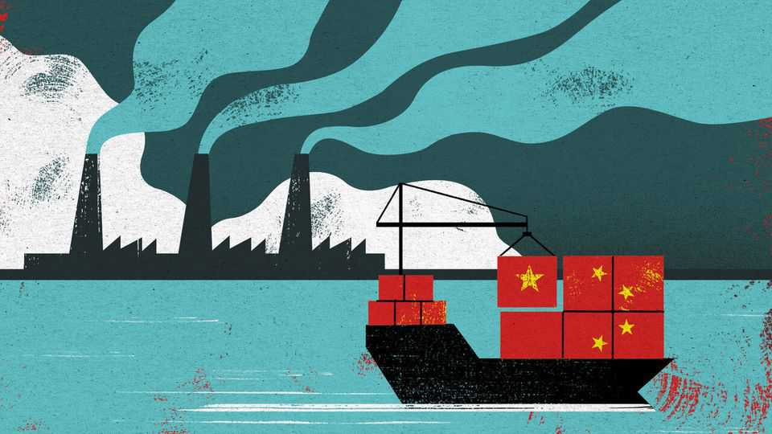

China | Chaguan
How a little Chinese island rose to global chemical dominance
A parable of China’s industrial supremacy
November 6th 2025

TO CATCH A glimpse of China’s industrial heft, visit Changxing Island in the country’s north-east. There, jutting into the Bohai Sea, is one piece of the machine: a specialised petrochemical plant that opened in 2012 and has grown relentlessly ever since. It represents, in condensed form, the powerful mixture that has fuelled China’s dominance of global manufacturing: policy directives, state support, local incentives and restless entrepreneurs. For the rest of the world it is also a cautionary tale. Hope springs eternal that China might rein in its excess capacity, perhaps as a result of its “anti- involution” campaign, the government’s latest attempt to curb cut-throat competition among domestic producers. But Changxing Island shows it is

more realistic to expect another path—namely, that other countries will find it ever harder to displace China in global supply chains.

This story could be told about almost any kind of factory or locale in China, so sprawling is the country’s manufacturing base. Changxing Island, however, brings clarity to the analysis as a small place that has gone from basically nothing to become an unheralded linchpin of global industry in little more than a decade.

Until the early 2000s Changxing was mostly farmland and fishing villages, administered by the nearby city of Dalian. But it had a big selling point as China’s only underused deepwater shoreline. State planners wanted to kick- start it, so they designated it as a special development zone focused on chemicals, promising a variety of benefits, from streamlined approvals to subsidies, for companies that invested there.

What made these promises potent was how China’s private sector responded. A thousand kilometres to the south was a polyester producer, Hengli. Its take-off began in 1994 when a husband and wife took a chance on buying a bankrupt government-owned textile-maker. By running it more efficiently, they did well. But margins were low, compressed by extreme competition with other Chinese textile firms. They spotted an opportunity in Changxing to move up the value chain: to produce purified terephthalic acid (PTA), a white powder used for making polyester. In 2010 Hengli broke ground on its first PTA factory in Changxing.

A few expansions later—Hengli’s investment has reached about 25bn yuan ($3.5bn)—the Changxing facility is now the world’s biggest PTA producer. China, meanwhile, has gone from being a net importer of the stuff a decade ago to being the dominant supplier, accounting for more than 60% of global production. Faced with stiff competition, companies in Canada, Europe and Japan have all reduced their PTA output, or stopped making it.

The Changxing experience sheds light on how China did it. Hengli got big benefits from basing its PTA operations there. The development zone was listed as a priority project by the national government for the revitalisation of China’s north-east, an economically depressed region. Such designation usually brings tax incentives, preferential land pricing, credit lines from state

banks and regulatory fast-tracking. The government dredged and reclaimed tidal flats in Changxing, and built top-notch port facilities. Economists with the IMF recently estimated that the fiscal cost of China’s industrial policy is about 4.4% of GDP, much higher than elsewhere. That gives some idea of the financial support available to companies such as Hengli.

But China has not just thrown money at it. The state has also given the company direct access to scientific expertise. Less than a ten-minute drive from Hengli’s sprawling facilities is a campus of the Dalian Institute of Chemical Physics, an arm of the Chinese Academy of Sciences. Its researchers have, among other things, tried to devise more efficient ways of producing PTA. Hengli has boasted of the “rapid commercialisation of research outcomes” thanks to its collaboration with the institute. It is almost like having an extra R&D unit funded by the state.

The animating force in all this has been Hengli’s relentless drive for profit in ultra-competitive markets. The same logic that pushed Hengli from polyester into PTA is now sending it into ever more valuable bits of the supply chain. In 2019, facing high costs for imported paraxylene (PX), a feedstock for making PTA, it started making that, too. A vital ingredient for PX is crude oil, which Hengli is not about to start drilling for. But it has created a unit to build supertankers, so that it can transport its own supplies.

This is not to say that all is perfect in Hengli’s world. Ultimately its fortunes depend on polyester selling well. Recently the industry has slowed. Lorry drivers outside its Changxing facility wait under trees for orders to come in. “There are too many drivers now but demand is weaker,” says one. As in much of the Chinese economy, there are also concerns about Hengli’s debt.

Should the rest of the world care that China has become a PTA powerhouse? There is an argument that it does not matter. Control of the polyester supply chain is hardly a matter of national security. What is more, PTA is a commodity. Other countries could fire up their plants again if necessary. In the meantime, availing themselves of relatively inexpensive Chinese output frees them up to invest in more important domains.

Yet that is too glib. The chemicals sector is known as “the industry of industries” because its products feed into all manner of goods. PTA is just

one chemical, but China’s dominance spreads across many more. And it is only increasing. Officials from Washington to Brussels are focused on rare earths; they overlook chemicals at their peril. Changxing, meanwhile, is moving ahead: a new government plan calls for the island to upgrade into more specialised chemical products. Catching up with China is hard enough —and it is not a stationary target. ■

Subscribers to The Economist can sign up to our Opinion newsletter, which brings together the best of our leaders, columns, guest essays and reader correspondence.

This article was downloaded by zlibrary from https://www.economist.com//china/2025/11/03/how-a-little-chinese-island-rose-to- global-chemical-dominance

Middle East & Africa

Will anything—or anyone—stop the slaughter in Sudan? Tanzania has its Tiananmen moment Donald Trump says he may strike Nigeria to save Christians. Really? Iraq’s election may ensure stability but leave militias in control Israel’s politicians are taking on its lawyers once again