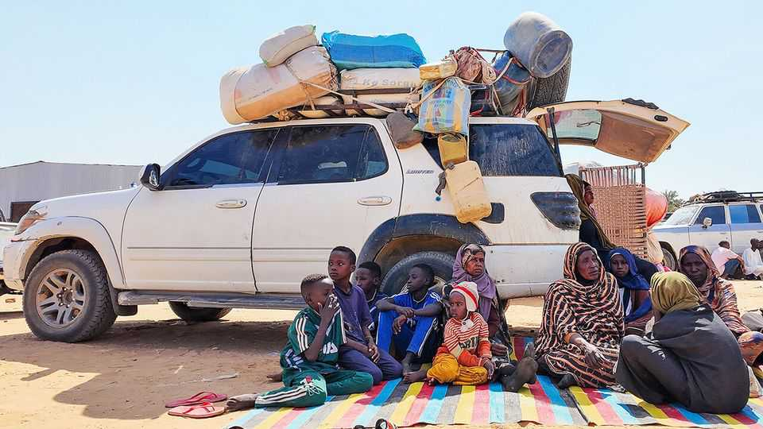
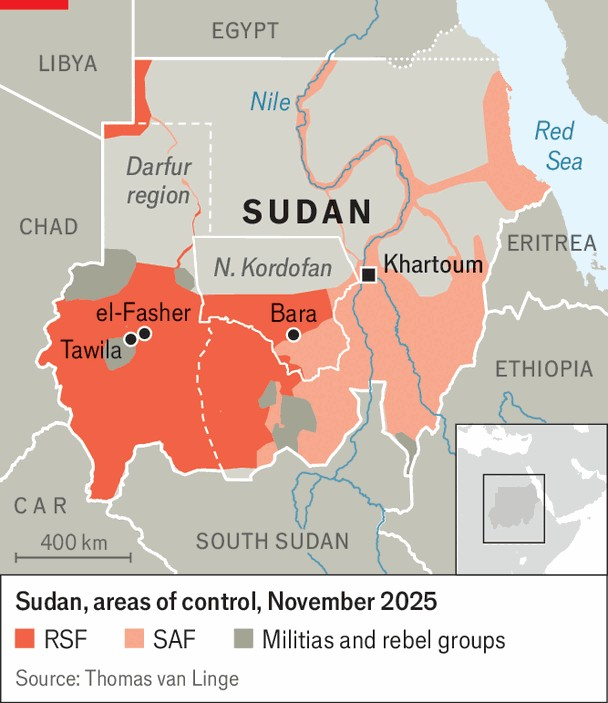

Middle East & Africa | Horror upon horror
Will anything—or anyone—stop the slaughter in Sudan?
As a killing spree unfolds in Darfur, an end to the civil war looks remote
November 6th 2025

Thousands of refugees have been arriving in Tawila, a town in western Sudan, in recent days. They are fleeing el-Fasher, the capital of the Darfur region, which fell to the Rapid Support Forces (RSF), one party in Sudan’s civil war, on October 27th after an 18-month siege. Those who have escaped since then tell of mass rape, abductions and streets lined with corpses. Many of the city’s roughly 260,000 residents remain unaccounted for. El-Fasher’s bloody fall marks yet another turning point in Sudan’s catastrophic civil war, in which fortunes have see-sawed since it began more than two and a half years ago. The RSF, which was ousted in March from the national capital, Khartoum, by the Sudanese Armed Forces (SAF), the

national army, is back in contention in its fight to rule the country. Hopes for a ceasefire have taken a knock. As evidence mounts of mass murder in el- Fasher, fears of further ethnic violence in Darfur and elsewhere in Sudan are intensifying.

Even by the standards of Sudan’s war, the battle for el-Fasher was exceptionally grim. The city is totemic for the RSF, whose leaders— including Muhammad Hamdan Dagalo, a warlord known as Hemedti— largely hail from Darfur. The paramilitary group is descended from the mostly Arab Janjaweed militias that are notorious for the slaughter of black Africans in Darfur in the 2000s. During the past two years the fiercest resistance the RSF faced in Darfur came from self-defence militias drawn from the same ethnic groups that were targeted in the past, who allied themselves with the SAF to defend el-Fasher.

In response the RSF, kitted out with drones and other arms allegedly supplied by the United Arab Emirates (UAE), launched a campaign targeting civilians. (The UAE strenuously denies supporting the RSF.) In a refugee camp on the outskirts of el-Fasher, as many as 1,500 people may have been killed in a single RSF assault in April. The group erected earth walls around the city centre to prevent people from fleeing. By October local activists were reporting an average of 30 deaths a day from violence, hunger and disease.

Having overrun el-Fasher, the RSF embarked on a murderous rampage. Videos circulating online show its fighters executing unarmed men. The World Health Organisation says more than 460 patients and their companions were killed in a single massacre in a maternity hospital. Bodies lying in pools of blood around the city are visible from space. More recent satellite images suggest the corpses are starting to be moved into mass graves.

What could stop the slaughter? Neither party has a pressing reason to make peace. With the dry season ahead, the RSF may decide to build on its momentum in Darfur. It is expected to advance farther into North Kordofan, where it captured the town of Bara—and killed more civilians—on October 25th (see map). Meanwhile the SAF “do not see themselves as down and out”, says a well-informed source. Some of its political allies, including hard-line Islamists, look determined to keep fighting.

Two decades ago, violence in Darfur was quelled thanks to international pressure, including a celebrity-studded campaign to “Save Darfur” that eventually led to a UN arms embargo and the dispatch of African Union peacekeepers. Today, the only realistic way to stop the fighting is to persuade the parties’ regional sponsors to stop backing them. That is hardly simple. The UAE is thought to see the RSF as a bulwark against the Islamists in the SAF. Egypt and Saudi Arabia are keen on a regime in Khartoum led by the SAF.

But there are signs that compromise is possible. In September America, Saudi Arabia, Egypt and the UAE issued a statement calling for a ceasefire and a post-war settlement for Sudan involving neither the SAF nor the RSF. The countries, known as the Quad, explicitly acknowledged that external military support served to prolong the conflict. Shortly before el-Fasher fell,

Massad Boulos, President Donald Trump’s Africa adviser, hosted officials from the three other countries at peace talks in Washington. Delegations from the SAF and the RSF, including Mr Dagalo’s brother, were there, too. That was a signal that for the first time both sides might be open to a ceasefire.

The bloodshed in el-Fasher, though humiliating for America’s diplomats, did not completely doom the talks. America is still negotiating with each side separately for a 90-day “humanitarian truce”. Mr Trump has in recent days appeared more exercised by alleged killings of Christians in Nigeria. But he may yet turn his attention to Sudan, perhaps with an eye on a Nobel peace prize.

Much will depend on whether Mr Trump is willing to press allies, above all the UAE, to stop backing the belligerents. “Just a tweet condemning the UAE’s support for the RSF would send shockwaves through Abu Dhabi,” says a former American official. So far the Trump administration, like that of Joe Biden before it, looks loth to confront the Emiratis. Yet on November 2nd the UAE’s foreign minister reiterated the emirate’s commitment to the Quad statement and regretted his country’s inadequate past support for civilian governance. That suggests an opening to press the UAE to align actions with words. Mr Trump’s intervention would not ensure a peace deal. But it may force the warring parties to consider one. ■

Sign up to the Analysing Africa, a weekly newsletter that keeps you in the loop about the world’s youngest—and least understood—continent.

This article was downloaded by zlibrary from https://www.economist.com//middle-east-and-africa/2025/11/06/will-anything-or- anyone-stop-the-slaughter-in-sudan