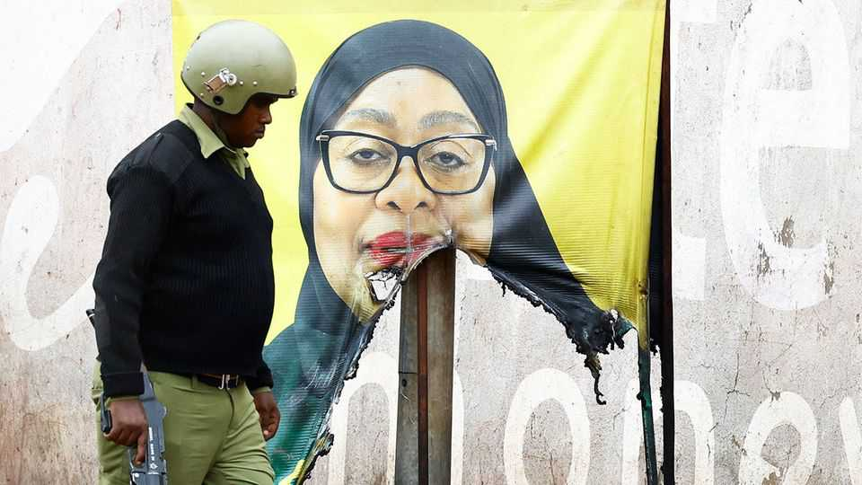

Middle East & Africa | Blood on the ballots
Tanzania has its Tiananmen moment
A post-election crackdown that killed hundreds has changed the country forever
November 6th 2025

The inauguration of Samia Suluhu Hassan as president of Tanzania on November 3rd was an incongruently unconfident event for someone who claims to have won 98% of the vote in an election on October 29th. The swearing-in was brought forward and moved from a stadium in the largest city, Dar es Salaam, to a military parade ground in Dodoma, the sleepy capital. The public was banned. Only four other African leaders turned up. All this reflects how an event meant to show the post-election strength of the Chama Cha Mapinduzi (CCM), the ruling party, revealed instead how it was rattled by the largest protests Tanzania has ever seen. After the CCM rigged an election by banning opposition parties, jailing their leaders and seemingly

fiddling the results, demonstrators rose up in numbers that smashed expectations. Rather than make concessions, the CCM unleashed terror on an unprecedented scale. Tanzania will never be the same. A party that claims to run one of Africa’s most peaceful countries has had its Tiananmen Square moment.

That Tanzania became the latest poor country to see youthful protests, after Nepal, Madagascar and others, is something of a surprise. The CCM, for all its authoritarianism, was the most popular party, at least according to pre- election polls by Afrobarometer, a pan-African research group. The country’s economic growth rate, forecast to be 6% in 2025, is one of the highest on the continent.

But Tanzania’s opposition movement “does not define itself in economic terms, it defines itself in democratic terms,” notes Dan Paget, a British academic specialising in the country. Tundu Lissu, the jailed leader of Chadema, a banned opposition party, had called for a boycott of the election unless the political space was opened up; “no reforms, no election” was his slogan. Dozens of regime opponents may have been disappeared by security forces this year. The brutal intransigence of Mrs Samia, who became president only after the death of her predecessor, John Magufuli, caused her elevation from vice-president in 2021, added to tensions. And in an age of booming youthful populations, including record numbers of university graduates, there were more willing participants in street protests than ever before.

They had much to complain about. The internet was shut down and there were reports of manipulation of vote tallies. An observer mission from the Southern African Development Community (SADC), typically a meek body that has rubber-stamped dodgy ballots in Zimbabwe and elsewhere, said that “in most areas, voters could not express their democratic will.”

What happened next was even more disturbing. Church groups and NGOs are still compiling death tolls, an exercise made harder by alleged efforts to hide bodies and remove CCTV footage from key sites. But early estimates suggest that many hundreds, and perhaps thousands, were killed. Such figures would make Tanzania’s among the bloodiest elections in recent African history.

What happens now? Opposition movements seem to have been bludgeoned into quiescence. The internet has been turned back on and businesses have begun to re-open. In Tanzania and many other African countries the aftermath of elections often sees a period of conciliation. Before the violence, Mr Lissu was expected to be released after the vote, maybe with a conviction that would bar him from standing for office. But the fear that the popular uprising has instilled in the regime may make it wary of making such a move.

In the medium term Tanzanian politics will be tumultuous. The CCM is, in effect, Africa’s longest-ruling liberation party. Its tenure stems from the role of its precursor parties in the formation of Tanzania, its mix of repression and genuine development gains—and the way it has allowed enough internal dissent to renew itself. Already there is speculation that Mrs Samia will be elbowed aside by party bigwigs and security forces, especially in the army, who see her as a liability.

Mrs Samia, whom protesters call “Idi Amin Mama” after the late Ugandan dictator, will want to cling on, if only to protect herself and her family. The race to succeed her as party leader in 2030, if not before, will have begun. Whatever happens, the president has destroyed Tanzania’s reputation as a relatively peaceful country in an often unstable region. ■

Sign up to the Analysing Africa, a weekly newsletter that keeps you in the loop about the world’s youngest—and least understood—continent.

This article was downloaded by zlibrary from https://www.economist.com//middle-east-and-africa/2025/11/06/tanzania-has-its- tiananmen-moment