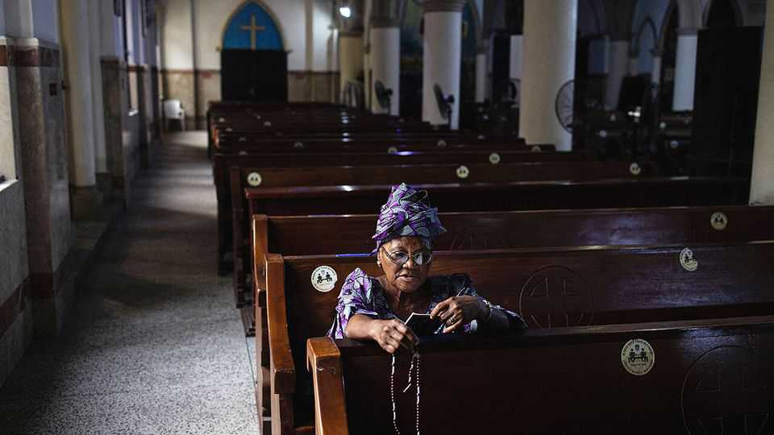

Middle East & Africa | An errant crusade
Donald Trump says he may strike Nigeria to save Christians. Really?
The reality behind the American president’s latest threats
November 6th 2025

“We are shocked that President Trump is mulling an invasion of our country,” a spokesperson for Bola Tinubu, Nigeria’s president, recently told CNN. And well they might be. Africa’s most populous country has done nothing to threaten America, its largest foreign investor. Nigerians are among the most pro-Trump people in the world: a poll earlier this year found that 79% of them had high confidence in America’s president to do “the right thing regarding world affairs”, the largest share of any of the 24 countries surveyed by the Pew Research Centre, a think-tank and pollster. But Donald Trump has Nigeria in his sights. On October 31st, having reportedly watched a Fox News segment about the ostensible slaughter of

Christians in the country, he posted that he would label Nigeria a “Country of Particular Concern”, a designation for supposed hotbeds of religious persecution that can pave the way for American sanctions. A day later Mr Trump said America “may very well go into that now disgraced country, ‘guns-a-blazing’”, to wipe out “Islamic Terrorists”.

The idea of a “Christian genocide” in Nigeria has gained traction in conservative circles in America. There are parallels with the so-called “white genocide” in South Africa, another subject to have received Mr Trump’s attention via right-wing TV and lobbying in Washington by Africans with agendas at home. In both cases, although there is a kernel of truth, the specific claims are mostly wild exaggerations.

Nigeria, whose 230m people are broadly split between a Muslim-majority north and Christian-majority south, has three major security crises. First, terrorism by jihadist groups such as Boko Haram. Second, widespread banditry and kidnapping. Third, conflict between groups of herders and farmers. These crises, concentrated in the poor north, can involve Muslims murdering Christians. But they also involve Muslims (and Christians) killing Muslims. And the causes of the violence are often factors other than religion, like ethnicity, party politics or disputes over land.

“This is not religious violence, even if it has the semblance of it,” says the head of a Nigerian NGO. The Armed Conflict Location & Event Data (ACLED), an American monitor, estimates that since 2020 armed groups have targeted civilians on some 12,000 occasions, leading to nearly 21,000 deaths. Yet it reckons that there have been fewer than 400 cases that targeted Christians for their faith, with fewer than 500 reported deaths on these occasions. Massad Boulos, Mr Trump’s Africa adviser, said in October that “people of all religions and of all tribes are dying” in Nigeria.

And yet Mr Trump is right to imply that Nigerian governments have done far too little to tackle insecurity. Indeed they regularly make it worse. Human-rights groups have accused the army of killing civilians. Nigerian politicians hire thugs for elections. “The Americans didn’t invent our chaos —they merely licensed it,” argues Elnathan John, a Nigerian writer.

What will America do? Ted Cruz, a Republican senator, went to the White House on November 5th to discuss his bill that would sanction Nigerian politicians said to be abetting massacres. Other officials who must make sense of Mr Trump’s posts may be scrambling to think of potential targets. One possibility would be jihadists in the Lake Chad region. “But it’s not like there is a terrorist lair or uranium facilities that we can bomb,” says Matthew Page, a former Nigeria intelligence analyst for the American government, who now works at Chatham House, a think-tank in London.

For the moment Mr Trump is seeing what happens when he jolts the Nigerian government. It has pushed back on his characterisation while welcoming American help, as long as it is done in co-operation with Nigeria. Mr Tinubu will need to show an urgency that has been lacking in tackling Nigeria’s security crises and in his foreign policy. After taking office in 2023 he recalled Nigeria’s roughly 100 ambassadors—and has yet to appoint successors. Nigerian media suggest that some will be dispatched soon. Whoever goes to Washington will have work to do. ■

Sign up to the Analysing Africa, a weekly newsletter that keeps you in the loop about the world’s youngest—and least understood—continent.

This article was downloaded by zlibrary from https://www.economist.com//middle-east-and-africa/2025/11/06/donald-trump-says-he- may-strike-nigeria-to-save-christians-really