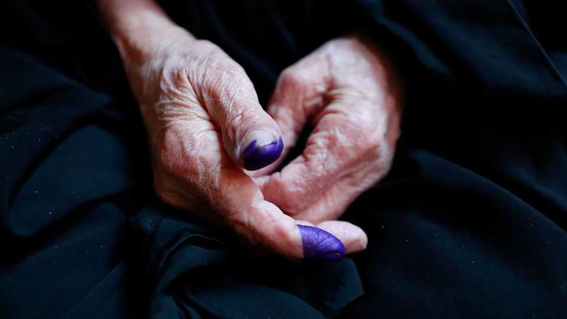

Middle East & Africa | The Iraqi paradox
Iraq’s election may ensure stability but leave militias in control
This may come at the cost of weakening civil society and wider freedoms
November 6th 2025

Outside one of Baghdad’s top universities, throngs of young women in niqabs gather. The walls behind them are plastered with posters of militia fighters. Among them is Qais al-Khazali, who heads one of Iraq’s toughest militias. His white turban and sharp eyes look down on the gossiping students, who are set to vote in the sixth general election since the American invasion of their country in 2002. In the past few years under the coalition government of Muhammad Shia al- Sudani, Iraq has enjoyed a remarkable period of calm and economic growth, keeping out of the turmoil that has shaken the region. Some say the election will make little difference to the way Iraq is governed, whether or not Mr

Sudani’s bloc wins the most seats in the 329-member parliament. But it could be a litmus test as to whether the country’s Iran-backed militias can still pull the strings behind whatever government emerges.

Two decades ago Mr Khazali was one of America’s most wanted: a leading light in the Shia Muslim insurgency against American-led coalition forces. He and his brother Laith were involved in numerous attacks on Western troops before being captured by British soldiers in 2007. Today Mr Khazali, still designated a terrorist by America, commands a militia that backs one of Iraq’s biggest political blocs (in theory the parties do not have their own armed wings). Nobody knows for sure whether he will again support Mr Sudani’s bloc. So Mr Khazali is a kingmaker in parliament. Whoever becomes prime minister will most probably have him to thank.

Last year, as Israel pulverised Iran’s “axis of resistance” in Lebanon, Syria and Yemen, many Iraqis nervously wondered if they might be next. Yet as the bombs rained down across the region, Mr Khazali’s militia, Asaib Ahl al-Haq (League of the Righteous), kept quiet. The group insisted it had no wish to drag Iraq into another war. This seems wise.

Mr Khazali’s vision goes beyond armed resistance. In recent years his militia has turned to business and government, raking in a fortune through state procurement contracts and the energy industry. Corruption has flourished. As the cats grew fat, they became less inclined to fight Iran’s battles; Iraq was rewarded with a fragile peace. Asaib was not the only militia to discover the rewards of commerce.

Lately, however, Asaib has gone a step further, taking control of Iraq’s education ministry and those chattering students. Its record there hints at how it intends to use its influence more profoundly in Iraqi politics and society. The country’s universities were once among the finest in the Middle East. For Mr Khazali, they are a jewel in the crown of his ambition to become Iraq’s leader behind the scenes. Embedding a militia at the heart of government has probably contributed to Iraq’s stability. But it also comes with costs for academic and wider freedoms.

Indeed, Asaib’s foray into governance has already damaged the universities. The group has taken a nakedly partisan approach to education, turning

campuses into ideological factories for its movement and a recruitment ground for its militia. “We have become their HR office,” laments a secular- minded student activist.

Top engineering students are siphoned into Asaib’s drone programme. Pro- militia student unions get lavish funding. Higher grades are bought through connections to the party. Debate among Iraq’s gregarious youth is being stifled, faculty posts handed to loyalists. So the universities’ reputation has begun to sink fast. “If this continues, there will be very strong protests—and people will start speaking out,” warns Dhiaa al-Asadi, an academic and former MP from a movement led by Muqtada al-Sadr, a rival Shia firebrand.

“There’s often been an argument that it’s better to have them inside the state than outside it, because at least you avoid open or direct violence,” says Renad Mansour of Chatham House, a think-tank in London. “But as they take over the state, they become part of a system in which people continue to suffer from structural forms of violence”. If the coming election were to hinge on competence in government, Asaib’s record in education would not bring it votes. But the deeper question may be how successful Mr Khazali has already been in turning the higher-education ministry into a tool of party patronage. The consequences of what militia leaders have been doing to parts of the state may not be felt for years.

Aware of the benefit of keeping out of the region’s wars, most voters are not expected to plump for the more fiery of the militias that still promise to take the fight to Israel and America. There is a growing consensus that Iraq should welcome the return of big American firms and that a limited American security presence may even bolster the country’s recent stability. (Currently some 2,500 keep a low profile, mainly as trainers.) In any event, the actual results of the coming vote may matter less than the horse-trading that follows. Forming a new government could take six months or more. Alliances can still be made and broken quickly.

Meanwhile Iraq’s militias are jumpy. They fear suffering the same fate as Hizbullah in Lebanon or Hamas in Gaza if they anger America or Israel. For the moment, at least for Mr Khazali, control of the universities is a safer bet than threatening to take up arms. The country’s students will pay the price. ■

Sign up to the Middle East Dispatch, a weekly newsletter that keeps you in the loop on a fascinating, complex and consequential part of the world.

This article was downloaded by zlibrary from https://www.economist.com//middle-east-and-africa/2025/11/06/iraqs-election-may- ensure-stability-but-leave-militias-in-control