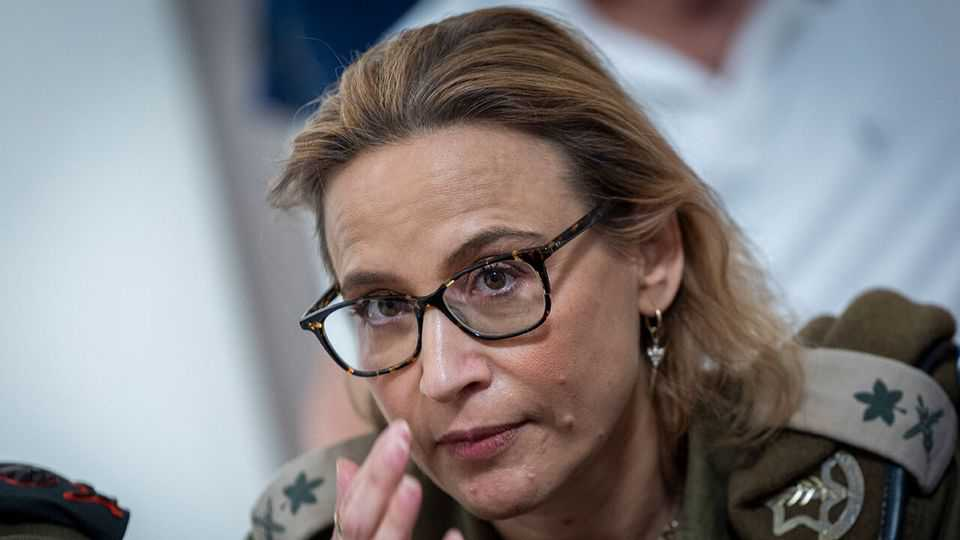

Middle East & Africa | Israeli politics
Israel’s politicians are taking on its lawyers once again
The arrest of the IDF’s top lawyer will affect Israel’s political future
November 6th 2025

The legal branch of the Israel Defence Forces (idf) claims to be investigating “hundreds” of allegations against Israeli troops of crimes committed during the war in Gaza. So far these have yielded only a handful of criminal charges. Major General Yifat Tomer-Yerushalmi, the military advocate- general, had overseen these investigations until she resigned on October 31st. Then, on November 2nd, she was arrested. General Tomer-Yerushalmi’s crime, to which she has admitted, was to leak to the press a video from July 2024 purportedly showing a group of idf soldiers sexually assaulting a member of Hamas held in Sde Teiman, a notorious detention centre in southern Israel. The investigation into the

assault, which included the arrest of soldiers serving there as jailers, triggered riots by far-right activists, including members of the government, who burst into Sde Teiman and another idf base. Five of the alleged perpetrators are now facing trial.

So far Binyamin Netanyahu, Israel’s prime minister, seems far more worried about the leak than the alleged assault. In a statement to his cabinet he called it “the most serious reputational attack Israel has experienced since its foundation”. For “attack” he used the Hebrew word used to describe terrorist attacks. His allies are calling for the charges against the assailants, and any other soldiers accused of crimes in Gaza, to be dropped.

They are also trying to use the investigation leak to attack the attorney- general, Gali Baharav-Miara, and the Supreme Court judges who have backed General Tomer-Yerushalmi throughout the war. They accuse Ms Baharav-Miara of being slow to arrest her for the leak, allowing her to vanish for hours in what was either a half-hearted or fake suicide attempt during which her phone disappeared in the sea.

This saga most immediately demonstrates Israel’s inability to monitor and judge the war crimes alleged to have taken place during the two years of its war in Gaza. It will also have an impact on the country’s political future.

By law the next election to the Knesset, the Israeli parliament, must take place by the end of October 2026. But the demands of the hard-right parties that Israel should return to war in Gaza, and of the ultra-Orthodox parties for legislation that will exempt seminary students from national service, are straining the coalition. If the government collapses, as expected, the poll would have to be brought forward.

The signs are that Mr Netanyahu intends to campaign at least in part by appealing to the animosity his supporters feel towards Israel’s legal establishment. His coalition was lagging in the polls even before the disastrous war in Gaza because of its divisive reforms to limit the powers of the Supreme Court and attorney-general. But the accusations that General Tomer-Yerushalmi did not act alone in leaking the Sde Teiman video, but had allies in the judiciary and the media, are fuelling a co-ordinated assault by the far right on the “deep state” of Israel’s old elites.

Since October 2023, Mr Netanyahu has been trying to shift the blame for the failure to anticipate Hamas’s attacks onto the security chiefs, nearly all of whom have since resigned. This latest scandal is giving those efforts new life. He is also hoping to divert attention and perhaps end an investigation into three of his media advisers, who stand accused of leaking secret intelligence documents last year.

What is clear is that the focus in Israel is now squarely back on the domestic struggle between the Netanyahu government and the legal system. Any hope of a national reckoning over the failures of October 7th and what Israel has done in Gaza will have to wait until after the election. ■

Sign up to the Middle East Dispatch, a weekly newsletter that keeps you in the loop on a fascinating, complex and consequential part of the world.

This article was downloaded by zlibrary from https://www.economist.com//middle-east-and-africa/2025/11/05/israels-politicians- are-taking-on-its-lawyers-once-again

Europe

Jordan Bardella starts to lay out his plans Ukraine’s valiant defence of Pokrovsk is nearing its end War is blasting Ukraine’s border city of Kharkiv but boosting Lviv A Czech shift to the right is worrying news for Ukraine Pope Leo XIV is infuriating MAGA Catholics Why moderates are reclaiming Europe’s national flags