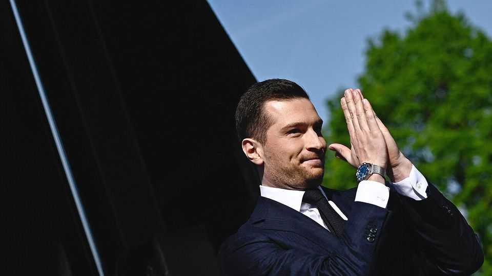

Europe | France’s populist right
Jordan Bardella starts to lay out his plans
The 30-year-old French populist who is preparing for power
November 6th 2025

On the first evening of his book tour last week, in a small town in the mining basin of northern France, Jordan Bardella spent six hours signing copies for 1,300 people. Two days later, in a town in Burgundy, a long line of fans snaked along the pavement waiting to see him. Aged just 30, the protégé of Marine Le Pen and president of her populist-right party, National Rally (RN), is now France’s most popular politician. His face is splashed across the front pages; his new book tops the best-seller lists, second only to the latest Astérix volume. Mr Bardella’s fandom is not inconsequential. With French politics gridlocked, there is a chance that this young man could, in the near future, win power.

Mr Bardella is the overwhelming favourite to win the first round of voting in the presidential election due in 2027. A new poll gives him 35%, over twice the 15.5% of his nearest rival, Edouard Philippe, a former centrist prime minister, though the poll does not test the run-off. Mr Bardella is currently the RN’s pick to become prime minister, should President Emmanuel Macron hold snap legislative elections before then. If an appeals court next year confirms a ban on Ms Le Pen from running for elected office (over a European Parliament party-financing offence), the pair have agreed that he will be the RN presidential candidate.

It is quite an ascent for a geeky kid who grew up in social housing in a rough neighbourhood north of Paris. After joining the party as a teenager, then dropping out of university to become a full-time RN hack, Mr Bardella has risen at record speed under Ms Le Pen’s wing. He was elected party leader in 2022. Like Ms Le Pen, Mr Bardella has sought to distance the party from its roots in xenophobia, antisemitism and the snarling indignation practised by Ms Le Pen’s father, Jean-Marie. When Le Pen senior made it into the presidential run-off in 2002, Mr Bardella was just six years old.

This year he cancelled an appearance at a conservative event near Washington, DC, after Steve Bannon made a Nazi-like salute. He also, in an arresting shift, went to Israel, visiting Yad Vashem, the Holocaust memorial.

Having last year cut the RN’s ties to the extremist Alternative for Germany, Mr Bardella now speaks warmly of Giorgia Meloni, Italy’s prime minister, who embodies a more moderate version of the populist right.

Unlike Ms Le Pen, however, Mr Bardella is a product of a young generation. With over 2m followers on TikTok, he periodically posts clips of himself in regular-guy mode—eating Haribo sweets, working out at the gym—or sets reels to Brazilian funk tracks. The RN president still plays identity politics and taps into nostalgia for a pre-immigrant past. But his breezy optimism, ready smile and upbeat talk of growth and AI make him a fearsome retail politician.

The party now deploys Mr Bardella as part of its backroom charm-offensive to reassure the French elite. He promises €100bn ($115bn) of budget savings over five years, “pro-growth taxation”, and a simplification of rules that weigh down firms. He dismisses the left’s tax plans as a recipe for “Venezuela without the oil”. The value of work runs through his new book, a series of encounters with French people struggling to make ends meet. “I’m trying to develop positions that are pro-business,” Mr Bardella argues, describing himself as “pragmatic on economics”: “If we don’t create wealth, we won’t be able to deal with the wall of debt.” Not all French bosses are convinced. One says he found Mr Bardella “very smart”. Another says he is deeply sceptical of the pledge on budget cuts, and rolls his eyes at the RN’s support for a wealth tax.

Mr Bardella claims to have no political role model. He likes the way that Donald Trump “defends his country’s interests” but adds that “he does it in a very American style that is not European and even less French.” Yet there is something quite Trumpian about Mr Bardella’s blend of anti-immigrant, tech-focused, green-sceptic nationalism. There is no talk of walls or swamps. Yet Mr Bardella, whose parents are of Italian origin, insists that the “European people” fear “disappearing” under pressure from “migratory waves”. Supporters chant “This is our home” at RN rallies.

Behind Mr Bardella’s thinking is a “France first” impulse. He wants preference in public orders for French firms that manufacture at home. He would pull France out of the EU electricity-pricing scheme, so it can benefit from its cheaper nuclear power (“We are being forced to pay for everyone

else”). He wants a rebate on France’s payments to the EU budget, which keep rising (“It’s madness”). America should be a “partner, not a big brother”.

What emerges is a radical plan that would challenge the principles that underpin the EU, built on the idea of collective strength through risk- sharing. Mr Bardella says he is “not in favour of leaving the EU”, but for “a Europe of nations”. Europe, he says “should stop regulating the noise of lawnmowers, and focus on major projects for the future that are vital for European civilisation: AI, digital technology, space, data…But it should leave it to us to tell our farmers what products they can use.”

More controversially, Mr Bardella says that “we won’t be able to avoid a discussion with the European Central Bank about French debt,” which currently amounts to nearly 116% of GDP. He wants to raise the idea that “the ECB could do quantitative easing, as it did 12-15 years ago.” During the euro-zone crisis of 2009-2012 the ECB bought sovereign debt for troubled countries. Such a scheme, he breezily reckons, accompanied by a credible five-year growth plan, could be in the common interest if it helped bring stability: “If the French economy cracks, the whole euro zone will crack.”

Such ideas expose the contradictions in Mr Bardella’s plans. He wants to unpick European policy, but also benefit from the institutions and alliances the continent has built (he calls France’s contribution to defending NATO’s eastern flank against the Russian threat “fundamental”). His ideas would set France, a founding member of the union, on a collision path with not only EU institutions but Germany. For Mr Bardella, this seems to be the point. “The EU is an association in defence of Germany’s interests,” he declares. It is said with a smile, but it is a thundering message that will dismay Europe’s defenders and delight his fans in equal measure. ■

To stay on top of the biggest European stories, sign up to Café Europa, our weekly subscriber-only newsletter.

This article was downloaded by zlibrary from https://www.economist.com//europe/2025/11/05/jordan-bardella-starts-to-lay-out-his- plans