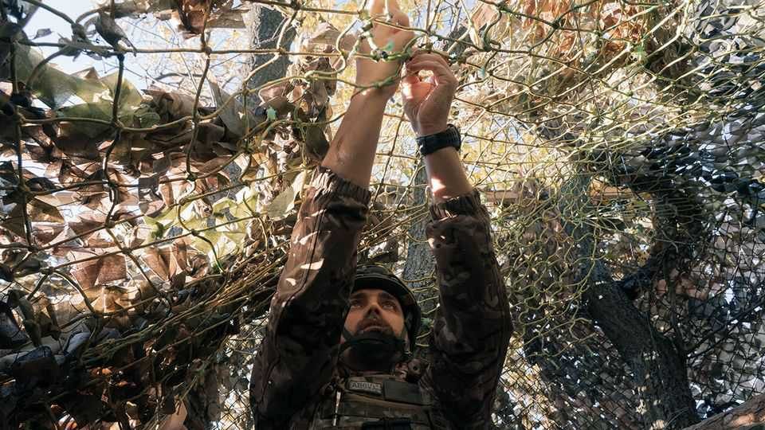
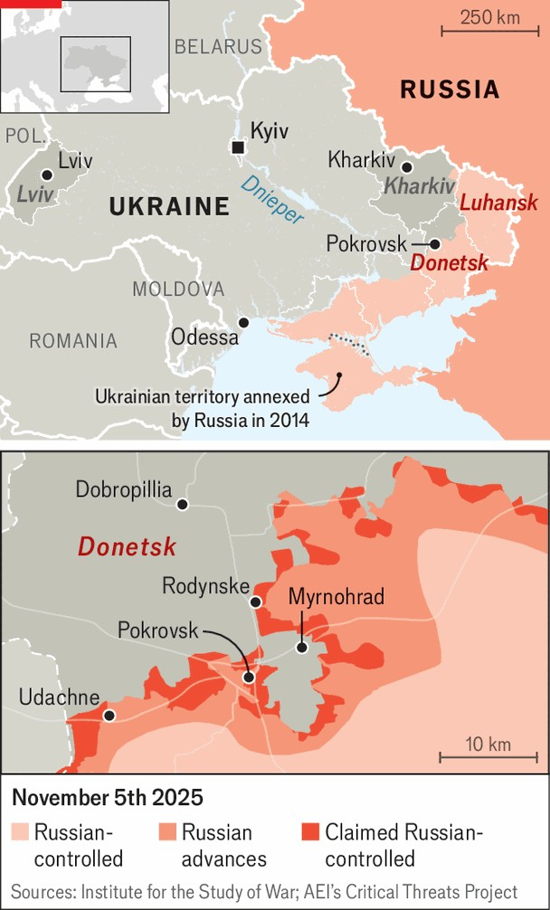

Europe | Gradually, then suddenly
Ukraine’s valiant defence of Pokrovsk is nearing its end
Russia suffers huge casualties, but its new drone-powered assault is working
November 6th 2025

Twenty-one months after it began, Vladimir Putin’s assault on the small Donbas city of Pokrovsk (pre-war population 60,000) is nearing its end. A bloody surge in late October made the situation in the city and in Myrhnohrad, a satellite town, irretrievable for the Ukrainians. Now they are battling for position to extract their forces, some trapped in pockets. The loss of Pokrovsk, though long anticipated, would be a significant blow. Worse could come later: the city is a crossroads that offers Russia a base for further advances.

Ukraine’s desperation showed with two daring helicopter raids on October 29th and 31st. Conducted by Ukrainian military intelligence (HUR) using American Black Hawk helicopters, and led personally by its commander Kyrylo Budanov, the missions slipped special forces into the contested zone at the city’s northern edge. The aim was to strengthen Ukrainian positions along an access road to the north. Russia promptly claimed to have destroyed the group, using obviously doctored footage as evidence. That Ukraine’s helicopters returned intact was one success. But to what extent the operation achieved its aims is still unknown.

“Michael”, the commander of Taifun, a special-forces drone unit fighting in the area, says Russia fully controls at least 60% of Pokrovsk itself, with the rest contested. “The whole of the northern part is grey zone,” he says. But a Ukrainian intelligence source says the balance depends less on horizontal geography than on vertical dominance. “You need to understand who controls the high buildings,” the source says. “It doesn’t matter so much what happens at ground level.” Ukraine is fighting to regain key heights to unblock units surrounded by the enemy further south.

The heights of northern Pokrovsk are the most pressing problem. “It looks like we will lose some of our units,” the officer says. But things do not look much better in Myrhnohrad to the east, where Ukrainian forces risk being encircled. A corridor to the north began to close starting on October 26th, when Russian forces entered the urban area of Rodynske. They were pushed out at least once, with footage showing piles of Russian corpses, but have returned. The Ukrainians are holding off Russian attempts to close the gap in the ring, now only a few kilometres wide.

Russia’s progress has been predicated on mass: men and weapons. “Sometimes it’s one to six, one to eight, one to ten, they keep throwing bodies at it,” says Taifun’s Michael. “Clausewitz would be shocked if he saw some of the ratios.” Just as crucially, however, Russia is edging ahead in the drone fight. Ukraine has deployed a record number of drone squads to the sector, but is struggling against a better-resourced enemy. Elite formations such as Rubikon, reporting directly to the defence ministry in Moscow, dominate the skies. Russian drones lurk along Ukraine’s main supply routes. Rather than flying after a target, they are already hovering in the sky or waiting at a road’s edge, ready to ambush. With more long-range drones, Russia’s reach is several kilometres deeper. That means they are able to hunt Ukrainian drone operators with near impunity.

Whether Russia can sustain this level of attack is uncertain. Its gains, still relatively small, come at a huge cost in blood. Yet the long-delayed collapse of the defence of Pokrovsk suggests they have found a formula that, while gruesome, works. For its part, Ukraine suffers from a systemic malaise of poor planning and paralysis in the face of bad news. Military and political bosses have failed to start building new underground fortifications in response to Russia’s war of mass and drones. Pokrovsk is not the end of the story, but should be a wake-up call. “Russia has gained a sense of courage,”

says the intelligence source. “It is time for everyone—at home and in the West—to stop messing around.” ■

To stay on top of the biggest European stories, sign up to Café Europa, our weekly subscriber-only newsletter.

This article was downloaded by zlibrary from https://www.economist.com//europe/2025/11/06/ukraines-valiant-defence-of-pokrovsk- is-nearing-its-end