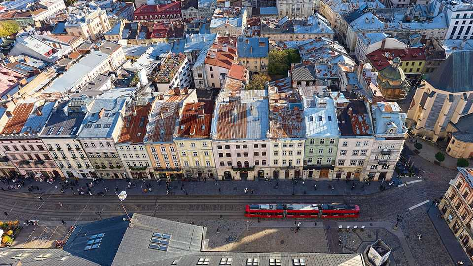
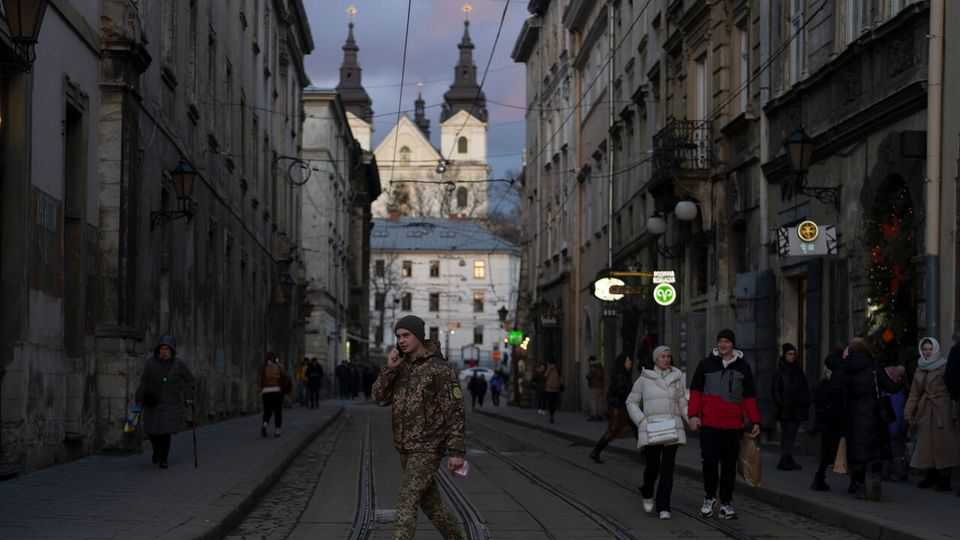
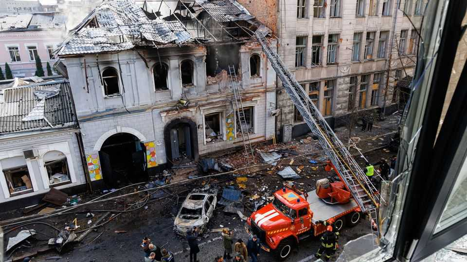
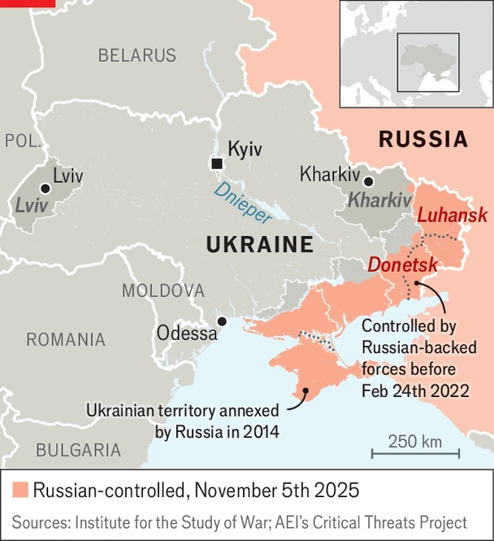

Europe | Location, location, location
War is blasting Ukraine’s border city of Kharkiv but boosting Lviv
A tale of two Ukrainian cities
November 6th 2025

WAR IS PERMANENTLY changing Ukraine’s geography. Nowhere is this illustrated more clearly than in the contrast between two of its great cities: Kharkiv in the east, and Lviv in the west. With combat raging to its north and east, Kharkiv, once an industrial powerhouse and Ukraine’s second city, is struggling. Meanwhile Lviv is profiting as people, business and investment move to the centre and west of the country. Location is everything. Kharkiv is just 40km (25 miles) from Russia, once a vital trading partner of Ukraine but now the country’s bitterest enemy. Lviv sits 70km from prosperous Poland, gateway to the markets of the European

Union. Many of the province’s inhabitants work on the other side of the border.

Maksym Kozytskyi, the governor of Lviv province, has a bust in his office of Emperor Franz Joseph, who ruled the Austro-Hungarian Empire until his death in 1916. Lviv was one of that empire’s biggest cities, Mr Kozytskyi recalls, but the Soviet conquest of Ukraine turned the country’s focus eastward. When Russia launched its full-scale invasion in 2022, the European Union responded by making Ukraine a candidate for accession. Ukraine’s growing integration with the EU since the war started has begun to return Lviv to its old place in central Europe.

Andriy Sadovyi, the city’s mayor, bubbles with excitement when he describes the changes. Ukraine’s population has been shrinking for decades, but Lviv has grown to a million inhabitants since 2022, thanks largely to the influx of 150,000 people from Kharkiv and other eastern areas. Some 280 companies have relocated to Lviv province, including 60 from Kharkiv. A major industrial park recently opened in the city’s suburbs, along with a university. The EU plans to help make Lviv a railway hub by upgrading links to Poland and Romania. “We have a much better economic situation than before the Russian invasion,” Mr Sadovyi says. The historic Austro- Hungarian city centre is packed and peaceful. Teachers shepherd groups of small children in high-visibility vests past crowds of tourists and students.

The centre of Kharkiv, meanwhile, is dominated by monumental buildings put up a century ago, when it was the capital of Soviet Ukraine. Its streets are much quieter. Until the invasion it was a major educational centre, home to some 270,000 university-level students. Now, because of frequent drone and missile attacks, most education is online. Only half the old number of students are believed to remain.

Before the full-scale invasion, Kharkiv was home to about 1.6m people. Nataliya Zubar, who runs a human-rights organisation in the city, estimates it is now between 1.2m and 1.3m. In the first phase of Russia’s war against Ukraine, starting in 2014, the city took in a wave of refugees from the occupied parts of Donetsk and Luhansk provinces. Since 2022 it has absorbed still more, from various war-ravaged areas in the east. Yet much of the city’s middle class has left for safer regions in the west. Ms Zubar thinks the city will recover after the war, becoming an armed-forces hub housing many soldiers and their families and a centre for Ukraine’s emerging military-technology industry.

Pavlo Kobzar is the co-founder of Logity, a freight-brokerage firm that employed 850 people in Kharkiv until 2022. Today only 185 of them remain there; Mr Kobzar now commutes between Kharkiv and Lviv. Kharkiv will take “at least a decade to recover”, he says. “The majority of my friends are not there any more.” How many will return will depend on how safe they feel he says. Russia, he notes, has said it wants to conquer all of Ukraine up to the Dnieper river, which would include Kharkiv.

Olga Shapoval, director of the Kharkiv IT Cluster, says that until 2022 there were some 50,000 IT professionals in the city. Perhaps half remain, she says, but it is hard to know for sure. Many remain registered as residents in

Kharkiv while actually living in Lviv or abroad. One study found that the share of the country’s IT workers who live in Kharkiv fell from 14% in 2021 to 4% last year. In Lviv it rose from 14% to 18%.

Sergii Fursa, deputy director of Dragon Capital, an investment firm, thinks Kharkiv could recover if the war is settled on a secure basis. But for now, he says, all the new private-equity investment is in western Ukraine: “We do not even look at any region on the left [east] bank of the Dnieper.” Construction statistics do not signal much confidence in Kharkiv. In the first six months of this year builders started work on 15,559 new homes in Kyiv province, 6,956 in Lviv and only 199 in Kharkiv.

Analysts say redeveloping cities such as Kharkiv will require the government to offer tax breaks and other incentives graduated by risk, meaning proximity to Russia or Russian-occupied territory. Kyiv will continue to attract wealth, talent and people. Odessa’s future is secure: it is Ukraine’s main port. But much of the country’s east could become a rust belt, perpetually threatened by war. Ivan Movchan is chief executive of USC, a company that once made industrial scales in Kharkiv. When its factory there was destroyed the company shifted production to central Ukraine. They want to return to Kharkiv, he says, “but it won’t be easy.” If companies like his do not manage to go home, he worries, the city will shrink to a shell of its former self, “like Detroit”. ■

To stay on top of the biggest European stories, sign up to Café Europa, our weekly subscriber-only newsletter.

This article was downloaded by zlibrary from https://www.economist.com//europe/2025/11/03/war-is-blasting-ukraines-border-city- of-kharkiv-but-boosting-lviv