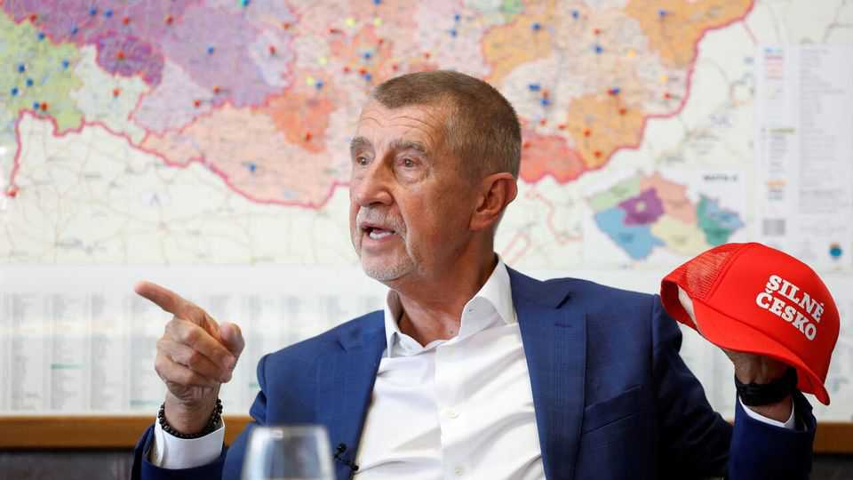

Europe | Ukraine-bashing Babis
A Czech shift to the right is worrying news for Ukraine
But the new prime minister will probably not join Viktor Orban’s efforts to block aid
November 6th 2025

ANDREJ BABIS is back in power in the Czech Republic, this time heading a government that leans more to the right. Although Mr Babis (pictured), a billionaire who first served as prime minister from 2017-21, has always campaigned as a populist, his ANO party is ideologically centrist. But on November 3rd he sealed a coalition deal with two smaller, more radical parties. The nationalist Freedom and Direct Democracy (SPD) party, headed by Tomio Okamura, a wise-cracking Japanese-Czech entrepreneur, wants a referendum on leaving the European Union and NATO, while Motorists for Themselves, an auto-owners’ party, is dead set against the EU’s Green Deal.

Mr Babis agrees with the Motorists on scaling back climate measures, though he will not give the SPD its referendums. But another big question is where he will come down on aid to Ukraine. During the campaign he criticised the previous government’s generosity, and said a Czech-run programme to buy ammunition for Ukraine would be handed over to NATO. Apart from that, his views are largely in line with the EU’s pro-Ukrainian consensus. But the SPD parrots the Russian line. And Viktor Orban, Hungary’s prime minister, would like to recruit the Czechs as part of an anti- Ukrainian alliance in central Europe.

For years, Mr Orban has been fanning Hungarians’ resentment over the costs of helping Ukraine defend itself against Russia. “We cannot allow Hungarians’ money to be sent to Ukraine,” he wrote on November 3rd on X, citing The Economist’s estimate that doing so would cost Europe around $400bn over four years. This is partly about domestic politics. Polls show Fidesz, his populist-right party, well behind Respect and Freedom (Tisza), a conservative party led by Peter Magyar, a charismatic former Fidesz member who has spent the past two years blasting the government for corruption.

Mr Orban’s search for partners focuses on his fellow members of the Visegrad Four countries: the Czech Republic, Poland and Slovakia. In fact, Hungary has always done less for Ukraine than the others. The Czech Republic, for instance, hosted more Ukrainian refugees per head than any other country (up to 600,000 in a country of 11m). Poland says it is spending around 5% of its GDP on help for Ukraine and its refugees in Poland. Mr Orban, for his part, has repeatedly blocked EU aid to Ukraine, often as a bargaining chip to get the bloc to release funding for Hungary frozen over rule-of-law violations. He is also vetoing progress on Ukraine’s accession to the EU.

Poland is among the EU’s staunchest backers of Ukraine’s war effort; even its populist opposition wants nothing to do with Hungary’s line. Mr Orban hopes for better luck with the other two Visegrad members. Robert Fico, Slovakia’s populist prime minister, opposes the EU’s sanctions on Russia. But he has a pragmatic attitude towards Ukraine, says Milan Nic of the German Council on Foreign Relations. Slovakia exports lots of ammunition

to its armed forces, and its businesses hope to profit from the country’s reconstruction.

“Orban is isolated on Ukraine,” says Armida van Rij of the Centre for European Reform, a think-tank in Brussels. For the first time in 15 years, he is the underdog in an election campaign. On November 7th he will meet Donald Trump in Washington, and try to get an exemption to American sanctions on Russian oil. He is organising a nationwide “anti-war tour” starting on November 15th, beginning in Gyor in western Hungary, to counter huge opposition rallies in recent months. But as in the Czech Republic, abandoning Ukraine may not be the political winner he hopes for. ■

To stay on top of the biggest European stories, sign up to Café Europa, our weekly subscriber-only newsletter.

This article was downloaded by zlibrary from https://www.economist.com//europe/2025/11/06/a-czech-shift-to-the-right-is- worrying-news-for-ukraine