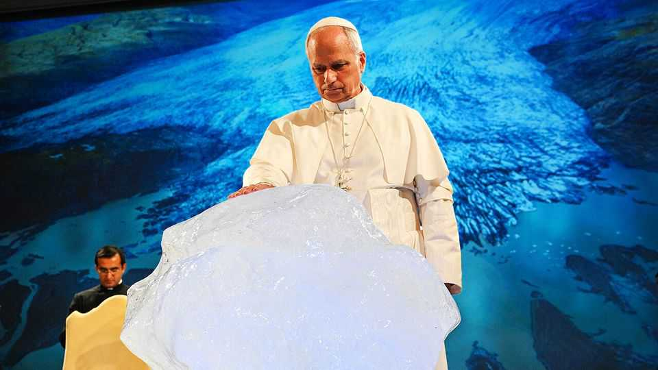

Europe | The woke pope
Pope Leo XIV is infuriating MAGA Catholics
Concern for the poor and the planet rubs some the wrong way
November 6th 2025

On October 25th Raymond Burke, an American cardinal, celebrated an ornate Latin-rite mass at St Peter’s Basilica in the Vatican, thick with incense and nostalgia. A year ago the spectacle would have been unthinkable: the late Pope Francis, who died in April, tightly restricted mass in Latin. Cardinal Burke, who headed a traditionalist revolt against Francis’s liberal reforms, was stripped of any significant position. For some conservative Catholics, who have been pushing the Latin mass ever since the church made it optional in the 1960s, it was a vindication. But others saw it as a sop meant to pacify them. Pope Leo XIV, who authorised the mass, seems content to let the incense waft while taking Francis’s line on issues such as poverty, inequality and climate change. His first major text,

Dilexi Te, describes protecting the climate, welcoming migrants and pursuing economic justice as sacred obligations. To admirers he is a compassionate reformer; to critics, the “commie” or “woke pope”.

Benjamin Harnwell, a correspondent for WarRoom, a MAGA podcast, said the traditionalists had been “bought off”. America’s conservative Catholics, many of whom voted for Donald Trump, had hoped for a pope who would keep quiet about migrants and capitalism, and lure back wealthy right-wing donors whom Francis had alienated.

Instead, Leo has deplored America’s “inhuman” deportation policies. At a meeting with American bishops in October he urged them to speak out on such issues. Shortly after Mr Trump called climate change “a con-job”, the pope berated leaders who “ridicule global warming” and proceeded to bless a chunk of ice from Greenland. Conservatives called the gesture paganism.

The shrillest reaction came after Leo said that supporters of the death penalty could not call themselves pro-life. Joseph Strickland, a bishop from Texas, wrote in an open letter that “the Church I love is being dismantled.” John Yep, head of Catholics for Catholics, a conservative group, noted that traditionalists were grateful Leo allowed the mass, but his stances on migrants suggest he is “not getting what is happening” in America.

Where Francis often acted brashly, Leo’s style is slow and careful. Leo is “more intelligent, more subtle than Francis and therefore more dangerous”, said Mr Harnwell. Although the new pope supports more input on policy and doctrine from lay people and women, he will probably disappoint progressives on abortion and gender. Yet overall, Pope Leo’s Vatican is clearly tilting further left. The conservatives got their mass, but not their man. ■

To stay on top of the biggest European stories, sign up to Café Europa, our weekly subscriber-only newsletter.

This article was downloaded by zlibrary from https://www.economist.com//europe/2025/11/06/pope-leo-xiv-is-infuriating-maga- catholics