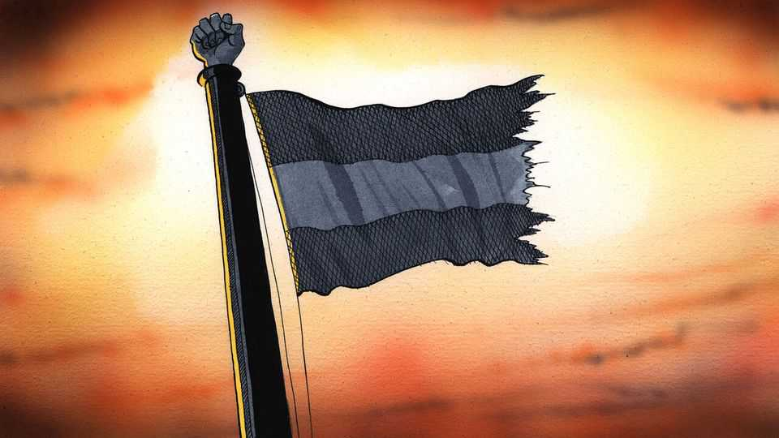

Europe | Charlemagne
Why moderates are reclaiming Europe’s national flags
Populists and nativists have usurped them
November 6th 2025

To be a European is to have learned from history that what starts off as patriotic fervour can, under the wrong kind of pressure, curdle into something far uglier. Most Europeans thus treat the flags of their respective countries—the most potent symbol of the national collective id—with something akin to polite restraint, as if to temper the passions they might suddenly unleash. Americans unabashedly flutter their star-spangled banner in front yards and on pickup trucks; no car dealership is complete without a sea of red, white and blue. Europeans on the whole are more circumspect. The French tricolore, Spanish Rojigualda or assorted Scandinavian crosses fly proudly atop parliaments, schools, war memorials and other patches of officialdom. But across much of the continent, for an individual to be seen

waving a national flag, or to hang one outside his or her home, is to invite questions. Is there a football championship under way? Is there some other cause for celebration? Or are you…one of those patriotic types?

Europe is a continent divided by flag-waving habits. Danes use theirs, the oldest in continued existence, as a crutch for even the most mundane of celebrations: visitors are greeted at the airport with plastic pennants, and no birthday cake is complete unless adorned by the Dannebrog. When ordinary Germans, uniquely mindful of where a surfeit of nationalism might lead, eagerly brandished their flag during the football World Cup of 2006, many felt a page had been turned. In 2022 struggling Dutch farmers took to flying their national emblem upside-down, a recognised sign of distress. In Belgium and Spain, displaying the national colours can indicate a desire for the country to remain united amid regional clamourings for secession. Across the European Union, politicians can show their affection for ever- closer union by draping themselves in the club’s 12-starred flag, as France’s president, Emmanuel Macron, has done. But in the absence of a national crisis, celebration or sporting triumph, public displays of affection for the flag are rare. Visit a European city and Ukrainian or Palestinian banners are more likely to adorn balconies than national ones.

Jingoistic types have knowingly stepped into this vexillological vacuum. Parties on the populist right have played an adept game of “capture the flag”. In the hands of these self-appointed defenders of the homeland, banners created to unite have been weaponised into symbols that divide. Marches held for the National Rally in France, the Alternative for Germany or the Brothers of Italy and fellow nativists across Europe brim with national colours. In part this is done to needle liberals, who feel unable to criticise reverence for the flag—even if they associate it with fuddy-duddy ideas harking back to the past, such as uncritical reverence for empire or militarism. But the main targets of the flag-wavers are immigrants. This flag, they are to be reminded, was ours before you lot arrived; dare you brandish it with the performative verve of the native-born? A sea of eagerly waved fabric is meant to intimidate outsiders, not bring them in. A recent campaign poster for Chega, a xenophobic Portuguese party, depicted the red-and-green national flag with the slogan “This is not Bangladesh.”

What was once confined to marches and rallies has taken a more public turn. National colours have appeared in unexpected places of late. Last month more than 20 black, red and gold German flags surreptitiously appeared in Nachrodt-Wiblingwerde, a small town near Dortmund. A banner explaining that “national pride is not a crime” left useful hints as to the purpose of the flag-hanging. A few days earlier Uithoorn, a town near Amsterdam, had found itself plastered in Dutch flags also of unclear provenance, but seemingly linked to a proposed asylum-processing centre. Similar outbreaks of spontaneous flag-flashing have been spotted in France and Ireland. The inspiration seems to have been a nativist British campaign, Operation Raise the Colours, that flourished last summer—the least welcome British export to the continent since Marmite.

Mindful of the provocation, moderates are striking back. Sir Keir Starmer has draped himself in the Union Jack to the point of Churchillian excess. On October 29th the unexpected winner of the Dutch elections, Rob Jetten, made his victory speech in front of an oversize national banner, after a campaign featuring what some Dutch found unseemly orgies of flag-waving. A young, cosmopolitan liberal from a pro-European party, Mr Jetten might have been expected to flaunt the EU emblem. By brandishing the Dutch flag that his adversaries on the populist right have tried to monopolise, his aim has been to “reclaim” what should be an inclusive emblem, he says. The subtext is that progressives need not leave patriotism to the demagogic fringes. It is not just Mr Jetten who wants to ensure the flag remains a national symbol, not a factional one. One placard at a French demo last year read “Don’t let fascists steal our flag”. Frank-Walter Steinmeier, the social- democratic German president, has beseeched his countrymen not to allow the flag “to be hijacked and abused by those who want to foment new nationalist hatred”.

Europeans may never rival Americans in flag-flying fervour, but they can at least aspire to a dignified half-mast of enthusiasm. There is something endearingly continental about fretting over whether hoisting a national emblem might accidentally summon goose-stepping zealots. The very idea that patriotism is something that should aim to exclude rather than include should strike most Europeans as daft. As Mr Jetten suggests, if centrists could manage to wave their banners without wincing, they might just remind voters that affection for one’s country need not come wrapped in menace. A

little pride, unfurled politely and at the right moment, could yet prove Europe’s most unifying fabric. ■

Subscribers to The Economist can sign up to our Opinion newsletter, which brings together the best of our leaders, columns, guest essays and reader correspondence.

This article was downloaded by zlibrary from https://www.economist.com//europe/2025/11/06/why-moderates-are-reclaiming-europes- national-flags

Britain

Brand Britain has bounced back Giorgia Meloni and Nigel Farage compared Nigel Farage bows to the bond market A British legal ruling about AI delights nobody Boom times in a British manufacturing town If Labour cranks up income taxes, the left will boo loudest