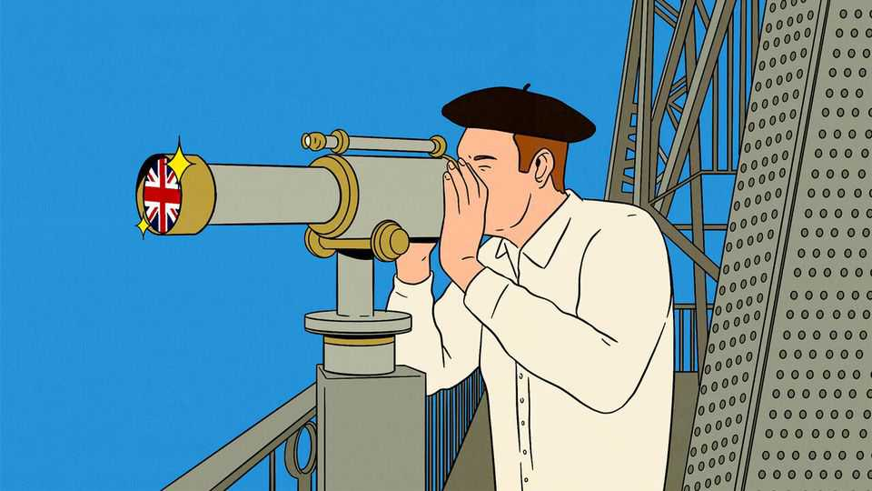
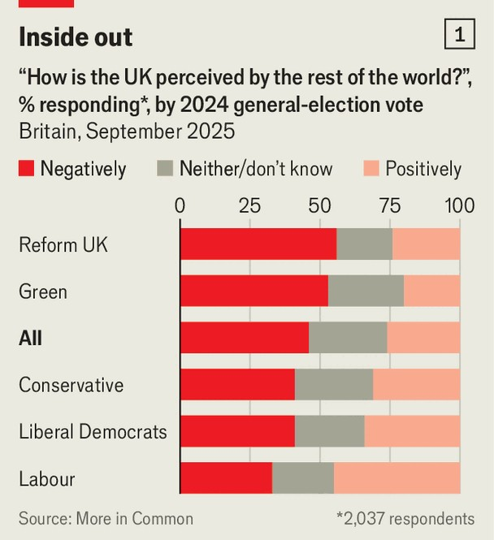
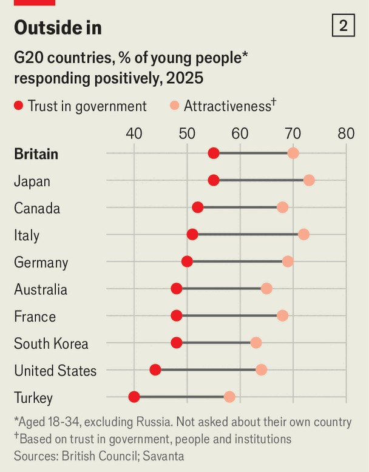
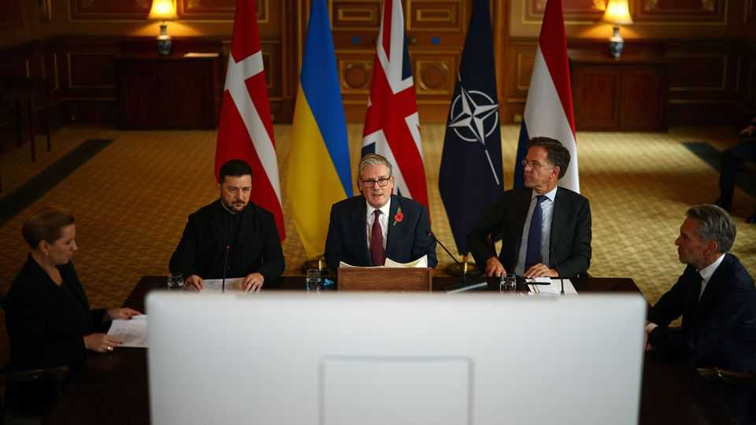

Britain | Unbroken Britain
Brand Britain has bounced back
Despite all the gloom at home, the country’s reputation is surprisingly bright
November 6th 2025

MARGARET THATCHER worried a lot about Britain’s reputation. “As I travel the world”, she said in a fiery speech in 1976, three years before she became prime minister, “I find people asking again and again: ‘What has happened to Britain?’” Britain held the undisputed title as “sick man of Europe”, crippled by industrial unrest, sky-high interest rates, economic decline and diplomatic impotence.

Ask Britons how they feel about the country today and you could be forgiven for thinking you had teleported back to 1976. Newspaper headlines suggest the country is on the cusp of an IMF bail-out, crime is out of control and public services are close to collapse. “We are living through a period of economic and social decline,” bemoans Nigel Farage, whose right-wing populist Reform UK leads in polls. “Our great country is heading in the wrong direction.” Nearly three-quarters of Britons agree, according to a recent survey by Ipsos, a pollster. Almost half of Britons also say that Britain is perceived negatively by the rest of the world (see chart 1).

Some high-profile foreigners delight in Britain-bashing, too. America’s vice- president, J.D. Vance, has worried aloud about threats to free speech in Britain. And the world’s richest man, Elon Musk, told his 229m followers on X on October 29th that “Civil war in Britain is inevitable.”

But the wider view from abroad tells a different story. This year’s survey data from the British Council on global perceptions of Britain show that the country’s international reputation is holding up remarkably well (see chart 2). Among 18- to 34-year-olds, Britain ranked as the third-most-attractive country in the G20 group of big economies. Trust in the British government scored highest, and trust in the country’s institutions second only to Japan. “If you look at classic soft-power measures—culture, institutions, people and values—then the UK is holding really steady,” says Christine Wilson of the council.

Other gauges point the same way. Every year Brand Finance, a consultancy, asks 100,000 respondents worldwide what they think of different countries and their influence. The results put Britain’s “brand” third, behind America and China. Polling by Anholt-Ipsos placed Britain’s “nation-brand”, a proxy for global reputation, fifth out of 50 countries surveyed. At home, Britain- bashing is a national pastime. But across four broad areas—foreign policy, business, culture and technology—Britain’s international stock is in fact rising.

First, foreign policy. Britain has quietly rebuilt some of the diplomatic influence it squandered in the Brexit years. It can do little to alter the

structural decline in power relative to America and China. But it can still aspire to punch above its weight.

Defence’s rise in the West’s agenda has helped. Britain is one of the five nuclear-armed states with a permanent seat on the UN Security Council. It is a muscular member of NATO and its signals-intelligence service, GCHQ, makes it a pillar of the “Five Eyes” intelligence-sharing elite, with America, Australia, Canada and New Zealand. Sir Keir Starmer, the prime minister, has impressed European leaders with his ability to convene allies and stake out tricky positions, like his early call to boost defence spending at the cost of aid. Restored trust has helped Britain’s “reset” with the EU and smoothed the way to bilateral deals with France and Germany.

France’s president, Emmanuel Macron, speaks privately about the “special path” he and Sir Keir are forging. Friedrich Merz, the German chancellor, says Britain is “in the inner circle of those who lead”. German securocrats praise the “strategic culture” and know-how British diplomats bring. And, despite fears of a painful choice, improved relations with Europe haven’t come at the expense of those with America.

Though Britain was hit by Donald Trump’s tariffs in April, it was the first to strike a deal to mitigate them. Britain has pulled out all the stops, including a

state visit with the king, to flatter Mr Trump. So far, it is working. “Together, we’ve done more good for humanity than any two countries in all of history,” said Mr Trump at his Windsor Castle banquet.

Britain’s defence industry is also boosting the country’s geopolitical clout. Britain, Italy and Japan are co-developing the “Tempest”, a state-of-the-art fighter jet, with headquarters in Reading. Germany is considering ditching its own fighter programme with France to join. Australia has turned to Britain, along with America, to develop and build a new class of advanced nuclear-powered submarine.

On business, the second area, the Labour government has done Britain’s reputation no favours by imposing higher taxes and extra regulations. Even so, this year’s survey of 5,000 global business leaders by PwC, a consultancy, placed Britain as the second-most-attractive country for investment (behind America), its highest ranking in the survey’s 28-year history. In a consumer poll by Barclays, a bank, more than one-third of respondents worldwide said they had knowingly paid a premium for British- made products and services.

Maybe surveys of business sentiment are lagging, and will wilt as they catch up with the government’s missteps. But for now, legal services exemplify Brand Britain’s strength. A 2025 survey by Queen Mary University and White & Case, a law firm, found that London remained the preferred seat for international arbitration, ahead of upstarts like Dubai or Singapore. British legal-services exports rose to £9bn ($11.5bn) last year, from £6.3bn in 2020. “The law is our biggest soft-power asset,” says Sir Simon McDonald, the former top civil servant at the Foreign Office.

American investors have pumped £11bn into British equities this year, more than in any other overseas market, according to data from Schroders, a fund manager. When sentiment about a country sinks, at some point its assets can start to look like a bargain. Larry Fink, the boss of BlackRock, an asset manager, says he is investing in “undervalued” Britain. This year the FTSE is beating the S&P 500 even before adjusting for the weak dollar.

Brand Britain’s third key area is culture. Around 86% of the £5.6bn spent on British-made productions last year came from abroad. Ted Sarandos, the

boss of Netflix, a streaming giant, has called Britain “one of the best countries in the world” for making television and films. Pinewood Studios, west of London, is set to become the world’s biggest studio lot, with 51 stages.

British media help the country punch above its weight. Although 53% of Brits now say they have little to no trust in the BBC, it remains the world’s most trusted international news brand, according to a 2025 survey across 18 countries by Tapestry Research, a market-research company.

Britain is one of only three net exporters of music in the world (the others are America and Sweden). And it has a high profile in sport, thanks in large part to the Premier League’s global following among football fans. The secret of that success has been an ability to attract top talent.

That is true for brain-boxes as well as ball-players. Britain is home to three of the world’s top ten universities. It ranks behind only America as the most attractive place to study in the G20. Academics fleeing Mr Trump’s crackdown on universities could hand Britain’s best outfits a further boost. The Economist’s “footloose index”, a ranking of 135 countries and territories based on their attractiveness to foreign talent, shows Britain to be the most attractive destination for restless Americans.

Brainpower is also key to the final area: technology. Though it cannot compete with juggernauts like America or China, Britain has strengths in niches. Critically, those include artificial intelligence (AI). Britain “is in a ‘Goldilocks’ circumstance”, said Jensen Huang, the head of Nvidia, a maker of AI chips. Britain, he told a tech conference in June, “has one of the richest AI communities anywhere on the planet”. He said it’s “the envy of the world”.

During Mr Trump’s state visit, both countries announced a “Tech Prosperity Deal” with billions in investments by American giants like Google, Nvidia and Microsoft. The language no doubt helps.

Palantir, an American data firm, employs a quarter of its staff in London, which it uses as a product-development centre; it recently made London the European headquarters for its defence business. Louis Mosley, Palantir’s boss in Britain, says that in the West “outside the US it is the only country that has the quality and quantity of engineering talent that we need.” Helsing, an Anglo-German defence startup, echoes this: it says most of Europe’s best AI researchers are in Britain.

Britain, for sure, has deep problems. Much of the criticism of the country is justified: it does indeed suffer from street crime, Islamism, creaking public services and economic stagnation. As in Lady Thatcher’s day, it needs to pluck up the courage for politically unpopular reforms. But when it comes to Brand Britain, contrary to conventional wisdom at home, the Lady’s not for turning in her grave. ■

For more expert analysis of the biggest stories in Britain, sign up to Blighty, our weekly subscriber-only newsletter.

This article was downloaded by zlibrary from [https://www.economist.com//britain/2025/11/06/brand-britain-has-bounced-back](https://www.economist.com//britain/2025/11/06/brand-britain-has-bounced-back)